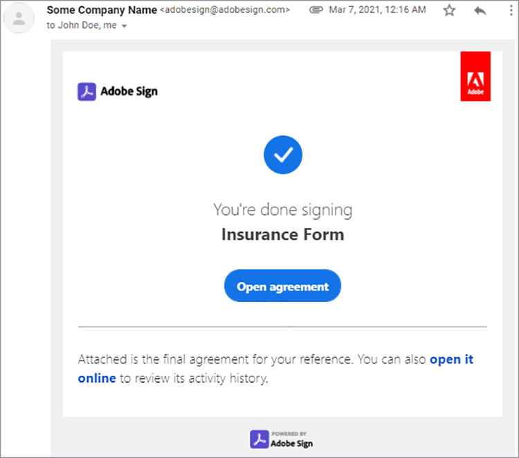

# Adobe Sign APIの概要

[Acrobat Sign API](https://www.adobe.io/apis/documentcloud/sign.html)は、署名済み契約書の管理方法を強化するための優れた機能です。 開発者はSign APIを使用してシステムを簡単に統合できます。この機能により、信頼性が高く簡単な方法で、文書のアップロード、署名用の送信、リマインダーの送信、電子サインの収集を行うことができます。

## 学習内容

この実践チュートリアルでは、開発者がSign APIを使用して、[!DNL Adobe Acrobat Services]で作成されたアプリケーションとワークフローを強化する方法について説明します。 [!DNL Acrobat Services]には、[Adobe PDF Services API](https://www.adobe.io/apis/documentcloud/dcsdk/pdf-tools.html)、[Adobe PDF Adobe Embed API](https://www.adobe.io/apis/documentcloud/viesdk) （無料）、および[Document Generation API](https://www.adobe.io/apis/documentcloud/dcsdk/doc-generation.html)が含まれています。

詳しくは、Acrobat Sign APIをアプリケーションに組み込んで、署名や、保険フォームの社員情報などの他の情報を収集する方法を確認してください。 簡略化されたHTTPリクエストとレスポンスを含む一般的な手順が使用されます。 これらのリクエストは、お気に入りの言語で実装できます。 [[!DNL Acrobat Services] API](https://www.adobe.io/apis/documentcloud/dcsdk/)を組み合わせてPDFを作成し、[transient](https://www.adobe.io/apis/documentcloud/sign/docs.html#!adobedocs/adobe-sign/master/overview/terminology.md)文書としてSign APIにアップロードして、契約書または[widget](https://www.adobe.io/apis/documentcloud/sign/docs.html#!adobedocs/adobe-sign/master/overview/terminology.md)ワークフローを使用してエンドユーザー署名を依頼できます。

## PDF文書の作成

まず、Microsoft Wordテンプレートを作成し、PDFとして保存します。 または、Document Generation APIを使用してパイプラインを自動化し、Wordで作成されたテンプレートをアップロードしてPDF文書を生成できます。 Document Generation APIは[!DNL Acrobat Services]の一部であり、6か月間は[無料、その後は従量課金制で文書トランザクションあたり$0.05または](https://www.adobe.io/apis/documentcloud/dcsdk/pdf-pricing.html)です。

この例のテンプレートは、いくつかの署名者フィールドを入力する単純な文書です。 フィールドに今すぐ名前を付け、後でこのチュートリアルの実際のフィールドを挿入します。


## 有効なAPIアクセスポイントの検出

Sign APIを使用する前に、[無料の開発者アカウントを作成](https://acrobat.adobe.com/ca/en/sign/developer-form.html)してAPIにアクセスし、文書の交換と実行をテストして、電子メール機能をテストしてください。

Adobeは、「シャード」と呼ばれる多くのデプロイメント単位で、世界中にAcrobat Sign APIを配布しています。 各シャードは、NA1、NA2、NA3、EU1、JP1、AU1、IN1などのお客様のアカウントに対応しています。 シャード名は地理的位置に対応します。 これらのシャードは、APIエンドポイントのベースURI（アクセスポイント）を構成します。

Sign APIにアクセスするには、最初にアカウントの正しいアクセスポイントを見つける必要があります。アクセスポイントには、api.na1.adobesign.com、api.na4.adobesign.com、api.eu1.adobesign.com、その他があり、お住まいの地域によって異なります。

```
  GET /api/rest/v6/baseUris HTTP/1.1
  Host: https://api.adobesign.com
  Authorization: Bearer {YOUR-INTEGRATION-KEY-HERE}
  Accept: application/json

  Response Body (example):

  {
    "apiAccessPoint": "https://api.na4.adobesign.com/", 
    "webAccessPoint": "https://secure.na4.adobesign.com/" 
  }
```

上記の例では、は値をアクセスポイントとする応答です。

>[!IMPORTANT]
>
>この場合、以降にSign APIに対して行うすべてのリクエストは、そのアクセスポイントを使用する必要があります。 自分の地域にサービスを提供していないアクセスポイントを使用すると、エラーが発生します。

## 一時的なドキュメントのアップロード

Adobe Signを使用すると、様々なフローを作成して、文書の署名やデータ収集を行うことができます。 アプリケーションのフローに関係なく、最初に文書をアップロードする必要があります。この文書は、7日間だけ使用可能です。 その後のAPI呼び出しでは、この一時的な文書を参照する必要があります。

ドキュメントは、POSTリクエストを使用して`/transientDocuments`エンドポイントにアップロードされます。 マルチパート要求は、ファイル名、ファイルストリーム、および文書ファイルのMIME（メディア）タイプで構成されます。 エンドポイント応答には、文書を識別するIDが含まれます。

また、Acrobat SignのコールバックURLを指定してpingを実行し、署名プロセスが完了したらアプリに通知することができます。


```
  POST /api/rest/v6/transientDocuments HTTP/1.1
  Host: {YOUR-API-ACCESS-POINT}
  Authorization: Bearer {YOUR-INTEGRATION-KEY-HERE}
  x-api-user: email:your-api-user@your-domain.com
  Content-Type: multipart/form-data
  File-Name: "Insurance Form.pdf"
  File: "[path]\Insurance Form.pdf"
  Accept: application/json

  Response Body (example):

  {
     "transientDocumentId": "3AAA...BRZuM"
  }
```

## Webフォームの作成

Webフォーム（以前の署名ウィジェット）は、アクセス権を持つユーザーが署名できるホストされた文書です。 Webフォームの例には、サインアップシート、免責条項など、多くの人がオンラインでアクセスおよび署名する文書が含まれます。

Sign APIを使用して新しいwebフォームを作成するには、まず一時的なドキュメントをアップロードする必要があります。 `/widgets`エンドポイントへのPOST要求では、返された`transientDocumentId`が使用されます。

この例では、Webフォームは`ACTIVE`ですが、次の3つの異なる状態のいずれかで作成できます。

* DRAFT — Webフォームを段階的に構築します。

* AUTHORING — Webフォームのフォームフィールドを追加または編集

* ACTIVE — Webフォームをすぐにホストします。

フォームの参加者に関する情報も定義する必要があります。 `memberInfos`プロパティには、電子メールなど、参加者のデータが含まれています。 現在、このセットは複数のメンバをサポートしていません。 ただし、Webフォームの作成時にWebフォーム署名者の電子メールが不明なため、次の例のように電子メールは空にしておく必要があります。 `role`プロパティは、`memberInfos`のメンバー（SIGNERやAPPROVERなど）が果たす役割を定義します。

```
  POST /api/rest/v6/widgets HTTP/1.1
  Host: {YOUR-API-ACCESS-POINT}
  Authorization: Bearer {YOUR-INTEGRATION-KEY-HERE}
  x-api-user: email:your-api-user@your-domain.com
  Content-Type: application/json

  Request Body:

  {
    "fileInfos": [
      {
      "transientDocumentId": "YOUR-TRANSIENT-DOCUMENT-ID"
      }
     ],
    "name": "Insurance Form",
      "widgetParticipantSetInfo": {
          "memberInfos": [{
              "email": ""
          }],
      "role": "SIGNER"
      },
      "state": "ACTIVE"
  }

  Response Body (example):

  {
     "id": "CBJ...PXoK2o"
  }
```

Webフォームを`DRAFT`または`AUTHORING`として作成し、フォームがアプリケーションパイプラインを通過するときに状態を変更できます。 Webフォームの状態を変更するには、[PUT/widgets/{widgetId}/state](https://secure.na4.adobesign.com/public/docs/restapi/v6#!/widgets/updateWidgetState)エンドポイントを参照してください。

## WebフォームホスティングURLの読み取り

次の手順は、WebフォームをホストしているURLを見つけることです。 /widgetsエンドポイントは、署名やその他のフォームデータを収集するために、ユーザーに転送するWebフォームのホストURLを含むWebフォームデータのリストを取得します。

このエンドポイントはリストを返すので、WebフォームをホストしているURLを取得する前に、`userWidgetList`でIDを使用して特定のフォームを検索できます。

```
  GET /api/rest/v6/widgets HTTP/1.1
  Host: {YOUR-API-ACCESS-POINT}
  Authorization: Bearer {YOUR-INTEGRATION-KEY-HERE}
  Accept: application/json

  Response Body:

  {
    "userWidgetList": [
      {
        "id": "CBJCHB...FGf",
        "name": "Insurance Form",
        "groupId": "CBJCHB...W86",
        "javascript": "<script type='text/javascript' ...
        "modifiedDate": "2021-03-13T15:52:41Z",
        "status": "ACTIVE",
        "Url":
        "https://secure.na4.adobesign.com/public/esignWidget?wid=CBFCIB...Rag*",
        "hidden": false
      },
      {
        "id": "CBJCHB...I8_",
        "name": "Insurance Form",
        "groupId": "CBJCHBCAABAAyhgaehdJ9GTzvNRchxQEGH_H1ya0xW86",
        "javascript": "<script type='text/javascript' language='JavaScript'
        src='https://sec
        "modifiedDate": "2021-03-13T02:47:32Z",
        "status": "ACTIVE",
        "Url":
        "https://secure.na4.adobesign.com/public/esignWidget?wid=CBFCIB...AAB",
        "hidden": false
      },
      {
        "id": "CBJCHB...Wmc",
```

## Webフォームの管理

このフォームは、ユーザーが入力するためのPDF文書です。 ただし、ユーザーが入力する必要があるフィールドと、文書内のどこに配置されているかをフォームのエディターに伝える必要があります。


上の文書には、まだフィールドが表示されていません。 署名者の情報を収集するフィールド、サイズ、位置を定義する際に追加されます。

次に、「契約書」ページの「[Webフォーム](https://secure.na4.adobesign.com/public/agreements/#agreement_type=webform)」タブに移動して、作成したフォームを見つけます。


「**編集**」をクリックして、ドキュメント編集ページを開きます。 使用可能な定義済みフィールドが右側のパネルに表示されます。


このエディターでは、テキストおよび署名フィールドをドラッグ&amp;ドロップできます。 必要なフィールドをすべて追加したら、フィールドのサイズを変更して配置し、フォームに磨きをかけることができます。 最後に、[**保存**]をクリックしてフォームを作成します。


## 署名用のWebフォームの送信

Webフォームを完了したら、ユーザーが入力および署名できるように送信する必要があります。 フォームを保存したら、URLと埋め込みコードを表示してコピーできます。

**WebフォームURLをコピー**：このURLを使用して、レビューおよび署名のために、この契約書のホストされているバージョンにユーザーを送信します。 次に例を示します。

[https://secure.na4.adobesign.com/public/esignWidget?wid=CBFCIBAA3...babw\*](https://secure.na4.adobesign.com/public/esignWidget?wid=CBFCIBAA3AAABLblqZhCndYscuKcDMPiVfQlpaGPb-5D7ebE9NUTQ6x6jK7PIs8HCtTzr3HOx8U6D5qqbabw*)

**Webフォーム埋め込みコードをコピー**：このコードをコピーしてHTMLーに貼り付けることで、webサイトに契約書を追加します。

次に例を示します。

```
<iframe
src="https://secure.na4.adobesign.com/public/esignWidget?wid=CBFC
...yx8*&hosted=false" width="100%" height="100%" frameborder="0"
style="border: 0;
overflow: hidden; min-height: 500px; min-width: 600px;"></iframe>
```


ユーザーがフォームのホストされたバージョンにアクセスすると、最初にアップロードされた一時的な文書を確認し、指定された位置にフィールドを配置します。


ユーザーがフィールドに入力し、フォームに署名します。


次に、ユーザーは以前に保存された署名を使用するか、新しい署名を使用して、文書に署名します。


ユーザーが&#x200B;**[適用]**&#x200B;をクリックすると、Adobeはユーザーに電子メールを開いて署名を確認するように指示します。 署名は確認が届くまで保留中です。


この認証により、多要素認証が追加され、署名プロセスのセキュリティが強化されます。




## 入力済みのWebフォームを読み取り中

次に、ユーザーが入力したフォームデータを取得します。 `/widgets/{widgetId}/formData`エンドポイントは、ユーザーがフォームに署名したときに、ユーザーがインタラクティブなフォームに入力したデータを取得します。

```
GET /api/rest/v6/widgets/{widgetId}/formData HTTP/1.1
Host: {YOUR-API-ACCESS-POINT}
Authorization: Bearer {YOUR-INTEGRATION-KEY-HERE}
Accept: text/csv
```

生成されるCSVファイルストリームには、フォームデータが含まれます。

```
Response Body:
"Agreement
name","completed","email","role","first","last","title","company","agreementId",
"email verified","web form signed/approved"
"Insurance Form","","myemail@email.com","SIGNER","John","Doe","My Job Title","My
Company Name","","","2021-03-07 19:32:59"
```

## 契約書の作成

Webフォームの代わりに、契約書を作成することもできます。 次のセクションでは、Sign APIを使用して契約書を管理するための簡単な手順を示します。

署名または承認のために、指定した受信者に文書を送信すると、契約書が作成されます。 APIを使用して、契約書のステータスと完了を追跡できます。

[一時的なドキュメント](https://helpx.adobe.com/sign/kb/how-to-send-an-agreement-through-REST-API.html)、[ライブラリドキュメント](https://www.adobe.io/apis/documentcloud/sign/docs.html#!adobedocs/adobe-sign/master/samples/send_using_library_doc.md)、またはURLを使用して、契約書を作成できます。 この例では、以前に作成されたWebフォームと同様に、契約書は`transientDocumentId`に基づいています。

```
POST /api/rest/v6/agreements HTTP/1.1
Host: {YOUR-API-ACCESS-POINT}
Authorization: Bearer {YOUR-INTEGRATION-KEY-HERE}
x-api-user: email:your-api-user@your-domain.com
Content-Type: application/json
Accept: application/json
Request Body:
{
    "fileInfos": [
      {
      "transientDocumentId": "{transientDocumentId}"
      }
     ],
    "name": "{agreementName}",
    "participantSetsInfo": [
      {
      "memberInfos": [
          {
          "email": "{signerEmail}"
          }
        ],
        "order": 1,
        "role": "SIGNER"
      }
    ],
    "signatureType": "ESIGN",
    "state": "IN_PROCESS"
  }
```

この例では、契約書はIN_PROCESSとして作成されますが、次の3つの異なる状態のいずれかで作成できます。

* DRAFT – 契約書を送信する前に段階的に作成します。

* AUTHORING – 契約書のフォームフィールドを追加または編集します。

* IN_PROCESS – 契約書をすぐに送信します。

契約書の状態を変更するには、`PUT /agreements/{agreementId}/state`エンドポイントを使用して、以下の許可された状態遷移のいずれかを実行します。

* オーサリングへのドラフト

* IN_PROCESSへのオーサリング

* IN_PROCESSをCANCELLEDに

上記の`participantSetsInfo`プロパティでは、契約書に参加する予定のユーザーの電子メールと、そのユーザーが実行するアクション（署名、承認、確認など）を提供します。 上記の例では、参加者は1人だけです。署名者です。 手書き署名は1つの文書につき4つまでに制限されています。

Webフォームとは異なり、契約書を作成すると、Adobeによって署名用に自動送信されます。 エンドポイントは、契約書の一意のIDを返します。


```
  Response Body:

  {
     id (string): The unique identifier of the agreement
  }
```

## 契約書メンバーに関する情報の取得

契約書を作成したら、`/agreements/{agreementId}/members`エンドポイントを使用して、契約書のメンバーに関する情報を取得できます。 例えば、参加者が契約書に署名したかどうかを確認できます。

```
GET /api/rest/v6/agreements/{agreementId}/members HTTP/1.1
Host: {YOUR-API-ACCESS-POINT}
Authorization: Bearer {YOUR-INTEGRATION-KEY-HERE}
Accept: application/json
```

生成されるJSON応答の本文には、参加者に関する情報が含まれています。

```
  Response Body:

  {
     "participantSets":[
        {
           "memberInfos":[
              {
                 "id":"CBJ...xvM",
                 "email":"participant@email.com",
                 "self":false,
                 "securityOption":{
                    "authenticationMethod":"NONE"
                 },
                 "name":"John Doe",
                 "status":"ACTIVE",
                 "createdDate":"2021-03-16T03:48:39Z",
                 "userId":"CBJ...vPv"
              }
           ],
           "id":"CBJ...81x",
           "role":"SIGNER",
           "status":"WAITING_FOR_MY_SIGNATURE",
           "order":1
        }
     ],
```

## 契約書のリマインダーの送信

ビジネス規則によっては、期限によって、特定の日付以降に参加者が契約書に署名できない場合があります。 契約書に有効期限がある場合、その日付が近づくと参加者に通知できます。

最後のセクションの`/agreements/{agreementId}/members`エンドポイントへの呼び出し後に受信した契約書メンバーの情報に基づいて、契約書にまだ署名していないすべての参加者に対して電子メールのリマインダーを発行できます。

`/agreements/{agreementId}/reminders`エンドポイントへのPOSTリクエストにより、`agreementId`パラメーターで識別される契約書の指定された参加者に関するリマインダーが作成されます。

```
POST /agreements/{agreementId}/reminders HTTP/1.1
Host: {YOUR-API-ACCESS-POINT}
Authorization: Bearer {YOUR-INTEGRATION-KEY-HERE}
x-api-user: email:your-api-user@your-domain.com
Content-Type: application/json
Accept: application/json
  Request Body:

  {
    "recipientParticipantIds": [{agreementMemberIdList}],
    "agreementId": "{agreementId}",
    "note": "This is a reminder that you haven't signed the agreement yet.",
    "status": "ACTIVE"
  }

  Response Body:

  {
     id (string, optional): An identifier of the reminder resource created on the
     server. If provided in POST or PUT, it will be ignored
  }
```

リマインダーを投稿すると、ユーザーは、契約書の詳細と契約書へのリンクが記載された電子メールを受信します。


## 完了した契約書を読み取り中

Webフォームと同様に、受信者が署名した契約書の詳細を読むことができます。 `/agreements/{agreementId}/formData`エンドポイントは、ユーザーがWebフォームに署名したときに入力したデータを取得します。

```
GET /api/rest/v6/agreements/{agreementId}/formData HTTP/1.1
Host: {YOUR-API-ACCESS-POINT}
Authorization: Bearer {YOUR-INTEGRATION-KEY-HERE}
Accept: text/csv
Response Body:
"completed","email","role","first","last","title","company","agreementId"
"2021-03-16 18:11:45","myemail@email.com","SIGNER","John","Doe","My Job Title","My
Company Name","CBJCHBCAABAA5Z84zy69q_Ilpuy5DzUAahVfcNZillDt"
```

## 次の手順

Acrobat Sign APIを使用すると、文書、Webフォーム、契約書を管理できます。 Webフォームと契約書を使用して作成された、シンプルでありながら完全なワークフローは、開発者が任意の言語を使用して実装できる一般的な方法で実行されます。

Sign APIの仕組みについて詳しくは、[API使用のデベロッパーガイド](https://www.adobe.io/apis/documentcloud/sign/docs.html#!adobedocs/adobe-sign/master/api_usage.md)を参照してください。 このドキュメントには、この記事で行う多くの手順に関する短い記事と、その他の関連トピックが含まれています。

Acrobat Sign APIは、[シングルユーザーおよびマルチユーザーの電子サインプラン](https://acrobat.adobe.com/jp/ja/sign/pricing/plans.html)の複数の階層を通じて利用できるため、ニーズに最適な価格モデルを選ぶことができます。 Sign APIをアプリに簡単に組み込める方法を習得したところで、[Acrobat Sign Webhooks](https://www.adobe.io/apis/documentcloud/sign/docs.html#!adobedocs/adobe-sign/master/webhooks.md) （プッシュベースのプログラミングモデル）などの他の機能に興味をお持ちかもしれません。 Webhookでは、アプリケーションでAcrobat Signイベントを頻繁に確認する必要がなくなり、イベントが発生したときにSign APIがPOSTコールバックリクエストを実行するHTTP URLを登録できます。 Webhookを使用すると、アプリケーションにリアルタイムで即座に更新を適用できるため、堅牢なプログラミングが可能になります。

6か月間のAdobe PDF Services APIの無料体験期間が終了する時点と、Adobe PDF Embed APIの無料体験版が終了する時点については、[従量課金制](https://www.adobe.io/apis/documentcloud/dcsdk/pdf-pricing.html)を参照してください。

文書の自動作成や文書の署名など、画期的な機能をアプリに追加するには、[[!DNL Adobe Acrobat Services]](https://www.adobe.io/apis/documentcloud/dcsdk/gettingstarted.html)を使い始めてください。
