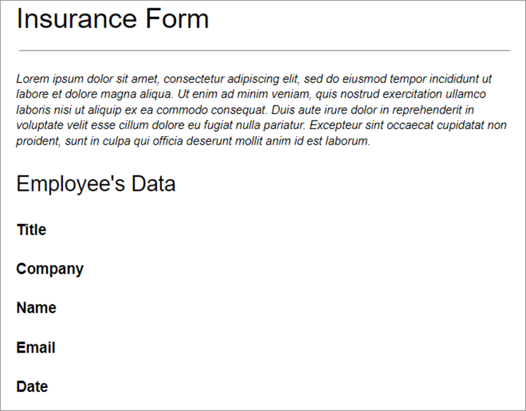
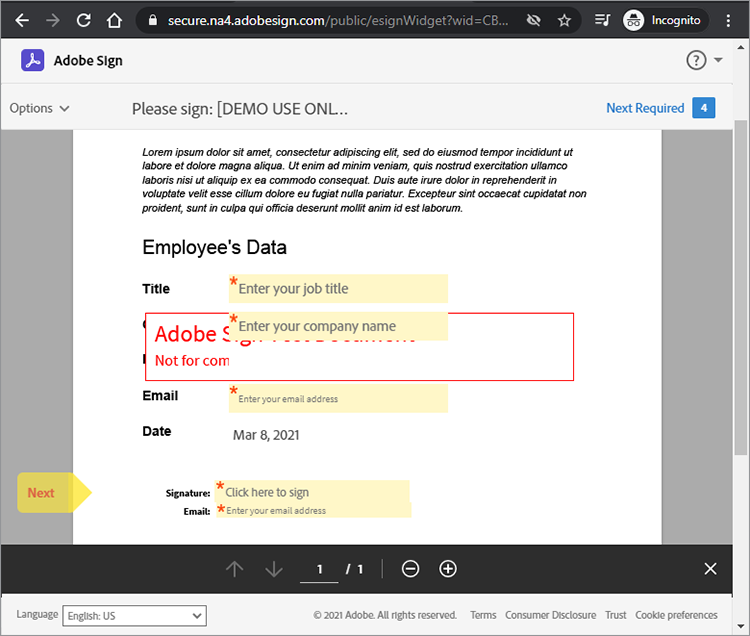

# Adobe Sign API 入門


[Acrobat Sign API](https://www.adobe.io/apis/documentcloud/sign.html) は、署名済み契約書の管理方法を強化するのに最適な方法です。 開発者は、システムを Sign API と簡単に統合できます。これにより、文書のアップロード、署名用に文書を送信、リマインダーを送信、電子サインを収集する信頼性の高い簡単な方法が提供されます。

## 学習内容

この実践チュートリアルでは、開発者が Sign API を使用して、 [!DNL Adobe Acrobat Services]を選択します。 [!DNL Acrobat Services] includes [Adobe PDF Services API](https://www.adobe.io/apis/documentcloud/dcsdk/pdf-tools.html), [Adobe PDF Embed API](https://www.adobe.io/apis/documentcloud/viesdk) （無料）および [Adobeドキュメント生成 API](https://www.adobe.io/apis/documentcloud/dcsdk/doc-generation.html)を選択します。

具体的には、Acrobat Sign API をアプリケーションに組み込んで、署名や、保険書類の従業員情報などのその他の情報を収集する方法について説明します。 簡略化された HTTP 要求と応答を持つ一般的な手順が使用されます。 これらのリクエストは、お好みの言語で実装できます。 PDFは、 [[!DNL Acrobat Services] API](https://www.adobe.io/apis/documentcloud/dcsdk/)で、Sign API に [transient](https://www.adobe.io/apis/documentcloud/sign/docs.html#!adobedocs/adobe-sign/master/overview/terminology.md) 契約書または [widget](https://www.adobe.io/apis/documentcloud/sign/docs.html#!adobedocs/adobe-sign/master/overview/terminology.md) ワークフロー

## ドキュメントPDFの作成

まず、Microsoft Word テンプレートを作成し、PDFとして保存します。 または、ドキュメント生成 API を使用してパイプラインを自動化し、Word で作成したテンプレートをアップロードしてから、PDF文書を生成します。 文書生成 API は [!DNL Acrobat Services], [6 ヶ月間無料で使用でき、従量課金制でドキュメントトランザクションあたり 0.05 USD でご利用いただけます](https://www.adobe.io/apis/documentcloud/dcsdk/pdf-pricing.html)を選択します。

この例では、テンプレートは数個の署名者フィールドが入力される単純な文書です。 フィールドに名前を付け、このチュートリアルで実際のフィールドを挿入します。



## 有効な API アクセスポイントを検出しています

Sign API を使用する前に、 [無料の開発者アカウントを作成する](https://acrobat.adobe.com/ca/en/sign/developer-form.html) api にアクセスするには、ドキュメントの交換と実行をテストし、電子メール機能をテストします。

Adobeは、Acrobat Sign API を「シャード」と呼ばれる様々なデプロイメントユニットで世界中に配布しています。 各シャードは、NA1、NA2、NA3、EU1、JP1、AU1、IN1 などの顧客のアカウントに対応します。 シャード名は地理的な位置に対応しています。 これらのシャードは、API エンドポイントのベース URI（アクセスポイント）を構成します。

Sign API にアクセスするには、まずアカウントの正しいアクセスポイントを見つける必要があります。これは、場所によって api.na1.adobesign.com、api.na4.adobesign.com、api.eu1.adobesign.com などになります。

```
  GET /api/rest/v6/baseUris HTTP/1.1
  Host: https://api.adobesign.com
  Authorization: Bearer {YOUR-INTEGRATION-KEY-HERE}
  Accept: application/json

  Response Body (example):

  {
    "apiAccessPoint": "https://api.na4.adobesign.com/", 
    "webAccessPoint": "https://secure.na4.adobesign.com/" 
  }
```

上記の例では、は値をアクセスポイントとする応答です。

>[!IMPORTANT]
>
>この場合、それ以降に Sign API に対して行うすべてのリクエストでは、そのアクセスポイントを使用する必要があります。 地域にサービスを提供しないアクセスポイントを使用すると、エラーが発生します。

## 一時的なドキュメントのアップロード

Adobe Signでは、署名やデータ収集のために文書を準備する様々なフローを作成できます。 アプリケーションのフローに関係なく、最初にドキュメントをアップロードする必要があります。このドキュメントは 7 日間のみ使用できます。 その後の API 呼び出しでは、この一時ドキュメントを参照する必要があります。

文書は、POST要求を `/transientDocuments` 端点： マルチパート要求は、ファイル名、ファイルストリーム、およびドキュメントファイルの MIME（メディア）タイプで構成されます。 エンドポイントの応答には、文書を識別する ID が含まれます。

また、アプリケーションでは、Acrobat Signから ping へのコールバック URL を指定して、署名プロセスの完了時にアプリに通知することもできます。


```
  POST /api/rest/v6/transientDocuments HTTP/1.1
  Host: {YOUR-API-ACCESS-POINT}
  Authorization: Bearer {YOUR-INTEGRATION-KEY-HERE}
  x-api-user: email:your-api-user@your-domain.com
  Content-Type: multipart/form-data
  File-Name: "Insurance Form.pdf"
  File: "[path]\Insurance Form.pdf"
  Accept: application/json

  Response Body (example):

  {
     "transientDocumentId": "3AAA...BRZuM"
  }
```

## Web フォームの作成

Web フォーム（以前の署名ウィジェット）は、アクセス権を持つすべてのユーザーが署名できるホストされた文書です。 Web フォームの例としては、サインアップシート、権利放棄証書、および多くの人がオンラインでアクセスして署名するその他の文書などがあります。

Sign API を使用して新しい Web フォームを作成するには、まず一時的なドキュメントをアップロードする必要があります。 POSTリクエストを `/widgets` エンドポイントは、返された `transientDocumentId` を選択します。

この例では、Web フォームは `ACTIVE`ただし、次の 3 つの状態のいずれかで作成できます。

* ドラフト — Web フォームを増分的に作成します。

* AUTHORING — Web フォームのフォームフィールドを追加または編集します。

* ACTIVE — Web フォームをすぐにホストします。

フォームの参加者に関する情報も定義する必要があります。 この `memberInfos` プロパティには、電子メールなどの参加者のデータが含まれます。 現在、このセットは複数のメンバーをサポートしていません。 ただし、Web フォーム署名者の電子メールは Web フォームの作成時に不明であるため、次の例のように電子メールは空のままにする必要があります。 この `role` プロパティは、 `memberInfos` （署名者や承認者など）。

```
  POST /api/rest/v6/widgets HTTP/1.1
  Host: {YOUR-API-ACCESS-POINT}
  Authorization: Bearer {YOUR-INTEGRATION-KEY-HERE}
  x-api-user: email:your-api-user@your-domain.com
  Content-Type: application/json

  Request Body:

  {
    "fileInfos": [
      {
      "transientDocumentId": "YOUR-TRANSIENT-DOCUMENT-ID"
      }
     ],
    "name": "Insurance Form",
      "widgetParticipantSetInfo": {
          "memberInfos": [{
              "email": ""
          }],
      "role": "SIGNER"
      },
      "state": "ACTIVE"
  }

  Response Body (example):

  {
     "id": "CBJ...PXoK2o"
  }
```

Web フォームは、 `DRAFT` または `AUTHORING`を選択し、フォームがアプリケーションパイプラインを通過するときに状態を変更します。 Web フォームの状態を変更するには、 [PUT/widgets/{widgetId}/state](https://secure.na4.adobesign.com/public/docs/restapi/v6#!/widgets/updateWidgetState) 端点：

## Web フォームホスティング URL の読み取り

次の手順は、Web フォームをホストしている URL を見つけることです。 /widgets エンドポイントは、署名およびその他のフォームデータを収集するために、ユーザーに転送する Web フォームのホスト URL を含む Web フォームデータの一覧を取得します。

このエンドポイントはリストを返すので、 `userWidgetList` web フォームをホストする URL を取得する前に、次の操作を行います。

```
  GET /api/rest/v6/widgets HTTP/1.1
  Host: {YOUR-API-ACCESS-POINT}
  Authorization: Bearer {YOUR-INTEGRATION-KEY-HERE}
  Accept: application/json

  Response Body:

  {
    "userWidgetList": [
      {
        "id": "CBJCHB...FGf",
        "name": "Insurance Form",
        "groupId": "CBJCHB...W86",
        "javascript": "<script type='text/javascript' ...
        "modifiedDate": "2021-03-13T15:52:41Z",
        "status": "ACTIVE",
        "Url":
        "https://secure.na4.adobesign.com/public/esignWidget?wid=CBFCIB...Rag*",
        "hidden": false
      },
      {
        "id": "CBJCHB...I8_",
        "name": "Insurance Form",
        "groupId": "CBJCHBCAABAAyhgaehdJ9GTzvNRchxQEGH_H1ya0xW86",
        "javascript": "<script type='text/javascript' language='JavaScript'
        src='https://sec
        "modifiedDate": "2021-03-13T02:47:32Z",
        "status": "ACTIVE",
        "Url":
        "https://secure.na4.adobesign.com/public/esignWidget?wid=CBFCIB...AAB",
        "hidden": false
      },
      {
        "id": "CBJCHB...Wmc",
```

## Web フォームの管理

このフォームは、ユーザーがPDFに入力するための入力用ドキュメントです。 ただし、ユーザーが入力する必要があるフィールドと、文書内のそのフィールドの場所を、フォームのエディターに伝える必要があります。


上記の文書には、まだフィールドが表示されていません。 これらのフィールドは、署名者の情報、サイズ、位置を収集するフィールドを定義するときに追加されます。

次に、 [Web フォーム](https://secure.na4.adobesign.com/public/agreements/#agreement_type=webform) 」タブをクリックし、作成したフォームを見つけます。


クリック **編集** をクリックして、ドキュメント編集ページを開きます。 使用可能な定義済みフィールドは右側のパネルにあります。


このエディターでは、テキストフィールドと署名フィールドをドラッグ&amp;ドロップできます。 必要なフィールドをすべて追加したら、サイズを変更したり整列させたりして、フォームを仕上げることができます。 最後に、「 **保存** 」をクリックします。


## 署名用の Web フォームの送信

Web フォームの入力が完了したら、ユーザーがフォームに入力して署名できるように、フォームを送信する必要があります。 フォームを保存すると、URL と埋め込みコードを表示してコピーできます。

**Web フォーム URL をコピー**:この URL を使用して、レビューおよび署名用にこの契約書のホスト版にユーザーを送信します。 次に例を示します。

[https://secure.na4.adobesign.com/public/esignWidget?wid=CBFCIBAA3babw\*](https://secure.na4.adobesign.com/public/esignWidget?wid=CBFCIBAA3AAABLblqZhCndYscuKcDMPiVfQlpaGPb-5D7ebE9NUTQ6x6jK7PIs8HCtTzr3HOx8U6D5qqbabw*)

**Web フォーム埋め込みコードをコピー**:このコードをコピーして Web サイトに貼り付け、契約書を Web サイトにHTMLします。

次に例を示します。

```
<iframe
src="https://secure.na4.adobesign.com/public/esignWidget?wid=CBFC
...yx8*&hosted=false" width="100%" height="100%" frameborder="0"
style="border: 0;
overflow: hidden; min-height: 500px; min-width: 600px;"></iframe>
```


ユーザーがホストされているバージョンのフォームにアクセスすると、一時的なドキュメントが最初にアップロードされ、指定されたフィールドの位置でレビューされます。



その後、ユーザーはフィールドに入力してフォームに署名します。


次に、ユーザーは以前に保存した署名を使用するか、新しい署名を使用して文書に署名します。


ユーザーが **適用**&#x200B;で、Adobeは電子メールを開いて署名を確認するように指示します。 署名は、確認メッセージが届くまで保留状態のままです。


この認証により、多要素認証が追加され、署名プロセスのセキュリティが強化されます。


## 完了した Web フォームの読み取り

次に、ユーザーが入力したフォームデータを取得します。 この `/widgets/{widgetId}/formData` エンドポイントは、ユーザーがフォームに署名したときに、ユーザーが入力したデータをインタラクティブフォームに取得します。

```
GET /api/rest/v6/widgets/{widgetId}/formData HTTP/1.1
Host: {YOUR-API-ACCESS-POINT}
Authorization: Bearer {YOUR-INTEGRATION-KEY-HERE}
Accept: text/csv
```

結果の CSV ファイルストリームには、フォームデータが含まれます。

```
Response Body:
"Agreement
name","completed","email","role","first","last","title","company","agreementId",
"email verified","web form signed/approved"
"Insurance Form","","myemail@email.com","SIGNER","John","Doe","My Job Title","My
Company Name","","","2021-03-07 19:32:59"
```

## 契約書の作成

Web フォームの代わりに、契約書を作成することもできます。 次のセクションでは、Sign API を使用して契約書を管理するための簡単な手順を示します。

署名または承認のために文書を指定された受信者に送信すると、契約書が作成されます。 API を使用して、契約書のステータスと完了を追跡できます。

契約書は、 [一時的文書](https://helpx.adobe.com/sign/kb/how-to-send-an-agreement-through-REST-API.html), [ライブラリ文書](https://www.adobe.io/apis/documentcloud/sign/docs.html#!adobedocs/adobe-sign/master/samples/send_using_library_doc.md)、または URL。 この例では、契約書は `transientDocumentId`を作成します。

```
POST /api/rest/v6/agreements HTTP/1.1
Host: {YOUR-API-ACCESS-POINT}
Authorization: Bearer {YOUR-INTEGRATION-KEY-HERE}
x-api-user: email:your-api-user@your-domain.com
Content-Type: application/json
Accept: application/json
Request Body:
{
    "fileInfos": [
      {
      "transientDocumentId": "{transientDocumentId}"
      }
     ],
    "name": "{agreementName}",
    "participantSetsInfo": [
      {
      "memberInfos": [
          {
          "email": "{signerEmail}"
          }
        ],
        "order": 1,
        "role": "SIGNER"
      }
    ],
    "signatureType": "ESIGN",
    "state": "IN_PROCESS"
  }
```

この例では、契約書は IN_PROCESS として作成されますが、次の 3 つの状態のいずれかで作成できます。

* ドラフト — 契約書を送信する前に、契約書を増分的に作成します。

* オーサリング — 契約書のフォームフィールドを追加または編集します。

* IN_PROCESS — 契約書をすぐに送信します。

契約書の状態を変更するには、 `PUT /agreements/{agreementId}/state` エンドポイントを使用して、次のいずれかの許可された状態遷移を実行します。

* 下書きからオーサリング

* IN_PROCESS へのオーサリング

* IN_PROCESS をキャンセルしました

この `participantSetsInfo` 上記のプロパティは、契約書に参加する予定のユーザーと実行するアクション（署名、承認、確認など）の電子メールを提供します。 上記の例では、構成要素は 1 つだけです。署名者 手書き署名は、文書 1 件につき 4 件までに制限されています。

Web フォームとは異なり、契約書を作成すると、Adobeは署名用に自動的に送信します。 エンドポイントは、契約書の一意の識別子を返します。


```
  Response Body:

  {
     id (string): The unique identifier of the agreement
  }
```

## 契約メンバーに関する情報の取得

契約書を作成したら、 `/agreements/{agreementId}/members` エンドポイント：契約書のメンバーに関する情報を取得します。 例えば、参加者が契約書に署名したかどうかを確認できます。

```
GET /api/rest/v6/agreements/{agreementId}/members HTTP/1.1
Host: {YOUR-API-ACCESS-POINT}
Authorization: Bearer {YOUR-INTEGRATION-KEY-HERE}
Accept: application/json
```

結果の JSON 応答の本文には、参加者に関する情報が含まれます。

```
  Response Body:

  {
     "participantSets":[
        {
           "memberInfos":[
              {
                 "id":"CBJ...xvM",
                 "email":"participant@email.com",
                 "self":false,
                 "securityOption":{
                    "authenticationMethod":"NONE"
                 },
                 "name":"John Doe",
                 "status":"ACTIVE",
                 "createdDate":"2021-03-16T03:48:39Z",
                 "userId":"CBJ...vPv"
              }
           ],
           "id":"CBJ...81x",
           "role":"SIGNER",
           "status":"WAITING_FOR_MY_SIGNATURE",
           "order":1
        }
     ],
```

## 契約書リマインダーの送信

ビジネスルールによっては、期限によっては、参加者が特定の日付以降に契約書に署名できない場合があります。 契約書に有効期限がある場合は、有効期限が近づいたことを参加者に通知できます。

お客様が `/agreements/{agreementId}/members` エンドポイント最後のセクションでは、まだ契約書に署名していないすべての参加者に電子メールリマインダーを発行できます。

POSTリクエストを `/agreements/{agreementId}/reminders` エンドポイントは、 `agreementId` パラメーターを使用します。

```
POST /agreements/{agreementId}/reminders HTTP/1.1
Host: {YOUR-API-ACCESS-POINT}
Authorization: Bearer {YOUR-INTEGRATION-KEY-HERE}
x-api-user: email:your-api-user@your-domain.com
Content-Type: application/json
Accept: application/json
  Request Body:

  {
    "recipientParticipantIds": [{agreementMemberIdList}],
    "agreementId": "{agreementId}",
    "note": "This is a reminder that you haven't signed the agreement yet.",
    "status": "ACTIVE"
  }

  Response Body:

  {
     id (string, optional): An identifier of the reminder resource created on the
     server. If provided in POST or PUT, it will be ignored
  }
```

リマインダーを投稿すると、契約書の詳細と契約書へのリンクが記載された電子メールがユーザーに送信されます。


## 完了した契約書の読み取り

Web フォームと同様に、受信者が署名した契約書の詳細を読むことができます。 この `/agreements/{agreementId}/formData` エンドポイントは、ユーザーが Web フォームに署名したときに入力したデータを取得します。

```
GET /api/rest/v6/agreements/{agreementId}/formData HTTP/1.1
Host: {YOUR-API-ACCESS-POINT}
Authorization: Bearer {YOUR-INTEGRATION-KEY-HERE}
Accept: text/csv
Response Body:
"completed","email","role","first","last","title","company","agreementId"
"2021-03-16 18:11:45","myemail@email.com","SIGNER","John","Doe","My Job Title","My
Company Name","CBJCHBCAABAA5Z84zy69q_Ilpuy5DzUAahVfcNZillDt"
```

## 次の手順

Acrobat Sign API を使用すると、文書、Web フォーム、および契約書を管理できます。 Web フォームと契約書を使用して作成された、シンプルでありながら完全なワークフローは、開発者があらゆる言語を使用して実装できる汎用的な方法で実行されます。

Sign API のしくみの概要については、 [API の使用に関する開発者ガイド](https://www.adobe.io/apis/documentcloud/sign/docs.html#!adobedocs/adobe-sign/master/api_usage.md)を選択します。 このドキュメントには、この記事の手順の多くに関する短い記事と、その他の関連トピックが記載されています。

Acrobat Sign API は、 [シングルユーザーおよびマルチユーザーの電子サインプラン](https://acrobat.adobe.com/jp/ja/sign/pricing/plans.html)」を選択することで、ニーズに最適な価格モデルを選択できます。 Sign API をアプリに簡単に組み込めるようになったので、 [Acrobat Sign Webhooks](https://www.adobe.io/apis/documentcloud/sign/docs.html#!adobedocs/adobe-sign/master/webhooks.md)は、プッシュベースのプログラミングモデルです。 Webhooks を使用すると、Acrobat Signイベントを頻繁にチェックする代わりに、イベントが発生するたびに Sign API がPOSTコールバックリクエストを実行する HTTP URL を登録できます。 Webhooks を使用すると、リアルタイムで瞬時にアプリケーションを更新して、強力なプログラミングを実現できます。

詳細については、 [従量課金制](https://www.adobe.io/apis/documentcloud/dcsdk/pdf-pricing.html)、6 ヶ月間の無償のAdobe PDF Services API 体験版が終了し、無償のAdobe PDF Embed API が終了した場合。

ドキュメントの自動作成やドキュメントへの署名など、便利な機能をアプリに追加するには、 [[!DNL Adobe Acrobat Services]](https://www.adobe.io/apis/documentcloud/dcsdk/gettingstarted.html)を選択します。
