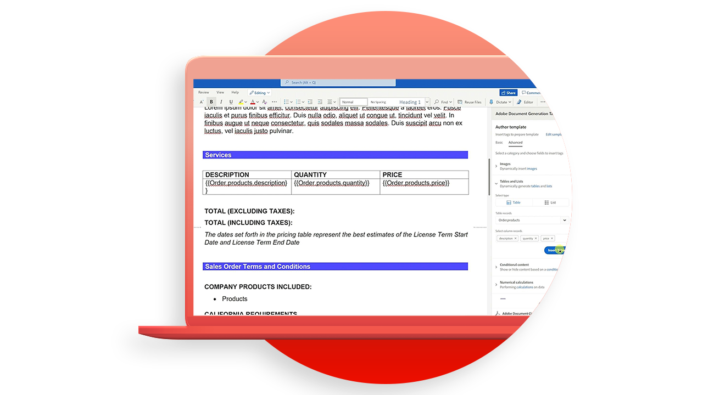

# Document Generation APIチュートリアル

Document Generation APIは、WordテンプレートとJSONデータからPDF文書とWord文書を作成します。

>[!NOTE]
>
>Document Generation APIは、PDFサービスAPIに含まれています。

## テンプレートの作成

Document Generation APIでは、入力データとともに（テンプレートタグが付いた）文書テンプレートを受け入れ、最終文書を生成します。 最終文書は、データ入力に対応する実際の値に基づいて、文書テンプレート内のすべてのテンプレートタグを動的コンテンツに置き換えることによって生成される。

<table style="table-layout:fixed">
<tr>
 <td>
   
    

   <a href="taggeroverview.md"><strong>Adobe文書生成タガーの概要</strong></a>
    

    <em>AdobeのDocument Generation APIで使用するように設計されたAdobeのDocument Generation Taggerの概要を確認します</em>
     
  </td>
  <td>
   
    

   <a href="taggeraddtexttags.md"><strong>テキストタグの追加</strong></a>
    

    <em>AdobeのDocument Generation APIで使用するAdobeのDocument Generation Taggerを使用して、Microsoft Wordテンプレートにテキストタグを追加する方法について説明します</em>
     
  </td>
  <td>
   
    

   <a href="taggeraddimagetags.md"><strong>画像タグの追加</strong></a>
    

    <em>AdobeのDocument Generation Taggerを使用してMicrosoft Wordテンプレートに画像タグを追加し、AdobeのDocument Generation APIを使用して画像を文書に動的にプッシュする方法について説明します。</em>
     
  </td>
  <td>
   
    

   <a href="taggertables.md"><strong>表とリストタグの追加</strong></a>
    

    <em>AdobeのDocument Generation Taggerを使用してMicrosoft Wordテンプレートに表とリストタグを追加し、AdobeのDocument Generation APIを使用してデータに基づいて表またはリストの行を動的に追加する方法について説明します。</em>
     
  </td>
</tr>
<tr>
  <td>
   
    

   <a href="taggercalculations.md"><strong>数値計算タグの設定</strong></a>
    

    <em>AdobeのDocument Generation Taggerを使用してMicrosoft Wordテンプレートで数値計算タグを設定し、AdobeのDocument Generation APIを使用してデータ値の集計または計算を行う方法について説明します。</em>
     
  </td>
  <td>
   
    

   <a href="taggerconditional.md"><strong>条件付きコンテンツの設定</strong></a>
    

    <em>AdobeのDocument Generation Taggerを使用してMicrosoft Wordテンプレートのセクションを設定し、AdobeのDocument Generation APIを使用してデータに基づいて文書のセクションを動的に含めるか除外する方法について説明します</em>
     
  </td>
  <td>
    
    

     
  </td>
   <td>
    
    

     
  </td>
</tr>
</table>
