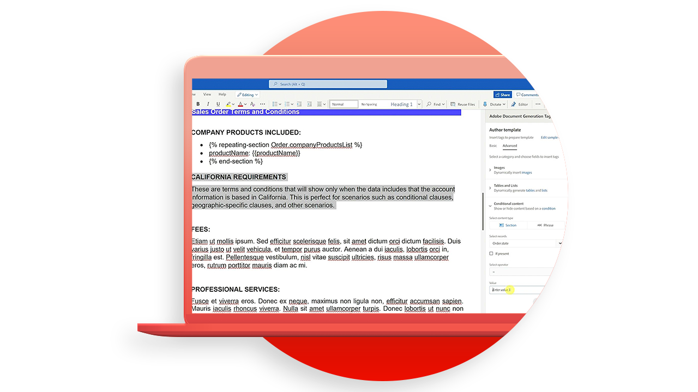

# 文書生成 API チュートリアル

ドキュメント生成 API は、Word テンプレートと JSON データからPDFドキュメントと Word ドキュメントを作成します。

>[!NOTE]
>
>ドキュメント生成 API は、PDFサービス API に含まれています。

## テンプレートの作成

ドキュメント生成 API では、最終的なドキュメントを生成するために、入力データとともにドキュメントテンプレート（テンプレートタグ付き）を受け取ります。 文書テンプレート内のすべてのテンプレートタグを、データ入力に対応する実際の値に基づく動的コンテンツに置き換えることにより、最終文書を生成する。

<table style="table-layout:fixed">
<tr>
 <td>
   
    

   <a href="taggeroverview.md"><strong>ドキュメント生成Adobeの概要</strong></a>
    

    <em>Adobeドキュメント生成 API で使用するように設計されたAdobeドキュメント生成タグの概要を取得</em>
     
  </td>
  <td>
   
    

   <a href="taggeraddtexttags.md"><strong>テキストタグの追加</strong></a>
    

    <em>Adobe文書生成タグを使用して、Microsoft Word テンプレートにテキストタグを追加し、Adobe文書生成 API で使用する方法を説明します</em>
     
  </td>
  <td>
   
    

   <a href="taggeraddimagetags.md"><strong>画像タグの追加</strong></a>
    

    <em>Adobe文書生成タグを使用してMicrosoft Word テンプレートに画像タグを追加し、Adobe文書生成 API を使用して画像を文書に動的にプッシュする方法について説明します</em>
     
  </td>
  <td>
   
    

   <a href="taggertables.md"><strong>テーブルおよびリストタグの追加</strong></a>
    

    <em>Adobe文書生成タグを使用して、Microsoft Word テンプレートに表やリストのタグを追加する方法を説明します。Adobe文書生成 API を使用して、データに基づいて表やリストの行を動的に追加できます</em>
     
  </td>
</tr>
<tr>
  <td>
   
    

   <a href="taggercalculations.md"><strong>数値計算タグの設定</strong></a>
    

    <em>Microsoft Word テンプレートで数値計算タグを設定し、Adobe文書生成タグを使用して、Adobe文書生成 API でデータ値の集計または演算を計算する方法について説明します</em>
     
  </td>
  <td>
   
    

   <a href="taggerconditional.md"><strong>条件付きコンテンツの設定</strong></a>
    

    <em>Adobe文書生成タグを使用してMicrosoft Word テンプレートのセクションを設定し、Adobe文書生成 API を使用して、データに基づいて文書のセクションを動的に含めたり除外したりする方法について説明します</em>
     
  </td>
  <td>
    
    

     
  </td>
   <td>
    
    

     
  </td>
</tr>
</table>
