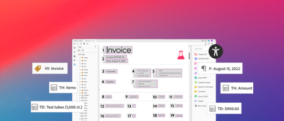

# [!DNL Adobe Acrobat Services] APIチュートリアル

[!DNL Adobe Acrobat Services]には6つの主なAPIがあります：

* [!DNL Adobe PDF Services API]
* [!DNL Adobe PDF Embed API]
* [!DNL Adobe Document Generation API]
* [!DNL Adobe PDF Electronic Seal API]
* [!DNL Adobe PDF Extract API]
* [!DNL Adobe PDF Accessibility Auto-Tag API]

後の2つのAPIとそのSDKは、有料サービスの一部として[!DNL Adobe PDF Services API]にバンドルされています。 [!DNL PDF Embed API]は無料サービスです。 これらのAPIは、最新のクラウドベースのWebサービスのセットを介して、ドキュメントコンテンツの生成、操作、変換を自動化します。 これらは、ドキュメントに対するユーザー操作の制御、PDFワークフローの合理化、使用と保持の促進など、シンプルで迅速なブランドエクスペリエンスを提供するのに役立ちます。 これらのチュートリアルでは、[!DNL Adobe Acrobat Services] APIを使用して、ブランド化されたエクスペリエンスをよりシンプルかつ迅速に提供します。

<table style="table-layout:fixed">
<tr>
  <td>
    
    

      <a href="pdfservices/overview-pdfservices.md"><strong>PDFサービスAPI</strong></a>
      

      node.js、.Net、Java用のSDKを使用して、PDFの作成、変換、OCRなどをPDFするAPI
       
  </td>
  <td>
    
    

      <a href="docgen/overview-docgen.md"><strong>Document Generation API</strong></a>
      

      WordテンプレートおよびJSONデータからPDF文書およびWord文書を生成
       
  </td>  
  <td>
    
    

      <a href="pdfaccessibility/overview-accessibility.md"><strong>PDFアクセシビリティ自動タグAPI</strong></a>
      

      このAIを活用したAPIにより、文書に自動的にタグ付けされるため、PDFのアクセシビリティを簡単に拡大・縮小できます
       
  </td>
  <td>
    
     

      <a href="pdfaccessibility/overview-accessibility.md"><strong>PDFエクストラクトAPI</strong></a>
      

      AdobeSensiの機械学習を活用したWebサービスで、あらゆるPDFの構造とコンテンツ要素を利用できます
       
  </td>
</tr>
<tr>
  <td>
    
    

      <a href="pdfelectronicseal/overview-electronic-seal.md"><strong>PDF eシールAPI</strong></a>
      

      改ざんの跡がすぐわかるeシールを大規模なPDFに適用する方法を説明します
       
  </td>
  <td>
    
    

      <a href="pdfembed/overview-embed.md"><strong>PDF埋め込みAPI</strong></a>
      

      無料のJavascript APIにより、忠実度の高いPDFを埋め込み、共同作業を可能にし、分析を表示
       
  </td>
  <td>
    
    

      <a href="acrobatsign/overview-sign.md"><strong>Acrobat Sign API</strong></a>
      

      電子サインをプラットフォームまたはアプリケーションに統合
       
  </td>
   <td>
    
    

      <a href="usecases/overview-usecases.md"><strong>AcrobatサービスAPIの使用例</strong></a>
      

      様々なAcrobatサービスAPIのユースケース
       
  </td>
</tr>
</table>
