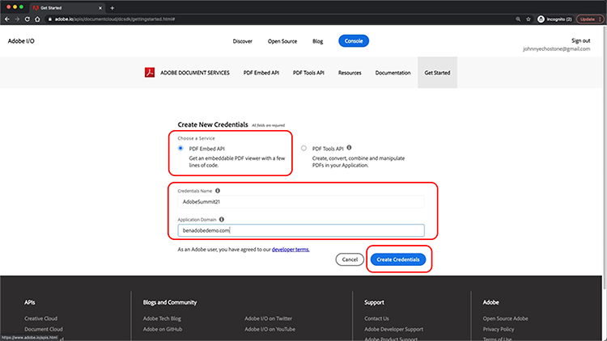
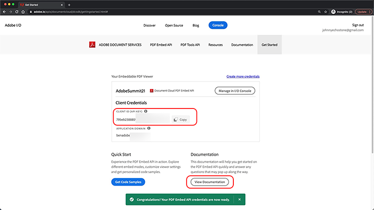
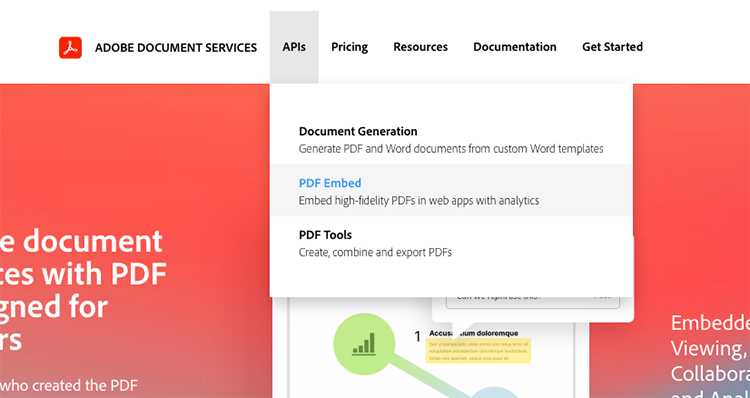
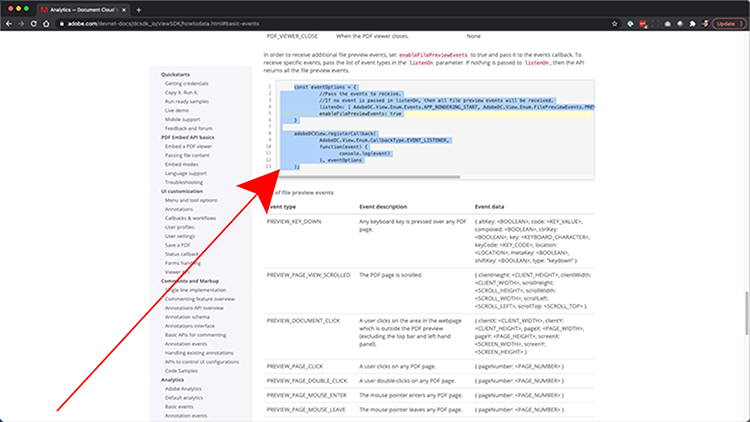
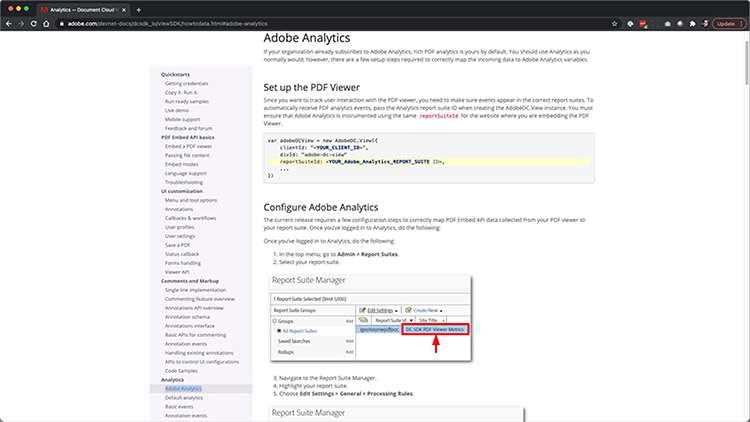

# PDFのオンラインエクスペリエンスを制御し、分析を収集

所属する組織がwebサイトにPDFを投稿していますか？ Adobe PDF Embed APIを使用して外観をコントロールし、共同作業を有効にし、ユーザーがPDFーとどのように対話するかについての分析（ページと検索に費やした時間など）を収集する方法について説明します。 この4部構成の実践チュートリアルを開始するには、*PDF埋め込みAPIの概要*&#x200B;を選択します。

<table style="table-layout:fixed">
<tr>
  <td>
    <a href="controlpdfexperience.md#part1">
        
    </a>
    <div>
    <a href="controlpdfexperience.md#part1"><strong>パート1: PDF埋め込みAPIの概要</strong></a>
    </div>
  </td>
  <td>
    <a href="controlpdfexperience.md#part2">
        
    </a>
    <div>
    <a href="controlpdfexperience.md#part2"><strong>パート2: WebページにPDF埋め込みAPIを追加しています</strong></a>
    </div>
  </td>
  <td>
   <a href="controlpdfexperience.md#part3">
      
   </a>
    <div>
    <a href="controlpdfexperience.md#part3"><strong>パート3: Analytics APIへのアクセス</strong></a>
    </div>
  </td>
  <td>
   <a href="controlpdfexperience.md#part4">
      
   </a>
    <div>
    <a href="controlpdfexperience.md#part4"><strong>パート4:イベントに基づくインタラクティブ機能の追加</strong></a>
    </div>
  </td>
</tr>
</table>

## パート1:PDF埋め込みAPIの概要 {#part1}

パート1では、パート1～3に必要なものをすべて使い始める方法を説明します。 API資格情報の取得から始めます。

**必要な項目**

* チュートリアルリソース[ダウンロード](https://github.com/benvanderberg/adobe-pdf-embed-api-tutorial)
* Adobe ID [こちら](https://accounts.adobe.com/jp)から入手してください
* Webサーバー（Node JS、PHPなど）
* HTML/JavaScript/CSSに関する実務知識

**ご利用のプラン**

* 基本的なWebサーバー（ノード）
* Visual Studioコード
* GitHub

### 資格情報の取得

1. [Adobe.ioのwebサイト](https://www.adobe.io/)に移動します。
1. 「魅力的なドキュメントエクスペリエンスを構築する」の「**[!UICONTROL 詳細情報]**」をクリックします。

   ![[詳細情報]ボタンのスクリーンショット](assets/ControlPDF_1.png)

   これにより、[!DNL Adobe Acrobat Services]ホームページに移動します。

1. ナビゲーションバーの&#x200B;**[!UICONTROL 開始]**&#x200B;をクリックします。

   **[!DNL Acrobat Services] APIの使用を開始**&#x200B;して、**新しい資格情報を作成**&#x200B;するか、**既存の資格情報を管理**&#x200B;するためのオプションが表示されます。

1. **[!UICONTROL 新しい資格情報の作成]**&#x200B;の下にある&#x200B;**[!UICONTROL 開始]**&#x200B;ボタンをクリックします。

   ![[開始]ボタンのスクリーンショット](assets/ControlPDF_2.png)

1. 「**[!UICONTROL Application Embed API]**」ラジオボタンを選択し、次のウィンドウで任意の資格情報名とPDFドメインを追加します。

   >[!NOTE]
   >
   >これらの資格情報は、ここにリストされているアプリケーションドメインでのみ使用できます。 任意のドメインを選択して使用できます。

   

1. **[!UICONTROL [資格情報の作成]]**&#x200B;をクリックします。

   ウィザードの最後のページに、クライアントの認証情報の詳細が表示されます。 このウィンドウは開いたままにしておきます。戻ってクライアントID（APIキー）をコピーし、後で使用することができます。

1. **[!UICONTROL ドキュメントの表示]**&#x200B;をクリックすると、このAPIの使用方法に関する詳細な情報が記載されたドキュメントに移動します。

   

## パート2:webページへのPDF埋め込みAPIの追加 {#part2}

パート2では、PDF埋め込みAPIを簡単にwebページに埋め込む方法を説明します。 そのためには、Adobe PDF Embed APIのオンラインデモを使用し、コードを作成します。

### 演習コードを取得する

使用するコードを作成しました。 独自のコードを使用できますが、デモはチュートリアルのリソースに関連しています。 サンプルコード[こちら](https://github.com/benvanderberg/adobe-pdf-embed-api-tutorial)をダウンロードします。

1. [[!DNL Adobe Acrobat Services] webサイト](https://www.adobe.io/apis/documentcloud/dcsdk/)に移動します。

   ![[!DNL Adobe Acrobat Services]のWebサイトのスクリーンショット](assets/ControlPDF_6.png)

1. ナビゲーションバーの&#x200B;**[!UICONTROL API]**&#x200B;をクリックし、ドロップダウンリンクの&#x200B;**[!UICONTROL PDF埋め込みAPI]**&#x200B;ページに移動します。

   

1. 「**[!UICONTROL デモを試す]**」をクリックします。

   PDF埋め込みAPIのデベロッパーサンドボックスを含む新しいウィンドウが表示されます。

   のスクリーンショット

   ここでは、様々な表示モードのオプションを確認できます。

1. フルウィンドウ、サイズ調整されたコンテナ、インライン、ライトボックスの表示モードをクリックします。

   

1. **[!UICONTROL [ウィンドウ全体]]**&#x200B;表示モードをクリックし、**[!UICONTROL [カスタマイズ]]**&#x200B;ボタンをクリックして、オプションのオンとオフを切り替えます。

   ![[カスタマイズ]ボタンのスクリーンショット](assets/ControlPDF_10.png)

1. **[!UICONTROL ダウンロード]** PDFオプションを無効にします。
1. **[!UICONTROL [コードの生成]]**&#x200B;ボタンをクリックして、コードプレビューを表示します。
1. パート1のクライアント資格情報ウィンドウから&#x200B;**[!UICONTROL クライアントID]**&#x200B;をコピーします。

   

1. コードエディターで&#x200B;**[!UICONTROL Web]** -> **[!UICONTROL resources]** -> **[!UICONTROL js]** -> **[!UICONTROL dc-config.js]**&#x200B;ファイルを開きます。

   clientID変数があることがわかります。

1. 二重引用符の間にクライアント資格情報を貼り付けて、clientIDを資格情報に設定します。

1. 開発者サンドボックスコードプレビューに戻ります。

1. Adobeスクリプトがある2行目をコピーします。

   ```
   <script src=https://documentccloud.adobe.com/view-sdk/main.js></script>
   ```

   

1. コードエディターに移動して、**[!UICONTROL Web]** -> **[!UICONTROL exercise]** -> **[!UICONTROL index.html]**&#x200B;ファイルを開きます。

1. 次のコメントの下の18行のファイルの`<head>`にスクリプトコードを貼り付けます： **TODO：演習1: INSERT EMBED API SCRIPT TAG**。

   

1. デベロッパーサンドボックスコードプレビューに戻り、次のコードを含むコードの最初の行をコピーします。

   ```
   <div id="adobe-dc-view"></div>
   ```

   

1. コードエディターに移動して、もう一度&#x200B;**[!UICONTROL Web]** -> **[!UICONTROL exercise]** -> **[!UICONTROL index.html]**&#x200B;ファイルを開きます。

1. `<div>`コードを、**TODO: EXERCISE 1: INSERT PDF埋め込みAPIコード**&#x200B;というコメントの下、67行のファイルの`<body>`に貼り付けます。

   

1. 開発者サンドボックスコードプレビューに戻り、以下の`<script>`のコード行をコピーします：

   ```
   <script type="text/javascript">
       document.addEventListener("adobe_dc_view_sdk.ready",             function(){ 
           var adobeDCView = new AdobeDC.View({clientId:                     "<YOUR_CLIENT_ID>", divId: "adobe-dc-view"});
           adobeDCView.previewFile({
               content:{location: {url: "https://documentcloud.                adobe.com/view-sdk-demo/PDFs/Bodea Brochure.                    pdf"}},
               metaData:{fileName: "Bodea Brochure.pdf"}
           }, {showDownloadPDF: false});
       });
   </script>
   ```

1. コードエディターに移動して、もう一度&#x200B;**[!UICONTROL Web]** -> **[!UICONTROL exercise]** -> **[!UICONTROL index.html]**&#x200B;ファイルを開きます。

1. `<script>`コードを68行の`<div>`タグの下にあるファイルの`<body>`に貼り付けます。

1. 同じ&#x200B;**index.html**&#x200B;ファイルの70行目を変更して、以前に作成されたclientID変数を含めます。

   

1. 同じ&#x200B;**index.html**&#x200B;ファイルの72行目を変更して、ローカルファイルを使用するようにPDFファイルの場所を更新します。

   **/resources/pdfs/whitepaper.pdf**&#x200B;のチュートリアルファイルで使用可能なものがあります。

1. 変更したファイルを保存し、**`<your domain>`/summit21/web/exercise/**&#x200B;に移動してWebサイトをプレビューします。

   Technical Whitepaperのレンダリング結果が、ブラウザーのフルウィンドウモードに表示されます。

## パート3: Analytics APIへのアクセス {#part3}

これで、PDFをレンダリングするPDF埋め込みAPIを含むwebページが正常に作成されました。第3部では、JavaScript PDFを使用して分析を測定し、ユーザーがイベントをどのように使用しているかを理解する方法を確認できるようになりました。

### ドキュメントの検索

PDF埋め込みAPIの一部として使用できるJavaScriptイベントは数多くあります。 [!DNL Adobe Acrobat Services]のドキュメントからアクセスできます。

1. [ドキュメント](https://www.adobe.io/apis/documentcloud/dcsdk/docs.html)サイトに移動します。
1. APIの一部として使用できる様々なイベントタイプを確認します。 これらは参考になり、今後のプロジェクトでも役立ちます。

   

1. Webサイトに記載されているサンプルコードをコピーします。

   これをコードの基準として使用し、変更します。

   

   ```
   const eventOptions = {
     //Pass the PDF analytics events to receive.
      //If no event is passed in listenOn, then all PDF         analytics events will be received.
   listenOn: [ AdobeDC.View.Enum.PDFAnalyticsEvents.    PAGE_VIEW, AdobeDC.View.Enum.PDFAnalyticsEvents.DOCUMENT_DOWNLOAD],
     enablePDFAnalytics: true
   }
   
   
   adobeDCView.registerCallback(
     AdobeDC.View.Enum.CallbackType.EVENT_LISTENER,
     function(event) {
       console.log("Type " + event.type);
       console.log("Data " + event.data);
     }, eventOptions
   );
   ```

1. 前に追加したコードセクションを以下のように検索し、このコードの後に上のコードを&#x200B;**index.html**&#x200B;に追加します。

   

1. Webブラウザーにページを読み込み、コンソールを開いて、PDFビューアを操作するさまざまなイベントからのコンソール出力を表示します。

   

   

### イベントをキャプチャするためのスイッチを追加

これでconsole.logに出力されるイベントが作成されました。次に、イベントに基づいて動作を変更しましょう。 これを行うには、スイッチの例を使用します。

1. **snippets/eventsSwitch.js**&#x200B;に移動し、ファイルの内容をチュートリアルコードにコピーします。

   

1. イベントリスナー関数にコードを貼り付けます。

   

1. ページが読み込まれ、PDFビューアを操作したときに、コンソールが正しく出力されることを確認します。

### Adobe Analytics

ビューアにAdobe Analyticsのサポートを追加する場合は、webサイトに記載されている手順に従います。

>[!IMPORTANT]
>
>Webページには、ヘッダーのページにAdobe Analyticsが既に読み込まれている必要があります。

[Adobe Analyticsドキュメント](https://www.adobe.com/devnet-docs/dcsdk_io/viewSDK/howtodata.html#adobe-analytics)に移動して、webページでAdobe Analyticsが既に有効になっているかどうかを確認します。 指示に従ってreportSuiteを設定します。

### Google Analytics



Adobe PDF Embed APIは、Adobe Analyticsとの事前定義済みの連携を提供します。 ただし、すべてのイベントはJavaScriptイベントとして使用できるため、PDFイベントを取得し、ga()関数を使用してGoogle AnalyticsをAdobe Analyticsに追加することで、イベントと統合できます。

1. **snippets/eventsSwitchGA.js**&#x200B;に移動して、Google Analyticsと連携する方法を確認してください。
1. WebページがAdobe Analyticsを使用してトラックされ、既にWebページに埋め込まれている場合は、このコードを確認して例として使用してください。

   

## パート4：イベントに基づくインタラクティブ機能の追加 {#part4}

パート4では、2ページ目をスクロールした後に表示されるペイウォールを、PDFビューアの上に重ねる方法について説明します。

### ペイウォールの例

この[ペイウォールの背後にあるPDFの例](https://www3.technologyevaluation.com/research/white-paper/the-forrester-wave-digital-decisioning-platforms-q4-2020.html)に移動します。 この例では、PDF表示エクスペリエンスの上にインタラクティブ機能を追加する方法を説明します。

### ペイウォールコードを追加

1. snippets/paywallCode.htmlに移動し、内容をコピーします。
1. exercise/index.htmlで`<!-- TODO: EXERCISE 3: INSERT PAYWALL CODE -->`を検索します。

   

1. コピーしたコードをコメントの後に貼り付けます。
1. **snippets/paywallCode.js**&#x200B;に移動し、内容をコピーします。

   

1. コードをその場所に貼り付けます。

### ペイウォールでデモを試す

これで、デモを表示できます。

1. Webサイトで&#x200B;**index.html**&#x200B;を再読み込みします。
1. 下にスクロールして> 2ページを表示します。
1. 2ページ目の後に、チャレンジユーザーに上がるダイアログを表示します。

   

## その他の参考資料

その他のリソースは、[こちら](https://www.adobe.io/apis/documentcloud/dcsdk/docs.html)で確認できます。
