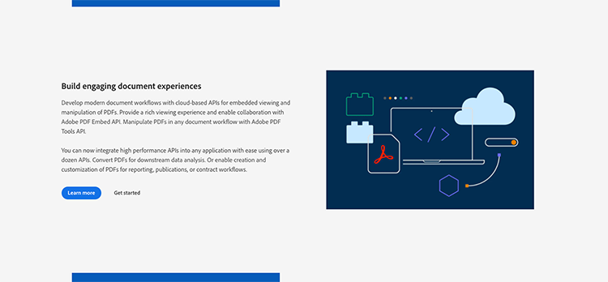
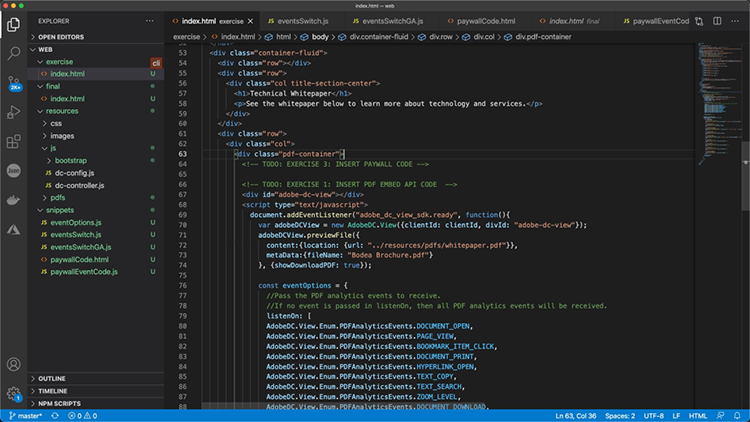

# オンラインPDF体験を制御し、分析を収集

自社の web サイトにPDFを投稿していますか？ Adobe PDF Embed API を使用して外観を制御し、共同作業を可能にし、ページや検索に費やした時間など、ユーザーのPDFとのやり取りに関する分析を収集する方法について説明します。 この 4 部構成のハンズオンチュートリアルを開始するには、 *PDF埋め込み API 入門*&#x200B;を選択します。

<table style="table-layout:fixed">
<tr>
  <td>
    <a href="controlpdfexperience.md#part1">
        
    </a>
    <div>
    <a href="controlpdfexperience.md#part1"><strong>パート 1:PDF埋め込み API 入門</strong></a>
    </div>
  </td>
  <td>
    <a href="controlpdfexperience.md#part2">
        
    </a>
    <div>
    <a href="controlpdfexperience.md#part2"><strong>パート 2:Web ページへのPDF埋め込み API の追加</strong></a>
    </div>
  </td>
  <td>
   <a href="controlpdfexperience.md#part3">
      
   </a>
    <div>
    <a href="controlpdfexperience.md#part3"><strong>パート 3:Analytics API へのアクセス</strong></a>
    </div>
  </td>
  <td>
   <a href="controlpdfexperience.md#part4">
      
   </a>
    <div>
    <a href="controlpdfexperience.md#part4"><strong>パート 4:イベントに基づいたインタラクティブ機能の追加</strong></a>
    </div>
  </td>
</tr>
</table>

## パート 1:PDF埋め込み API 入門 {#part1}

パート 1 では、パート 1 ～ 3 に必要なすべての作業の開始方法について説明します。 まず、API 資格情報を取得します。

**必要なもの**

* チュートリアルのリソース [ダウンロード](https://github.com/benvanderberg/adobe-pdf-embed-api-tutorial)
* Adobe ID [ここに届ける](https://accounts.adobe.com/jp)
* Web サーバー（ノード JS、PHP など）
* HTML/JavaScript/CSS の実用的な知識

**使用目的**

* 基本的な Web サーバー (Node)
* Visual Studio Code
* GitHub

### 資格情報の取得

1. 次の [Adobe.io web サイト](https://www.adobe.io/)を選択します。
1. クリック **[!UICONTROL 詳細]** 「魅力的なドキュメントのエクスペリエンスを構築」

   

   これにより、 [!DNL Adobe Acrobat Services] ホームページ、

1. クリック **[!UICONTROL はじめに]** をクリックします。

   オプションは **使用を開始する [!DNL Acrobat Services] API** を **新しい資格情報の作成** または **既存の資格情報の管理**&#x200B;を選択します。

1. クリック **[!UICONTROL はじめに]** 下のボタン **[!UICONTROL 新しい資格情報の作成]**&#x200B;を選択します。

   

1. 選択する **[!UICONTROL PDF埋め込み API]** 」ラジオボタンをクリックし、次のウィンドウで選択した資格証明名とアプリケーションドメインを追加します。

   >[!NOTE]
   >
   >これらの資格情報は、ここに表示されているアプリケーションドメインでのみ使用できます。 任意のドメインを選択して使用できます。

   

1. クリック **[!UICONTROL 資格情報の作成]**&#x200B;を選択します。

   ウィザードの最後のページに、クライアントの資格情報の詳細が表示されます。 このウィンドウを開いたままにしておくと、後で使用するためにクライアント ID（API キー）をコピーできます。

1. クリック **[!UICONTROL ドキュメントを見る]** を参照してください。

   

## パート 2:Web ページへのPDF埋め込み API の追加 {#part2}

パート 2 では、Web ページにPDF埋め込み API を簡単に埋め込む方法を学びます。 Adobe PDF Embed API オンラインデモを使用してコードを作成します。

### 演習コードを取得する

ご利用いただけるコードを作成しました。 独自のコードを使用することもできますが、デモンストレーションはチュートリアルリソースのコンテキストで行います。 サンプルコードをダウンロード [ここ](https://github.com/benvanderberg/adobe-pdf-embed-api-tutorial)を選択します。

1. 移動 [[!DNL Adobe Acrobat Services] web サイト](https://www.adobe.io/apis/documentcloud/dcsdk/)を選択します。

   ![スクリーンショット [!DNL Adobe Acrobat Services] web サイト](assets/ControlPDF_6.png)

1. クリック **[!UICONTROL API]** を選択し、 **[!UICONTROL PDF埋め込み API]** ページをクリックします。

   

1. クリック **[!UICONTROL デモを見る]**&#x200B;を選択します。

   開発者埋め込み API の開発者サンドボックスを含む新しいウィンドウがPDFされます。

   

   ここでは、様々な表示モードのオプションを確認できます。

1. フルウィンドウ、サイズコンテナ、インライン、ライトボックスのそれぞれの表示モードをクリックします。

   

1. クリック **[!UICONTROL ウィンドウ全体]** 表示モードで、 **[!UICONTROL カスタマイズ]** ボタンをクリックして、オプションのオンとオフを切り替えます。

   

1. 無効 **[!UICONTROL ダウンロード]** PDF
1. クリック **[!UICONTROL コードを生成]** 」ボタンをクリックして、コードプレビューを表示します。
1. コピー **[!UICONTROL クライアント ID]** パート 1 の「Client Credentials」ウィンドウ

   

1. パネルの「 **[!UICONTROL Web]** -> **[!UICONTROL resources]** -> **[!UICONTROL js]** -> **[!UICONTROL dc-config.js]** ファイルを開きます。

   clientID 変数が表示されます。

1. 二重引用符の間にクライアント資格情報を貼り付けて、clientID を資格情報に設定します。

1. 開発者サンドボックスのコードプレビューに戻ります。

1. 次のコマンドを実行して、コピー・スクリプトを含む 2 行目をAdobeします。

   ```
   <script src=https://documentccloud.adobe.com/view-sdk/main.js></script>
   ```

   

1. コードエディターを開き、 **[!UICONTROL Web]** -> **[!UICONTROL 練習]** -> **[!UICONTROL index.html]** します。

1. スクリプトコードを `<head>` 18 行目のファイルのコメントの下に次のように入力します。 **TODO:演習 1:埋め込み API スクリプトタグの挿入**&#x200B;を選択します。

   

1. 開発者サンドボックスコードプレビューに戻り、次のコードの最初の行をコピーします。

   ```
   <div id="adobe-dc-view"></div>
   ```

   

1. コードエディターを開き、 **[!UICONTROL Web]** -> **[!UICONTROL 練習]** -> **[!UICONTROL index.html]** ファイルを開きます。

1. ペースト `<div>` コードを `<body>` というコメントの下の 67 行目にあるファイルの **TODO:演習 1:挿入/PDF/埋め込み API コード**&#x200B;を選択します。

   

1. 開発者サンドボックスのコードプレビューに戻り、 `<script>` 下：

   ```
   <script type="text/javascript">
       document.addEventListener("adobe_dc_view_sdk.ready",             function(){ 
           var adobeDCView = new AdobeDC.View({clientId:                     "<YOUR_CLIENT_ID>", divId: "adobe-dc-view"});
           adobeDCView.previewFile({
               content:{location: {url: "https://documentcloud.                adobe.com/view-sdk-demo/PDFs/Bodea Brochure.                    pdf"}},
               metaData:{fileName: "Bodea Brochure.pdf"}
           }, {showDownloadPDF: false});
       });
   </script>
   ```

1. コードエディターを開き、 **[!UICONTROL Web]** -> **[!UICONTROL 練習]** -> **[!UICONTROL index.html]** ファイルを開きます。

1. ペースト `<script>` コードを `<body>` ファイルの 68 行目の `<div>` タグを使用します。

1. 同じ行 70 を修正 **index.html** ファイルに追加します。

   

1. 同じ行 72 を修正 **index.html** ファイル：ローカルファイルを使用するようにPDFファイルの場所を更新します。

   のチュートリアルファイルで使用可能なものがあります。 **/resources/pdfs/whitepaper.pdf**&#x200B;を選択します。

1. 変更したファイルを保存し、 **`<your domain>`/summit21/web/exercise/**&#x200B;を選択します。

   お使いのブラウザーで、フルウィンドウモードでレンダリングされたテクニカルホワイトペーパーをご覧ください。

## パート 3:Analytics API へのアクセス {#part3}

これで、PDFをレンダリングするPDF埋め込み API を含む Web ページの作成に成功しました。パート 3 では、JavaScript イベントを使用して分析を測定し、ユーザーがPDFをどのように使用しているかを理解する方法を探ることができます。

### ドキュメントの検索

イベント埋め込み API の一部として使用できる JavaScriptPDFは多数あります。 これらのファイルには、 [!DNL Adobe Acrobat Services] ドキュメント、

1. 次の場所にある [文書](https://www.adobe.io/apis/documentcloud/dcsdk/docs.html) サイト。
1. API の一部として使用できるさまざまなイベントタイプを確認します。 これらは参考になるだけでなく、今後のプロジェクトにも役立ちます。

   

1. Web サイトに表示されているサンプルコードをコピーします。

   これをコードのベースとして使用し、変更します。

   

   ```
   const eventOptions = {
     //Pass the PDF analytics events to receive.
      //If no event is passed in listenOn, then all PDF         analytics events will be received.
   listenOn: [ AdobeDC.View.Enum.PDFAnalyticsEvents.    PAGE_VIEW, AdobeDC.View.Enum.PDFAnalyticsEvents.DOCUMENT_DOWNLOAD],
     enablePDFAnalytics: true
   }
   
   
   adobeDCView.registerCallback(
     AdobeDC.View.Enum.CallbackType.EVENT_LISTENER,
     function(event) {
       console.log("Type " + event.type);
       console.log("Data " + event.data);
     }, eventOptions
   );
   ```

1. 前の手順で追加したコードセクションを以下のように検索し、 **index.html**:

   

1. Web ブラウザーにページを読み込み、コンソールを開いて、イベントビューアーを操作する際の様々なイベントからのコンソール出力をPDFします。

   

   

### イベントをキャプチャするためのスイッチの追加

これでイベントが console.log に出力されたので、イベントに基づいて動作を変更してみましょう。 これには、スイッチの例を使用します。

1. 次の場所に移動 **snippets/eventsSwitch.js** ファイルの内容をチュートリアルコードにコピーします。

   

1. イベントリスナー関数にコードをペーストします。

   

1. ページの読み込み時およびコンソールビューアの操作時に、コンソールが正しく出力されることをPDFします。

### Adobe Analytics

視聴者にAdobe Analyticsサポートを追加する場合は、Web サイトに記載されている手順に従ってください。

>[!IMPORTANT]
>
>Web ページのヘッダーには、既にAdobe Analyticsが読み込まれている必要があります。

次の場所にある [Adobe Analytics documentation](https://www.adobe.com/devnet-docs/dcsdk_io/viewSDK/howtodata.html#adobe-analytics) また、web ページでAdobe Analyticsが既に有効になっているかどうかも確認してください。 reportSuite の設定手順に従います。

### Google Analytics


Adobe PDF Embed API は、Adobe Analyticsとすぐに統合できます。 ただし、すべてのGoogle Analyticsは JavaScriptPDFとして使用できるので、イベントをキャプチャし、ga() 関数を使用してイベントをAdobe Analyticsに追加することで、イベントと統合できます。

1. 次の場所に移動 **snippets/eventsSwitchGA.js** を参照してください。Google Analytics
1. Web ページがAdobe Analyticsを使用して追跡され、既に Web ページに埋め込まれている場合は、このコードを例として確認して使用してください。

   

## パート 4:イベントに基づいたインタラクティブ機能の追加 {#part4}

パート 4 では、2 ページ目をスクロールして過ぎた後に表示されるペイウォールを、PDFビューアの上にレイヤー化する方法を説明します。

### Paywall の例

この [ペイウォールの背後にあるPDFの例](https://www3.technologyevaluation.com/research/white-paper/the-forrester-wave-digital-decisioning-platforms-q4-2020.html)を選択します。 この例では、インタラクティブ機能を追加し、さらにPDFを表示します。

### ペイウォールコードの追加

1. snippets/paywallCode.htmlに移動し、コンテンツをコピーします。
1. 検索対象 `<!-- TODO: EXERCISE 3: INSERT PAYWALL CODE -->` exercise/index.htmlを参照してください。

   

1. コピーしたコードをコメントの後にペーストします。
1. 移動 **snippets/paywallCode.js** を選択し、内容をコピーします。

   

1. コードをその場所にペーストします。

### Paywall でデモを試す

デモを表示できます。

1. リロード **index.html** できます。
1. ページ/2 まで下にスクロールします。
1. 2 ページ目の後にユーザーにチャレンジするためのダイアログを表示します。

   

## その他の参考資料

その他のリソース [ここ](https://www.adobe.io/apis/documentcloud/dcsdk/docs.html)を選択します。
