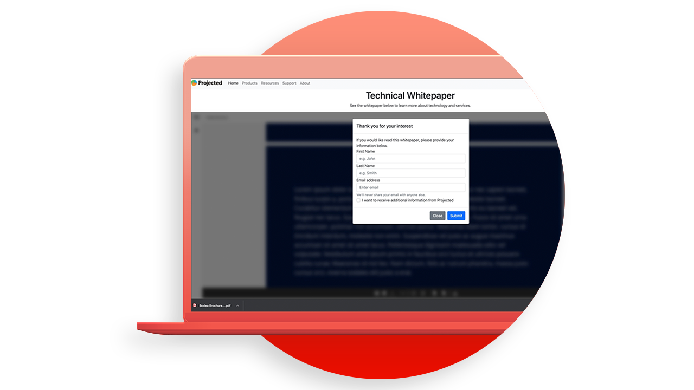

# Adobe PDF Embed API チュートリアル

PDF埋め込み API は、高精度のPDFを埋め込み、共同作業を可能にし、分析を表示するための無料の JavaScript API です。

<table style="table-layout:fixed">
<tr>
 <td>
   
    

   <a href="controlpdfexperience.md"><strong>オンラインPDF体験を制御し、分析を収集</strong></a>
    

    <em>Adobe PDF Embed API を使用して、外観の制御、共同作業の有効化、ユーザーのPDFとのやり取りに関する分析情報の収集（ページの滞在時間や検索時間など）をおこなう方法について説明します</em>
     
  </td>
  <td>
   
    

   <a href="https://experienceleague.adobe.com/docs/adobe-developers-live-events/events/2021/oct2021/pdf-embed-api.html"><strong>web 上でPDFをプロのように扱いましょう</strong></a>
    

    <em>無料のAdobe PDF Embed API を使用して Web サイトで簡単にPDFを使用する方法を説明します</em>
     
  </td>
  <td>
    
    

     
  </td>
</tr>
</table>
