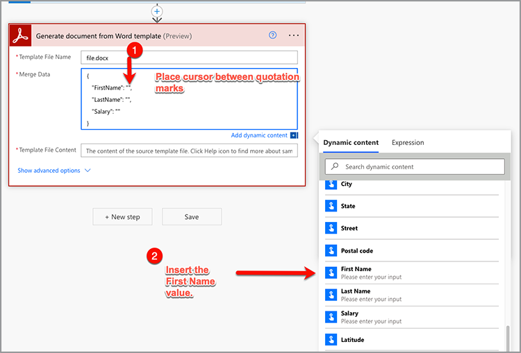

# Microsoft Power Automateで最初のフローを作成

[Adobe PDFサービス](https://us.flow.microsoft.com/en-us/connectors/shared_adobepdftools/adobe-pdf-services/)コネクタを使用して、[Microsoft Power Automate](https://flow.microsoft.com)で最初のフローを作成する方法について説明します。

この実践チュートリアルでは、次の方法について学習します。

* Word文書をPDFに変換
* PDF文書を1つのPDFに結合
* PDF文書をパスワードでProtectする

## 準備

### 必要なもの

* **Adobe PDFサービスの試用版または製品版の資格情報**
Microsoft Power Automateで資格情報を取得および設定する方法について詳しくは、[ここ](https://experienceleague.adobe.com/en/docs/acrobat-services-learn/tutorials/pdfservices/getting-credentials-power-automate)を参照してください。
* **プレミアムコネクタを使用したMicrosoft Power Automate**
Power Automateのライセンスレベルを確認する方法については、[こちら](https://docs.microsoft.com/en-us/power-platform/admin/power-automate-licensing/types)を参照してください。
* **OneDrive**
このチュートリアルではOneDriveストレージコネクターを使用しますが、他のストレージコネクターで代用することもできます。

### サンプルファイル

解凍してOneDriveにアップロードする必要がある[サンプルファイル](assets/sample-assets.zip)が2つあります：

* WordDocument01.docx
* WordDocument02.docx

### 資格情報の取得

このチュートリアルを完了するには、Adobe PDFサービス向けMicrosoft Power Automateで資格情報が既に設定されている必要があります。 この手順をまだ完了していない場合は、[説明](https://experienceleague.adobe.com/en/docs/acrobat-services-learn/tutorials/pdfservices/getting-credentials-power-automate)を参照してください。

## パート1：新しいフローを作成し、WordをPDFに変換する

### フローの作成

このパートでは、インスタントフローを使用して[Microsoft Power Automate](https://flow.microsoft.com)で新しいフローを作成し、パラメーターを追加して、OneDriveからファイルを取得し、PDFに変換します。

1. [Microsoft Power Automate](https://flow.microsoft.com)に移動し、資格情報を使用してログインします。
1. サイドバーで、**[!UICONTROL 作成]**&#x200B;を選択します。

   

1. **[!UICONTROL インスタントフロー]**&#x200B;を選択します。
1. フローに名前を付けます。
1. 「*このフローをトリガーする方法を選択*」で、「**[!UICONTROL フローを手動でトリガー]**」を選択します。
1. 「**[!UICONTROL 作成]**」を選択します。

### ファイルの内容を取得する

次に、サンプルファイルのファイル内容を取得します。

>[!PREREQUISITES]
>
>[サンプルファイル](assets/sample-assets.zip)をOneDriveにアップロードしていない場合は、解凍してアップロードします。


1. [Power Automate](https://flow.microsoft.com)で、**[!UICONTROL +新しい手順]**&#x200B;を選択します。
1. 検索バーで&#x200B;*OneDrive*&#x200B;を検索します。
1. **[!UICONTROL OneDrive for Business]**&#x200B;または&#x200B;**[!UICONTROL OneDrive]**&#x200B;を選択して、職場または個人のOneDriveアカウントを選択します。
1. 検索バーで&#x200B;*ファイルコンテンツを取得*&#x200B;を検索します。
1. 「**[!UICONTROL ファイル]**」フィールドで、フォルダーアイコンを選択して、OneDriveの&#x200B;*WordDocument01.docx*&#x200B;ファイルに移動します。

   

### ファイルをPDFに変換

これでファイルコンテンツが完成したので、文書をPDFに変換できます。

1. [Power Automate](https://flow.microsoft.com)で、**[!UICONTROL +新しい手順]**&#x200B;を選択します。
1. 検索バーで&#x200B;*Adobe PDFサービス*&#x200B;を検索します。
1. **[!UICONTROL Adobe PDFサービス]**&#x200B;を選択します。
1. 検索バーで&#x200B;*WordをPDFに変換*&#x200B;を検索します。
1. **[!UICONTROL ファイル名]**&#x200B;で、必要に応じてファイルに名前を付けますが、末尾は&#x200B;*.docx*&#x200B;にする必要があります。 この拡張子は、文書をWordからPDFに変換するために必要です。
1. **[!UICONTROL [ファイルコンテンツ]]**&#x200B;フィールドにカーソルを置きます。
1. **[!UICONTROL ダイナミックコンテンツ]**&#x200B;パネルを使用して、**[!UICONTROL ファイルコンテンツ]**&#x200B;を選択します。

   

### ファイルをOneDriveに保存

ドキュメントが生成されたら、ファイルをOneDriveに保存し直します。

1. [Microsoft Power Automate](https://flow.microsoft.com)で、**[!UICONTROL +新しい手順]**&#x200B;を選択します。
1. 検索バーで&#x200B;*OneDrive*&#x200B;を検索します。
1. **[!UICONTROL OneDrive for Business]**&#x200B;または&#x200B;**[!UICONTROL OneDrive]**&#x200B;を選択して、職場または個人のOneDriveアカウントを選択します。
1. 検索バーで&#x200B;*ファイルコンテンツを取得*&#x200B;を検索します。
1. 検索バーで&#x200B;*ファイルの作成*&#x200B;を検索します。
1. **[!UICONTROL [ファイルの作成]]**&#x200B;を選択します。
1. [**[!UICONTROL フォルダーパス]**]フィールドで、フォルダーアイコンを選択して、OneDrive内のファイルの保存先を指定します。
1. **[!UICONTROL ファイル名]**&#x200B;で、必要に応じてファイルに名前を付けますが、末尾は&#x200B;*.docx*&#x200B;にする必要があります。 この拡張子は、文書をWordからPDFに変換するために必要です。
1. **[!UICONTROL ファイルコンテンツ]**&#x200B;フィールドで、**[!UICONTROL ダイナミックコンテンツ]**&#x200B;パネルを使用して、PDFファイルコンテンツ変数を挿入します。

### 体験版のフロー

1. 左上で、**[!UICONTROL 名称未設定]**&#x200B;を選択して、フローの名前を変更します。
1. 「**[!UICONTROL 保存]**」を選択します。
1. **[!UICONTROL テスト]**&#x200B;を選択します。
1. **[!UICONTROL 手動]**&#x200B;を選択してから、**[!UICONTROL 保存とテスト]**&#x200B;を選択してください。
1. 「**[!UICONTROL 続行]**」を選択します。
1. **[!UICONTROL 実行フロー]**&#x200B;を選択します。

OneDriveフォルダーに、変換されたPDFが表示されます。


## パート2:テンプレートから動的ドキュメントを生成する

次のパートはパート1をベースに作成され、*Wordから文書を生成*&#x200B;テンプレートを使用して、データを文書に動的に結合します。

### 文書テンプレートをレビュー

OneDriveのサンプルファイルから&#x200B;*WordDocument02_.docx*&#x200B;を開きます。 Word文書には、データが文書に入力される場所を表すいくつかの異なるテキストタグが含まれています。

### トリガーするパラメーターの追加

動的データをドキュメントにプッシュするには、値の入力を促すトリガー用にいくつかのパラメーターを作成する必要があります。

1. フローを編集する場合は、[**[!UICONTROL フローを手動でトリガーする]**]を選択してアクションを展開します。
1. **[!UICONTROL 入力を追加]**&#x200B;を選択します。
1. **[!UICONTROL テキスト]**&#x200B;を選択します。
1. フィールドに&#x200B;*First Name*&#x200B;という名前を付けます。

手順2 ～ 4を繰り返して、次のフィールドを追加します。

* 姓
* 給与


### テンプレートのファイルコンテンツを取得する

文書を生成するには、まずWordテンプレートのファイルコンテンツを取得する必要があります。

1. Power Automateで、+ **[!UICONTROL 新しい手順]**&#x200B;を選択します。
1. 検索バーで&#x200B;*OneDrive*&#x200B;を検索します。
1. **[!UICONTROL OneDrive for Business]**&#x200B;または&#x200B;**[!UICONTROL OneDrive]**&#x200B;を選択して、職場または個人のOneDriveアカウントを選択します。
1. 検索バーで&#x200B;*ファイルコンテンツを取得*&#x200B;を検索します。
1. 「**[!UICONTROL ファイル]**」フィールドで、フォルダーアイコンを選択して、OneDriveの&#x200B;*WordDocument02.docx*&#x200B;ファイルに移動します。


### テンプレートから文書を生成

1. Power Automateで、**[!UICONTROL +新しい手順]**&#x200B;を選択します。
1. 検索バーで&#x200B;*Adobe PDFサービス*&#x200B;を検索します。
1. **[!UICONTROL Adobe PDFサービス]**&#x200B;を選択します。
1. **[!UICONTROL Wordテンプレートから文書を生成]**&#x200B;アクションを選択します。
1. 「**[!UICONTROL テンプレートファイル名]**」フィールドで、必要に応じてファイルに名前を付けます。末尾は&#x200B;*.docx*&#x200B;にする必要があります。

#### データを結合

*Wordテンプレートから文書を生成*&#x200B;アクションを使用すると、以前フローにあった様々な変数の任意のデータを、動的コンテンツを使用して文書に結合できます。

以下のJSONデータを&#x200B;**Merge Data**&#x200B;フィールドにコピーします。

```
{
    "FirstName": "",
    "LastName": "",
    "Salary": ""
}
```

1. *FirstName*&#x200B;の値を表す2つの引用符で囲まれたフィールドにカーソルを置きます。
1. **[!UICONTROL 動的コンテンツ]**&#x200B;パネルを使用して、フローを手動でトリガーするアクションから&#x200B;*名*&#x200B;の値を挿入します。

   

1. **[!UICONTROL LastName]**&#x200B;フィールドと&#x200B;**[!UICONTROL Salary]**&#x200B;フィールドに対して手順7 ～ 8を繰り返します。
1. **[!UICONTROL テンプレートファイルコンテンツ]**&#x200B;フィールドで、**[!UICONTROL ダイナミックコンテンツ]**&#x200B;パネルを使用して、*ファイルコンテンツを取得*&#x200B;手順の&#x200B;**[!UICONTROL ファイルコンテンツ]**&#x200B;値を挿入します。


>[!TIP]
>
>*Wordテンプレートから文書を生成*&#x200B;アクションでは、Adobe Document Generation APIが使用されます。 テンプレートの作成方法について詳しくは、いくつかのリソースをご覧ください。
>
>* [Adobe文書の生成に関する詳細情報](https://developer.adobe.com/document-services/apis/doc-generation/)
>* [Microsoft Word用のAdobe文書生成タガー](https://appsource.microsoft.com/en-US/product/office/WA200002654)
>* [Adobe Document Generation APIドキュメント](https://developer.adobe.com/document-services/docs/overview/document-generation-api/)

### ファイルをOneDriveに保存

ドキュメントが生成されたら、ファイルをOneDriveに保存し直すことができます。

1. Power Automateで、**+ [!UICONTROL 新しい手順]**&#x200B;を選択します。
1. 検索バーで&#x200B;*OneDrive*&#x200B;を検索します。
1. **[!UICONTROL OneDrive for Business]**&#x200B;または&#x200B;**[!UICONTROL OneDrive]**&#x200B;を選択して、職場または個人のOneDriveアカウントを選択します。
1. 検索バーで&#x200B;*ファイルの作成*&#x200B;を検索します。
1. **[!UICONTROL [ファイルの作成]]**&#x200B;を選択します。
1. [**[!UICONTROL フォルダーパス]**]フィールドで、フォルダーアイコンを選択して、OneDrive内のファイルの保存先を指定します。
1. 「**[!UICONTROL ファイル名]**」フィールドに、ファイルの名前を設定します。 出力はPDFなので、ファイル名の末尾は.pdf拡張子にする必要があります。
1. **[!UICONTROL ダイナミックコンテンツ]**&#x200B;パネルを使用して、PDFファイルコンテンツ変数を&#x200B;**[!UICONTROL ファイルコンテンツ]**&#x200B;フィールドに挿入します。

### 体験版のフロー


1. 「**[!UICONTROL 保存]**」を選択します。
1. **[!UICONTROL テスト]**&#x200B;を選択します。
1. **[!UICONTROL 手動]**&#x200B;を選択してから、**[!UICONTROL 保存とテスト]**&#x200B;を選択してください。
1. 「**[!UICONTROL 続行]**」を選択します。
1. *名*、*姓*、および&#x200B;*給与*&#x200B;の値を入力してください。
1. **[!UICONTROL 実行フロー]**&#x200B;を選択します。

OneDriveフォルダーに、Word文書から生成されたPDFが表示されるようになりました。 OneDriveでPDF文書を開くと、データがテキストタグの場所に結合されます。


## パート3:PDFを1つに組み合わせる

Word文書を生成してPDFに変換したので、次は複数のPDF文書を組み合わせることになりました。

>[!NOTE]
>
>前の操作では、文書のコピーをファイルとしてOneDriveに保存しました。 結合ツールなどのPDFを使用するには、ファイルをOneDriveに保存する必要はありません。 代わりに、1つのアクションから次のアクションに出力を直接渡すことができます。これは、各アクションの後にOneDriveに保存するよりも優れています。 ただし、デモの目的では、これらのファイルをOneDriveに保存します。

### 「結合PDFを追加」手順

1. フローを編集する場合は、**[!UICONTROL + 「次の手順」]**&#x200B;を選択して、フローの最後にアクションを追加します。
1. 検索バーで&#x200B;*Adobe PDFサービス*&#x200B;を検索します。
1. **[!UICONTROL Adobe PDFサービス]**&#x200B;を選択します。
1. **[!UICONTROL [PDFの結合]]**&#x200B;アクションを選択します。
1. 「**[!UICONTROL PDFファイル名を結合]**」フィールドに、目的のファイル名(*CombinedDocument.pdf*)を入力します。
1. **[!UICONTROL ファイルコンテンツ–1]**&#x200B;フィールドで、**[!UICONTROL ダイナミックコンテンツ]**&#x200B;パネルを使用して、**[!UICONTROL WordをPDFに変換]**&#x200B;手順の&#x200B;*PDFファイルコンテンツ*&#x200B;の値を入力します。
1. 次のドキュメントを追加するには、**+ [!UICONTROL 新しいアイテムの追加]**&#x200B;を選択します。
1. **[!UICONTROL ファイルコンテンツ – 2]**&#x200B;フィールドで、**[!UICONTROL ダイナミックコンテンツ]**&#x200B;パネルを使用して、*Wordテンプレートから文書を生成*&#x200B;手順の&#x200B;**[!UICONTROL 出力ファイルコンテンツ]**&#x200B;の値を挿入します。


### 結合したPDFをOneDriveに保存

文書が結合されたら、文書をOneDriveに保存し直すことができます。

1. Power Automateで、**+ [!UICONTROL 新しい手順]**&#x200B;を選択します。
1. 検索バーで&#x200B;*OneDrive*&#x200B;を検索します。
1. **[!UICONTROL OneDrive for Business]**&#x200B;または&#x200B;**[!UICONTROL OneDrive]**&#x200B;を選択して、職場または個人のOneDriveアカウントを選択します。
1. 検索バーで&#x200B;*ファイルの作成*&#x200B;を検索します。
1. **[!UICONTROL [ファイルの作成]]**&#x200B;を選択します。
1. [**[!UICONTROL フォルダーパス]**]フィールドで、フォルダーアイコンを選択して、OneDrive内のファイルの保存先を指定します。
1. 「**[!UICONTROL ファイル名]**」フィールドに、ファイルの名前を設定します。 出力はPDFなので、ファイル名の末尾は.pdfにする必要があります。
1. **[!UICONTROL ファイルコンテンツ]**&#x200B;フィールドで、**[!UICONTROL ダイナミックコンテンツ]**&#x200B;パネルを使用して、**[!UICONTROL 結合PDF]**&#x200B;の手順の&#x200B;*PDFファイルコンテンツ*&#x200B;の値を入力します。

   

### 体験版のフロー

1. 「**[!UICONTROL 保存]**」を選択します。
1. **[!UICONTROL テスト]**&#x200B;を選択します。
1. **[!UICONTROL 手動]**&#x200B;を選択してから、**[!UICONTROL 保存とテスト]**&#x200B;を選択してください。
1. 「**[!UICONTROL 続行]**」を選択します。
1. *名*、*姓*、および&#x200B;*給与*&#x200B;の値を入力してください。
1. **[!UICONTROL 実行フロー]**&#x200B;を選択します。

OneDriveフォルダーには、1つ目と2つ目の文書のページが結合されたPDFーが表示されます。

## パート4:Protect PDF文書

ドキュメントを生成した後、OneDriveに保存する前に追加の手順を追加することで、ドキュメントが編集されないように保護できます。

### PDF を保護

1. Power Automateでフローを編集する際に、**[!UICONTROL PDFを結合]**&#x200B;操作と&#x200B;**[!UICONTROL ファイルを作成]**&#x200B;操作の間にある&#x200B;**+**&#x200B;を選択します。

   

1. 「**[!UICONTROL アクションを追加]**」を選択します。
1. 検索バーで&#x200B;*Adobe PDFサービス*&#x200B;を検索します。
1. **[!UICONTROL Adobe PDFサービス]**&#x200B;を選択します。
1. **[!UICONTROL Protect PDFを表示から選択]**&#x200B;アクション。
1. 「**[!UICONTROL ファイル名]**」フィールドで、拡張子.pdfで終わる名前を指定します。
1. **[!UICONTROL パスワード]**&#x200B;フィールドを指定したパスワードに設定して、ドキュメントを開きます。
1. **[!UICONTROL ファイルコンテンツ]**&#x200B;フィールドで、**[!UICONTROL ダイナミックコンテンツ]**&#x200B;パネルを使用して、**[!UICONTROL 結合PDF]**&#x200B;の手順の&#x200B;*PDFファイルコンテンツ*&#x200B;の値を入力します。

### OneDriveに保存を更新

ドキュメントが保護されたら、ファイルをOneDriveに保存し直すことができます。 この例では、既存の&#x200B;**ファイル3**&#x200B;の作成アクションを新しい&#x200B;*ファイルコンテンツ*&#x200B;値で更新します。

1. **[!UICONTROL ファイルの作成3]**&#x200B;アクションの&#x200B;**[!UICONTROL ファイルコンテンツ]**&#x200B;フィールドでカーソルを選択します。
1. **[!UICONTROL ダイナミックコンテンツ]**&#x200B;パネルを使用して、**表示からのProtectPDF**&#x200B;手順の&#x200B;*PDFファイルコンテンツ*&#x200B;の値を挿入します。

### 体験版のフロー

1. 「**[!UICONTROL 保存]**」を選択します。
1. **[!UICONTROL テスト]**&#x200B;を選択します。
1. **[!UICONTROL 手動]**&#x200B;を選択してから、**[!UICONTROL 保存とテスト]**&#x200B;を選択してください。
1. 「**[!UICONTROL 続行]**」を選択します。
1. *名*、*姓*、および&#x200B;*給与*&#x200B;の値を入力してください。
1. **[!UICONTROL 実行フロー]**&#x200B;を選択します。

OneDriveフォルダーに、文書を閲覧するためのパスワードの入力を求める複合PDFが表示されます。

## 次のステップ

このチュートリアルでは、Word文書をPDFに変換し、データに基づいて文書を生成し、文書を結合して、パスワードで保護しました。 詳しくは、Microsoft Power AutomateのAdobe PDFサービスコネクタで使用できるその他のアクションを確認してください。

* Microsoft Power Automateで使用可能な、作成済みのテンプレートを表示します。
* Adobe技術ブログの[記事](https://medium.com/adobetech/tagged/microsoft-power-automate)から学ぶ。
* AdobeのDocument Generation APIの[ドキュメント](https://developer.adobe.com/document-services/docs/overview/document-generation-api/)を確認してください。
