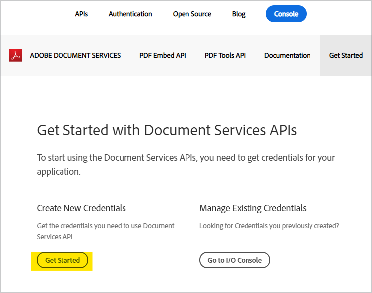
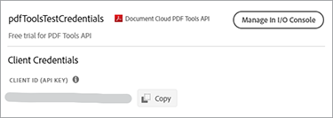

# PDFサービスAPIとNode.jsを使用して、HTMLまたはMS Officeから数分でPDFを作成します


新しいAdobe PDF Services APIにより、これまで以上に簡単に文書ワークフローのデジタル化を実現できます。このAPIを使用すると、開発者は、複雑な業務ワークフローのニーズを満たすために、複数の強力なPDF操作サービスから選択できます。 容易に利用できるこれらのクラウドベースのWebサービスを使用して、複雑なアーキテクチャ、実装戦略、およびテクノロジーの向上を合理化できます。

PDFサービスAPI内には、PDFを作成および操作したり、PDFからMS Officeやその他のフォーマットにエクスポートしたりするために使用可能なサービスがいくつかあります。

* 静的または動的HTML、MS Word、PowerPoint、ExcelなどからPDFファイルを作成
* MS Word、PowerPoint、ExcelなどへのExport PDF
* OCRを使用してPDFファイル内のテキストを認識し、文書検索を可能にする
* 文書を開くときにパスワードが設定されたProtect PDF
* PDFページまたはPDF文書を1つのPDFにまとめる
* PDFを圧縮して、電子メールまたはオンラインでの共有のサイズを縮小
* PDFをWeb表示用にリニア化
* Insert（挿入）、Replace（置換）、Reorder（並べ替え）、Delete（削除）、Rotate（回転）サービスによるPDFページの整理

利用可能なすべてのWebサービスにアクセスできるように用意されたサンプルファイルを、開発者はわずか数分で開始できます。 次の手順に従って開始できます。

## 資格情報の取得とサンプルファイルのダウンロード

最初の手順は、使用のロックを解除するための資格情報（APIキー）を取得することです。 [こちらから無料体験版に登録](https://www.adobe.com/go/dcsdks_credentials)し、[使用を開始]をクリックして新しい資格情報を作成してください。



「個人アカウント」を選択して無料体験版に登録することは重要です。


次の手順では、PDFサービスAPIサービスを選択し、資格情報の名前と説明を追加します。

「パーソナライズされたコードサンプルを作成」チェックボックスがあります。 このオプションを選択すると、手動の手順をスキップして、新しい資格情報が自動的にサンプルファイルに追加されます。

次に、Node.js固有のサンプルを受け取る言語としてNode.jsを選択し、「資格情報の作成」ボタンをクリックします。


ダウンロードする.zipファイルはPDFToolsSDK-Node.jsSamples.zipと呼ばれ、ローカルファイルシステムに保存できます。

## コードサンプルへの資格情報の追加

「パーソナライズされたコードサンプルの作成」オプションを選択した場合は、クライアントIDをコードサンプルファイルに手動で追加する必要はありません。次の手順をスキップして、下の「実行中のコードサンプル」セクションに直接移動できます。

「Create personalized code sample」オプションを選択しなかった場合は、Adobe.ioコンソールからクライアントID（APIキー）をコピーする必要があります。



PDFToolsSDK-Node.jsSamples.zipの内容を解凍します。

adobe-dc-pdf-tools-sdk-node-samplesフォルダーの下のルートディレクトリに移動します。

任意のテキストエディターまたはIDEでpdftools-api-credentials.jsonを開きます。

コードのクライアントIDのフィールドに資格情報を貼り付けます。

```javascript
{
 "client_credentials": {
  "client_id": "abcdefghijklmnopqrstuvwxyz",
```

ファイルを保存し、次の手順に進んでコードサンプルを実行します。

## 最初のコードサンプルの実行

コマンドプロンプトを使用して、adobe-dc-pdf-tools-sdk-node-samplesフォルダーの下のルートディレクトリに移動します。

npm installと入力します。

C:\Temp\PDFToolsAPI\adobe-dc-pdf-tools-sdk-node-samples>npm install

これで、サンプルファイルを実行する準備ができました。

最初のサンプルとして、次のPDFを作成します。

コマンドプロンプトが表示されているときに、次のコマンドを使用してcreate PDFサンプルを実行します。

C:\Temp\PDFToolsAPI\adobe-dc-pdf-tools-sdk-node-samples>node src/createpdf/create-pdf-from-docx.js

出力例：


PDFは、出力で指定されている場所（デフォルトではpdfServicesSdkResultディレクトリ）に作成されます。

## リソースと次のステップ

* その他のヘルプとサポートについては、[[!DNL Acrobat Services] API](https://community.adobe.com/t5/document-cloud-sdk/bd-p/Document-Cloud-SDK?page=1&sort=latest_replies&filter=all) Adobeフォーラムにアクセスしてください

PDFサービスAPI [ドキュメント](https://www.adobe.com/go/pdftoolsapi_doc)

* PDFサービスAPIの質問に関する[FAQ](https://community.adobe.com/t5/contentarchivals/contentarchivedpage/message-uid/10726197)
* ライセンスと価格に関する質問については、[お問い合わせ](https://www.adobe.com/go/pdftoolsapi_requestform)ください
* 関連記事：

   * [新しいPDFサービスAPIは、文書ワークフロー用にさらに多くの機能を提供します](https://community.adobe.com/t5/acrobat-services-api-discussions/new-pdf-tools-api-brings-more-capabilities-for-document-services/m-p/11294170)
   * [ [!DNL Adobe Acrobat Services]の7月リリース： PDFの埋め込みとPDFのサービス](https://medium.com/adobetech/july-release-of-adobe-document-services-pdf-embed-and-pdf-tools-17211bf7776d)
