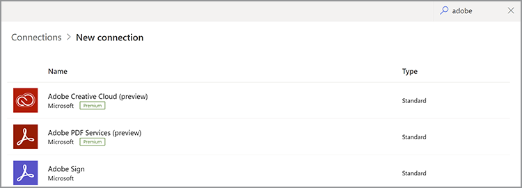

# Microsoft Power Automateの資格情報の取得

[Microsoft Power Automate](https://powerautomate.microsoft.com/) 市民の開発者や開発者が強力な自動プロセスを作成し、コードを記述することなくビジネスを改善するための強力な方法を提供します。 [Adobe PDF Services](https://japan.flow.microsoft.com/ja-jp/connectors/shared_adobepdftools/adobe-pdf-services/) コネクタ、の一部 [[!DNL Adobe Acrobat Services]](https://developer.adobe.com/document-services)を使用すると、Microsoft Power Automate内でAdobe PDFサービスAPIで使用可能な任意のアクションを実行できます。

このチュートリアルでは、資格情報を取得して、Adobe PDFサービスの使用または体験版のダウンロードを開始する方法について説明します。 体験版ユーザーか既存のお客様かに応じて、このチュートリアルでは資格情報を取得するための適切な手順を説明します。

## Microsoft Power AutomateユーザーがAdobe PDFサービスコネクタを使用し始めるにはどうすればよいですか？

既存のMicrosoft Power Automateユーザーは、次のことを実行できます [体験版の認証情報を取得](https://www.adobe.com/go/powerautomate_getstarted) Adobe PDFサービスの場合 上記のリンクは、このプロセス、特にMicrosoft Power Automateユーザー向けに役立つ特別な登録リンクです。


>[!IMPORTANT]
> 体験版にログインする場合は、Enterprise IDではなくAdobe IDを使用する必要があります。 お客様がAdobe PDF Services APIの現在のサブスクライバーではなく、企業でログインしようとすると、Enterprise IDがAdobe PDF Services APIの使用権限を持っていないため、権限エラーが発生する場合があります。 このため、個人版のAdobe IDを無料で使用することをお勧めします。
>

1. ログイン後、新しい資格情報の名前を選択するように求められます。 を入力します *資格情報名*.
1. チェックボックスをオンにすると、デベロッパー条件に同意します。
1. 選択 **[!UICONTROL 資格情報の作成]**.

   

これらの資格情報は、次の5つの異なる値をカバーします。

* クライアント ID（API キー）
* クライアントシークレット
* 組織 ID
* テクニカルアカウント ID
* Base64（エンコードされた秘密キー）


これらすべての値を含むJSONファイルも自動的にシステムにダウンロードされます。 このファイルの名前は `pdfservices-api-pa-credentials.json` 次のようになります。

```json
{
 "client_id": "client id value",
 "client_secret": "client secret value",
 "organization_id": "organized id value",
 "account_id": "account id value",
 "base64_encoded_private_key": "base64 version of the private key"
}
```

秘密キーのコピーを再度取得することはできないため、このファイルは安全な場所に保存してください。

### Microsoft Power Automateでの連携の追加

これで資格情報が完成したので、Microsoft Power Automateフローで資格情報を使用できるようになりました。

1. サイドバーメニューで、 **[!UICONTROL データ]** メニューと選択 **接続**:

   

1. 選択 **+ [!UICONTROL 新しい接続]**.

1. 次の画面は、使用可能な接続タイプの一覧を示します。 右上隅で、「adobe」と入力して、オプションをフィルタリングします。

   

1. 選択 **[!UICONTROL Adobe PDFサービス（プレビュー）]**.
1. モーダルウィンドウで、先ほど生成した5つの値をすべて入力します。 選択 **[!UICONTROL 作成]** 完了したら、

   

これで、Microsoft Power AutomateでAdobe PDFサービスを使用する準備ができました。

### 作成後の資格情報へのアクセス

既に資格情報を作成していて、ダウンロードした資格情報を間違って配置した場合は、 [Adobe Developer Console](https://developer.adobe.com/console).

1. にログインした後 [Adobe Developer Console](https://developer.adobe.com/console)まずプロジェクトを見つけて選択します。
1. 左側のメニューの「 *資格情報*、選択 **サービスアカウント(JWT)**:

   

1. ここに示す5つの値に注意してください。 *クライアントID*, *クライアントシークレット*, *テクニカルアカウントID*, *テクニカルアカウントのメールアドレス*、および *組織ID*.

残念ながら、以前の秘密キーはダウンロードできませんが、「公開/秘密キーペアを生成」ボタンを使用して新しいキーを作成することができます。

## 既存のAdobe PDFサービスの資格情報を使用する

次から生成された既存のAdobe PDFサービスAPI資格情報がある場合： [!DNL Adobe Acrobat Services] webサイトでは、Microsoft Power Automateで使用できます。 新規登録時にSDKをダウンロードした場合、既存の資格情報は、JSONファイルの形式で提供されていた可能性があります。 `pdfservices-api-credentials.json`. このJSONファイルには、接続資格情報の作成時に必要な5つのキーが含まれています。 それぞれの値をJSONファイルから対応する接続フィールドにコピーします。

秘密キーの値は、という2番目のファイルから取得されます。 `private.key`.

上記のように、Adobe Developer Consoleから値を取得することもできます。

## 方法 [!DNL Adobe Acrobat Services] Microsoft Power Automateを使用する場合

Power Automateの使用を開始するには、まず <https://powerautomate.microsoft.com> 「無料で開始」ボタンを使用します。 Microsoftアカウントをお持ちでない場合は作成する必要があります。 ログインすると、Power Automateダッシュボードが表示されます。


このチュートリアルの冒頭で説明したように、新しいフローを作成し、手順を追加して、Adobe PDFサービスを見つけます。 アクションを選択すると、プレミアムアカウントが必要であるという警告が表示されます。


上のスクリーンショットが示すように、職場アカウントに切り替えるか、新しい組織アカウントを設定できます。 利用できるようになったら、Adobe PDFサービスのアクションを追加できます。

最初のMicrosoft Power Automateフローの作成方法は、次のツールを使用して行います。 [!DNL Adobe Acrobat Services]を参照してください [Microsoft Power Automateで最初のワークフローを作成](https://experienceleague.adobe.com/docs/document-services/tutorials/pdfservices/create-workflow-power-automate.html).

## その他の参考資料

さらに役立つように、その他のリソースのリストを次に示します。

* 最初に、Adobe PDFサービスのPower Automateドキュメントを示します。 <https://docs.microsoft.com/en-us/connectors/adobepdftools/>. これらのリソースは、ここで学習した内容を補完するものです。
* 例が必要ですか？ 数多くのものが見つかります [Power Automateテンプレート](https://powerautomate.microsoft.com/en-us/connectors/details/shared_adobepdftools/adobe-pdf-services/) PDFサービスのデモ
* アドビのライブビデオコンテンツ [ペーパークリップ](https://www.youtube.com/playlist?list=PLcVEYUqU7VRe4sT-Bf8flvRz1XXUyGmtF)には、Power Automateの使用方法を説明するビデオも含まれています。
* この [Adobe技術ブログ](https://medium.com/adobetech/tagged/microsoft-power-automate) には、Power Automateの操作に関する多くの記事があります。
* 最後に、必ずコアに問い合わせてください [PDFサービス](https://developer.adobe.com/document-services/docs/overview/) ドキュメントも同様です。
