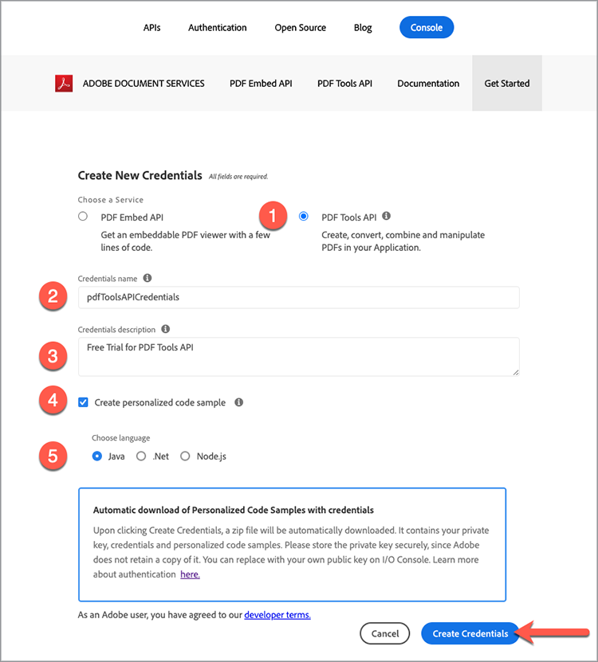

# Adobe PDF Services APIおよび.Netの概要

利用可能なすべてのWebサービスにアクセスできるように用意されたサンプルファイルを、開発者はわずか数分で開始できます。 このチュートリアルでは、PDFサービス.Net SDKを使用してサンプルの実行を開始するためのすべての手順を説明します。

## 手順1：資格情報の取得とサンプルファイルのダウンロード

最初の手順は、使用のロックを解除するための資格情報（APIキー）を取得することです。 [こちらから無料体験版に登録](https://www.adobe.io/apis/documentcloud/dcsdk/gettingstarted.html)し、[使用を開始]をクリックして新しい資格情報を作成してください。

「個人アカウント」を選択して無料体験版に登録することは重要です。

次の手順では、PDFサービスAPIサービスを選択し、資格情報の名前と説明を追加します。

「パーソナライズされたコードサンプルを作成」チェックボックスがあります。 このオプションを選択すると、新しい資格情報がサンプルファイルに自動的に追加され、プロジェクトに手動で追加する手順が保存されます。

次に、Node.js固有のサンプルを受け取る言語としてNode.jsを選択し、「資格情報の作成」ボタンをクリックします。

ダウンロードする.zipファイルはPDFToolsSDK-.NetSamples.zipと呼ばれ、ローカルファイルシステムに保存できます。

## 手順2:.NET環境をセットアップし、サンプルコードを実行する

1. [.Net SDK](https://dotnet.microsoft.com/learn/dotnet/hello-world-tutorial/install)をダウンロードしてインストールします
1. ダウンロードした&#x200B;**[!UICONTROL PDFToolsSDK-.NetSamples.zip]**&#x200B;を展開し、コンテンツを展開します
1. サンプルルートディレクトリ&#x200B;**[!UICONTROL adobe-DC.PDFTools.SDK.NET.Samples]**&#x200B;にcdします
1. サンプルルートディレクトリから、`dotnet build`を実行します

   C:\Temp\PDFToolsAPI\ PDFToolsSDK-.NetSamples\adobe-DC.PDFTools.SDK.NET.Samples>dotnet build

   これで、サンプルファイルを実行する準備ができました。

   次の最後の手順では、「WordからPDFを作成」操作で最初のサンプルを実行する方法を示します。

1. サンプルのルートディレクトリにあるディレクトリをCreatePDFFromDocxフォルダーに移動し、 cd CreatePDFFromDocx/

   C:\Temp\PDFToolsAPI\ PDFToolsSDK-.NetSamples\adobe-DC.PDFTools.SDK.NET.Samples>cd CreatePDFFromDocx/

1. `dotnet run CreatePDFFromDocx.csproj`を実行

   C:\Temp\PDFToolsAPI\ PDFToolsSDK-.NetSamples\adobe-DC.PDFTools.SDK.NET.Samples\CreatePDFFromDocx>dotnet run CreatePDFFromDocx.csproj

PDFは、出力で指定された場所に作成されます。デフォルトでは同じフォルダーです。

## 最後のアイデア

PDFサービスAPIは、一般的なワークフローを自動化し、処理負荷をクラウドに移行することで、手動プロセスを排除するのに役立ちます。 Adobe PDF Embed APIをBrowser Services APIと共に利用することで、PDFの扱いがブラウザーによって異なる場合は、PDFやデバイスに関係なく、**毎回**&#x200B;正しく実行され、表示される、合理的で信頼性の高い予測可能なプロセスを構築できます。

## リソースと次のステップ

* 追加のヘルプとサポートについては、[[!DNL Adobe Acrobat Services] API](https://community.adobe.com/t5/document-cloud-sdk/bd-p/Document-Cloud-SDK?page=1&sort=latest_replies&filter=all)コミュニティフォーラムにアクセスしてください

* PDFサービスAPI [ドキュメント](https://www.adobe.com/go/pdftoolsapi_doc)

* PDFサービスAPIの質問に関する[FAQ](https://community.adobe.com/t5/contentarchivals/contentarchivedpage/message-uid/10726197)

* ライセンスと価格に関する質問については、[お問い合わせ](https://www.adobe.com/go/pdftoolsapi_requestform)ください

* 関連記事

   * [新しいPDFサービスAPIは、文書ワークフロー用にさらに多くの機能を提供します](https://community.adobe.com/t5/acrobat-services-api-discussions/new-pdf-tools-api-brings-more-capabilities-for-document-services/m-p/11294170)
   * [ [!DNL Adobe Acrobat Services]の7月リリース： PDFの埋め込みとPDFのサービス](https://medium.com/adobetech/july-release-of-adobe-document-services-pdf-embed-and-pdf-tools-17211bf7776d)
