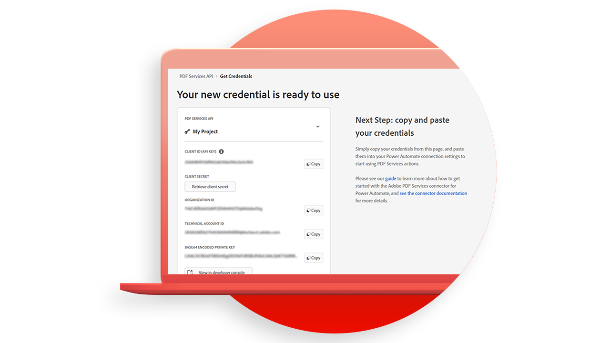

# Adobe PDF Services APIチュートリアル

<table style="table-layout:fixed">
<tr>
 <td>
   
    

   <a href="https://experienceleague.adobe.com/docs/adobe-developers-live-events/events/2021/oct2021/pdf-services-api.html"><strong>PDFサービスAPIの概要</strong></a>
    

    <em>AdobeのPDFサービスAPIを使用すると、開発者は、強力で柔軟なクラウドベースのAPIを介して、PDFからデータを作成、結合、エクスポート、および抽出できます</em>
     
  </td>
  <td>
   
    

   <a href="getting-credentials-power-automate.md"><strong>[!DNL Microsoft Power Automate]</strong></a>の資格情報を取得しています
    

    <em>[!DNL Adobe PDF Services]</em>の使用または取得を開始するための資格情報を取得する方法を説明します
     
  </td>
  <td>
   
    

   <a href="create-workflow-power-automate.md"><strong>[!DNL Microsoft Power Automate]</strong></a>で最初のワークフローを作成します
    

    <em>[!DNL Adobe PDF Services]コネクタを[!DNL Microsoft Power Automate]</em>で使用する方法の詳細
     
  </td>
  <td>
   
    

   <a href="createpdffromhtml.md"><strong>HTMLからPDFを作成するか、PDFサービスAPIとNode.jsを使用して数分で[!DNL MS Office]してください</strong></a>
    

    <em>[!DNL Adobe PDF Services API]は、複雑な業務ワークフローのニーズに合わせて、強力なPDF操作サービスを選べる自由な範囲を開発者に提供します。</em>
     
  </td>
</tr>
<tr>
  <td>
   
    

   <a href="exportpdf.md"><strong>[!DNL PDF Services API]を利用してPDFを[!DNL Word]様、[!DNL PowerPoint]様などにエクスポートしています</strong></a>
    

    <em>Node.js、Java、および.Net言語のサンプルファイルを使用して[!DNL PDF Services API]エクスポート操作を実行する方法を説明します</em>
     
  </td>
   <td>
   
    

   <a href="gettingstartedjava.md"><strong>Adobe PDF Services APIおよびJavaの概要</strong></a>
    

    <em>利用可能なすべてのWebサービスにアクセスできるように用意されたサンプルファイルを、開発者は数分で開始できます</em>
     
  </td>
   <td>
   
    

   <a href="ocr.md"><strong>[!DNL Adobe PDF Services API]を使用してOCRPDFファイルを処理しています</strong></a>
    

    <em>OCR (Optical Character Recognition)を使用すると、スキャンしたPDFをロック解除して、テキストを抽出し、検索可能なファイルを作成できます</em>
     
  </td>
  <td>
   
    

   <a href="gettingstartednet.md"><strong>[!DNL Adobe PDF Services API]と.Net</strong></a>の概要
    

    <em>[!DNL Adobe PDF Services API]は、複雑な業務ワークフローのニーズに合わせて、強力なPDF操作サービスを選べる自由な範囲を開発者に提供します。</em>
     
  </td>
</tr>
</table>
