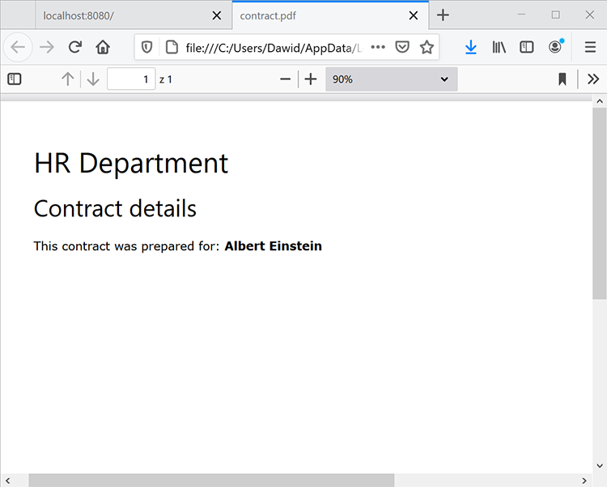

# Java での人事文書ワークフロー


多くの企業では、在宅勤務の従業員向けの職場契約など、新入社員に関する文書が必要です。 従来、企業はこれらの文書を管理し、保存するのが困難な形式で物理的に管理していました。 電子文書に切り替える場合、PDFファイルは他のファイルタイプよりも安全性が高く、修正が困難なため、最適な選択肢です。 また、電子署名もサポートしています。

## 学習内容

この実践チュートリアルでは、シンプルな Java Spring MVC アプリケーションを使用して、職場の合意をPDFにサインオフできるように Web ベースの人事フォームを実装する方法を学習します。

## 関連する API とリソース

* [PDFサービス API](https://opensource.adobe.com/pdftools-sdk-docs/release/latest/index.html)

* [Adobe Sign API](https://www.adobe.io/apis/documentcloud/sign.html)

* [プロジェクトコード](https://github.com/dawidborycki/adobe-sign)

## API 資格情報の生成

まずは、Adobe PDF Services API の無償体験版に新規登録してください。 次の [Adobe](https://www.adobe.io/apis/documentcloud/dcsdk/gettingstarted.html?ref=getStartedWithServicesSDK) [web サイト](https://www.adobe.io/apis/documentcloud/dcsdk/gettingstarted.html?ref=getStartedWithServicesSDK) を選択し、 *はじめに* 下のボタン *新しい資格情報の作成*&#x200B;を選択します。 無料体験版では、6 か月間で 1,000 件のドキュメントトランザクションを使用できます。 次のページ（以下を参照）で、サービス (PDFサービス API) を選択し、資格情報の名前（HRDocumentWFCredentials など）を設定し、説明を入力します。

言語（この例では Java）を選択し、「 *パーソナライズされたコードサンプルの作成*&#x200B;を選択します。 最後の手順では、API 内でアプリケーションを認証するための秘密キーとともに、使用する事前設定された pdftools-api-credentials.json ファイルがコードサンプルに確実に含まれるようにします。

最後に、 *資格情報の作成* 」ボタンをクリックします。 これにより資格情報が生成され、サンプルが自動的にダウンロードを開始します。


資格情報が機能していることを確認するには、ダウンロードしたサンプルを開きます。 ここでは、IntelliJ IDEA を使用しています。 ソースコードを開くと、統合開発環境 (IDE) からビルドエンジンの入力を求められます。 このサンプルでは Maven を使用していますが、好みに応じて Gradle を使用することもできます。

次に、 `mvn clean install` Maven の目標は、jar ファイルを構築することです。

最後に、以下に示すように CombinePDF サンプルを実行します。 出力フォルダー内にPDFが生成されます。


## Spring MVC アプリケーションの作成

資格情報を指定したら、アプリケーションを作成します。 この例では、Spring Initializr を使用しています。

まず、Java 8 言語と Jar パッケージを使用するようにプロジェクト設定を構成します（以下のスクリーンショットを参照）。


次に、（Web から）Spring Web と（テンプレートエンジンから）Thymeleaf を追加します。


プロジェクトの作成後、pom.xml ファイルに移動し、pdftools-sdk と log4j-slf4j-impl を使用して、「依存関係」セクションの項目を補足します。

```
<dependencies>
    <dependency>
        <groupId>org.springframework.boot</groupId>
        <artifactId>spring-boot-starter-thymeleaf</artifactId>
    </dependency>
    <dependency>
        <groupId>org.springframework.boot</groupId>
        <artifactId>spring-boot-starter-web</artifactId>
    </dependency>

    <dependency>
        <groupId>org.springframework.boot</groupId>
        <artifactId>spring-boot-starter-test</artifactId>
        <scope>test</scope>
    </dependency>

</dependencies>
```

次に、サンプルコードを使用してダウンロードした 2 つのファイルで、プロジェクトのルートフォルダーを補足します。

* pdftools-api-credentials.json

* private.key

## Web フォームのレンダリング

Web フォームをレンダリングするには、個人データフォームをレンダリングし、フォームの投稿を処理するコントローラーを使用して、アプリケーションを変更します。 そのため、まず PersonForm モデルクラスを使用してアプリケーションを変更します。

```
package com.hr.docsigning;
import javax.validation.constraints.NotNull;
import javax.validation.constraints.Size;

public class PersonForm {
    @NotNull
    @Size(min=2, max=30)
    private String firstName;

    @NotNull
    @Size(min=2, max=30)
    private String lastName;

    public String getFirstName() {
            return this.firstName;
    }


    public void setFirstName(String firstName) {
            this.firstName = firstName;
    }

    public String getLastName() {
           return this.lastName;
    }

    public void setLastName(String lastName) {
            this.lastName = lastName;
    }

    public String GetFullName() {
           return this.firstName + " " + this.lastName;
    }
}
```

このクラスには、次の 2 つのプロパティがあります。 `firstName` および `lastName`を選択します。 また、この簡単な検証を使用して、2 文字から 30 文字の間かどうかを確認できます。

モデルクラスを指定すると、コントローラを作成できます（関連コードの PersonController.java を参照）。

```
package com.hr.docsigning;
import org.springframework.stereotype.Controller;
import org.springframework.validation.BindingResult;
import org.springframework.web.bind.annotation.GetMapping;
import org.springframework.web.bind.annotation.PostMapping;
import javax.validation.Valid;


@Controller
public class PersonController {
    @GetMapping("/")
    public String showForm(PersonForm personForm) {
        return "form";
    }
}
```

コントローラのメソッドは 1 つだけです。showForm です。 resources/templates/form.htmlにあるテンプレートテンプレートを使用してフォームをHTMLする必要があります。

```
<html>
<head>
    <link rel="stylesheet" href="https://www.w3schools.com/w3css/4/w3.css">
</head>
 
<body>
<div class="w3-container">
    <h1>HR Department</h1>
</div>
 
<form class="w3-panel w3-card-4" action="#" th:action="@{/}"
        th:object="${personForm}" method="post">
    <h2>Personal data</h2>
    <table>
        <tr>
            <td>First Name:</td>
            <td><input type="text" class="w3-input"
                placeholder="First name" th:field="*{firstName}" /></td>
            <td class="w3-text-red" th:if="${#fields.hasErrors('firstName')}"
                th:errors="*{firstName}"></td>
        </tr>
        <tr>
            <td>Last Name:</td>
            <td><input type="text" class="w3-input"
                placeholder="Last name" th:field="*{lastName}" /></td>
            <td class="w3-text-red" th:if="${#fields.hasErrors('lastName')}"
                th:errors="*{lastName}"></td>
        </tr>
        <tr>
            <td><button class="w3-button w3-black" type="submit">Submit</button></td>
        </tr>
    </table>
</form>
</body>
</html>
```

ダイナミックコンテンツをレンダリングするには、Thymeleaf テンプレートレンダリングエンジンを使用します。 したがって、アプリケーションを実行すると、次のようになります。


## 動的コンテンツを使用したPDFの生成

次に、仮想コントラクトを含むPDF文書を生成します。この文書は、個人データ・フォームをレンダリングした後、選択したフィールドに動的に移入されます。 具体的には、作成済みの契約書に個人データを入力する必要があります。

ここでは、簡単にするために、ヘッダー、サブヘッダーおよび文字列定数の読み取りのみを設定します。「この契約は\のために準備された&lt;full name=&quot;&quot; of=&quot;&quot; the=&quot;&quot; person=&quot;&quot;>&quot;.

この目標を達成するには、まずAdobeの [動的PDFからのHTML](https://opensource.adobe.com/pdftools-sdk-docs/release/latest/howtos.html#create-a-pdf-from-dynamic-html) 例： このサンプルコードを分析すると、動的HTMLフィールドの生成が次のように行われます。

まず、静的および動的コンテンツを含むHTMLページを準備する必要があります。 動的部分は JavaScript を使用して更新されます。 つまり、PDFサービス API は JSON オブジェクトをHTMLに注入します。

その後、HTMLドキュメントの読み込み時に呼び出される JavaScript 関数を使用して、JSON プロパティを取得します。 この JavaScript 関数は、選択された DOM エレメントを更新します。 span エレメントにデータを入力し、人物のデータを保持する例を次に示します ( 関連コードのsrc\\main\\resources\\contract\\index.htmlを参照 )。

```
<html>
<head>
    <link rel="stylesheet" href="https://www.w3schools.com/w3css/4/w3.css">
</head>
 
<body onload="updateFullName()">
    <script src="./json.js"></script>
    <script type="text/javascript">
        function updateFullName()
        {
            var document = window.document;
            document.getElementById("personFullName").innerHTML = String(
                window.json.personFullName);
        }
    </script>
 
    <div class="w3-container ">
        <h1>HR Department</h1>
 
        <h2>Contract details</h2>
 
        <p>This contract was prepared for:
            <strong><span id="personFullName"></span></strong>
        </p>
    </div>
</body>
</html>
```

次に、すべての依存 JavaScript ファイルと CSS ファイルを含むHTMLを zip 圧縮する必要があります。 PDFサービス API では、HTMLファイルは 代わりに、入力として zip ファイルが必要です。 この場合、zip 形式のファイルをsrc\\main\\resources\\contract\\index.zipに保存します。

その後、 `PersonController` 別のメソッドを使用して、POST要求を処理

```
@PostMapping("/")
public String checkPersonInfo(@Valid PersonForm personForm,
    BindingResult bindingResult) {
    if (bindingResult.hasErrors()) {
        return "form";
    }
 
    CreateContract(personForm);
 
    return "contract-actions";
}
```

上記の方法では、提供された個人データを使用してPDF契約が作成され、契約アクションビューがレンダリングされます。 後者には、生成された署名へのリンクや、PDFに署名するためのリンクがPDFされます。

では、 `CreateContract` メソッドが動作します（完全なリストは以下のとおりです）。 このメソッドは、次の 2 つのフィールドに依存します。

* `LOGGER`を使用して、例外に関する情報をデバッグします

* `contractFilePath`に保存され、生成されたPDF

この `CreateContract` メソッドは資格情報を設定し、メソッドからPDFをHTMLします。 契約書に個人のデータを渡して入力するには、 `setCustomOptionsAndPersonData` ヘルパー このメソッドは、フォームから個人のデータを取得し、前述の JSON オブジェクトを介して生成されたPDFに送信します。

また、 `setCustomOptionsAndPersonData` ヘッダーとフッターを無効にしてPDFの外観を制御する方法を示します。 これらの手順が完了したら、PDFファイルをoutput/contract.pdfに保存し、最終的に以前に生成したファイルを削除します。

```
private static final Logger LOGGER = LoggerFactory.getLogger(PersonController.class);
private String contractFilePath = "output/contract.pdf"; 
private void CreateContract(PersonForm personForm) {
    try {
        // Initial setup, create credentials instance.
        Credentials credentials = Credentials.serviceAccountCredentialsBuilder()
                .fromFile("pdftools-api-credentials.json")
                .build();

        //Create an ExecutionContext using credentials 
       //and create a new operation instance.
        ExecutionContext executionContext = ExecutionContext.create(credentials);
        CreatePDFOperation htmlToPDFOperation = CreatePDFOperation.createNew();

        // Set operation input from a source file.
        FileRef source = FileRef.createFromLocalFile(
           "src/main/resources/contract/index.zip");
       htmlToPDFOperation.setInput(source);

        // Provide any custom configuration options for the operation
        // You pass person data here to dynamically fill out the HTML
        setCustomOptionsAndPersonData(htmlToPDFOperation, personForm);

        // Execute the operation.
        FileRef result = htmlToPDFOperation.execute(executionContext);

        // Save the result to the specified location. Delete previous file if exists
        File file = new File(contractFilePath);
        Files.deleteIfExists(file.toPath());

        result.saveAs(file.getPath());

    } catch (ServiceApiException | IOException | 
             SdkException | ServiceUsageException ex) {
        LOGGER.error("Exception encountered while executing operation", ex);
    }
}
 
private static void setCustomOptionsAndPersonData(
    CreatePDFOperation htmlToPDFOperation, PersonForm personForm) {
    //Set the dataToMerge field that needs to be populated 
    //in the HTML before its conversion
    JSONObject dataToMerge = new JSONObject();
    dataToMerge.put("personFullName", personForm.GetFullName());
 
    // Set the desired HTML-to-PDF conversion options.
    CreatePDFOptions htmlToPdfOptions = CreatePDFOptions.htmlOptionsBuilder()
        .includeHeaderFooter(false)
        .withDataToMerge(dataToMerge)
        .build();
    htmlToPDFOperation.setOptions(htmlToPdfOptions);
}
```

契約の生成時に、動的な個人固有のデータを固定契約条件とマージすることもできます。 これを行うには、 [静的PDFからのHTML](https://opensource.adobe.com/pdftools-sdk-docs/release/latest/howtos.html#create-a-pdf-from-dynamic-html) 例： または、 [2 つのPDF](https://opensource.adobe.com/pdftools-sdk-docs/release/latest/howtos.html#create-a-pdf-from-static-html)を選択します。

## ダウンロード用のPDFファイルの表示

ユーザーがダウンロードできるように、生成されたPDFへのリンクを表示できます。 これを行うには、まず contract-actions.html ファイルを作成します（関連コードの resources/templates contract-actions.html を参照してください）。

```
<html>
<head>
    <link rel="stylesheet" href="https://www.w3schools.com/w3css/4/w3.css">
</head>
 
<div class="w3-container ">
    <h1>HR Department</h1>
 
    <h2>Contract file</h2>
 
    <p>Click <a href="/pdf">here</a> to download your contract</p>
</div>
</body>
</html>
```

次に、 `downloadContract` メソッドを `PersonController` クラスを使用します。

```
@RequestMapping("/pdf")
public void downloadContract(HttpServletResponse response)
{
    Path file = Paths.get(contractFilePath);
 
    response.setContentType("application/pdf");
    response.addHeader(
        "Content-Disposition", "attachment; filename=contract.pdf");

    try
    {
        Files.copy(file, response.getOutputStream());
        response.getOutputStream().flush();
    }
    catch (IOException ex) 
    {
        ex.printStackTrace();
    }
}
```

アプリケーションを実行すると、次のフローが発生します。 最初の画面は、個人データ・フォームを示しています。 テストするには、2 ～ 30 文字の任意の値を入力します。


を選択し、 *送信* 」ボタンをクリックすると、フォームが検証され、PDFがHTML(resources/contract/index.html) に基づいて生成されます。 別のビュー（契約の詳細）が表示されます。ここで、PDFをダウンロードできます。


このPDFは、Web ブラウザーでレンダリングした後、次のようになります。 つまり、入力した個人データがPDF



## 署名とセキュリティの有効化

契約書の準備ができたら、Adobe Signで承認を表す電子署名を追加できます。 Adobe Sign認証は、OAuth とは少し動作が異なります。 次に、アプリケーションとAdobe Signを統合する方法を見てみましょう。 そのためには、アプリケーションのアクセストークンを準備する必要があります。 次に、Adobe Sign Java SDK を使用してクライアントコードを記述します。

認証トークンを取得するには、いくつかの手順を実行する必要があります。

まず、 [開発者アカウント](https://acrobat.adobe.com/jp/ja/sign/developer-form.html)を選択します。

CLIENT アプリケーションを [Adobe Sign portal](https://www.adobe.io/apis/documentcloud/sign/docs.html#!adobedocs/adobe-sign/master/gstarted/create_app.md)を選択します。

アプリケーションの OAuth を設定します（手順を参照）。 [ここ](https://www.adobe.io/apis/documentcloud/sign/docs.html#!adobedocs/adobe-sign/master/gstarted/configure_oauth.md) および [ここ](https://secure.eu1.adobesign.com/public/static/oauthDoc.jsp)を選択します。 クライアント識別子とクライアントシークレットを記録します。 その後、 `https://www.google.com` をリダイレクト URI および次のスコープとして設定します。

* user_login:self

* agreement_read:アカウント

* agreement_write:アカウント

* agreement_send:アカウント

\&lt;client_id>:

```
https://secure.eu1.adobesign.com/public/oauth?redirect_uri=https://www.google.com
&response_type=code
&client_id=<CLIENT_ID>
&scope=user_login:self+agreement_read:account+agreement_write:account+agreement_send:account
```

Web ブラウザーで上記の URL を入力します。 google.com にリダイレクトされ、コードがアドレスバーに code=\として表示されます。&lt;your_code>例：

```
https://www.google.com/?code=<YOUR_CODE>&api_access_point=https://api.eu1.adobesign.com/&web_access_point=https://secure.eu1.adobesign.com%2F
```

\&lt;your_code> と api_access_point を使用します。

アクセストークンをPOSTする HTTP アクセストークン要求を送信するには、クライアント ID、\を使用します&lt;your_code>および api_access_point の値を指定します。 以下を使用できます [Postman](https://helpx.adobe.com/sign/kb/how-to-create-access-token-using-postman-adobe-sign.html) または cURL:

```
curl --location --request POST "https://**api.eu1.adobesign.com**/oauth/token"
\\

\--data-urlencode "client_secret=**\<CLIENT_SECRET\>**" \\

\--data-urlencode "client_id=**\<CLIENT_ID\>**" \\

\--data-urlencode "code=**\<YOUR_CODE\>**" \\

\--data-urlencode "redirect_uri=**https://www.google.com**" \\

\--data-urlencode "grant_type=authorization_code"
```

サンプル応答は次のとおりです。

```
{
    "access_token":"3AAABLblqZhByhLuqlb-…",
    "refresh_token":"3AAABLblqZhC_nJCT7n…",
    "token_type":"Bearer",
    "expires_in":3600
}
```

access_token をメモします。 クライアントコードを認証するために必要です。

## Adobe Sign Java SDK の使用

アクセストークンを取得したら、REST API 呼び出しをAdobe Signに送信できます。 このプロセスを簡素化するには、Adobe Sign Java SDK を使用します。 ソースコードは、 [AdobeGitHub リポジトリ](https://github.com/adobe-sign/AdobeSignJavaSdk)を選択します。

このパッケージをアプリケーションと統合するには、コードを複製する必要があります。 次に、Maven パッケージ（mvn パッケージ）を作成し、次のファイルをプロジェクトにインストールします（これらのファイルは、adobe-sign-sdk フォルダーの関連コードにあります）。

* target/swagger-java-client-1.0.0.jar

* target/lib/gson-2.8.1.jar

* target/lib/gson-fire-1.8.0.jar

* target/lib/hamcrest-core-1.3.jar

* target/lib/junit-4.12.jar

* target/lib/logging-interceptor-2.7.5.jar

* target/lib/okhttp-2.7.5.jar

* target/lib/okio-1.6.0.jar

* target/lib/swagger-annotations-1.5.15.jar

IntelliJ IDEA では、 *プロジェクト構造* （ファイル/プロジェクト構造）。

## 署名用にPDFを送信

これで、署名用に契約書を送信する準備ができました。 これを行うには、まず contract-details.html に送信リクエストの別のハイパーリンクを追加します。

```
<html>
<head>
    <link rel="stylesheet" href="https://www.w3schools.com/w3css/4/w3.css">
</head>
 
<div class="w3-container ">
    <h1>HR Department</h1>
 
    <h2>Contract file</h2>
 
    <p>Click <a href="/pdf"> here</a> to download your contract</p>
 
    
</div>
</body>
</html>
```

次に、別のコントローラを追加します。 `AdobeSignController`を実装する `sendContractMethod` （関連コードを参照）。 このメソッドは次のように機能します。

まず、 `ApiClient` API エンドポイントを取得します。

```
ApiClient apiClient = new ApiClient();

//Default baseUrl to make GET /baseUris API call.
String baseUrl = "https://api.echosign.com/";
String endpointUrl = "/api/rest/v6";
apiClient.setBasePath(baseUrl + endpointUrl);

// Provide an OAuth Access Token as "Bearer access token" in authorization
String authorization = "Bearer ";

// Get the baseUris for the user and set it in apiClient.
BaseUrisApi baseUrisApi = new BaseUrisApi(apiClient);
BaseUriInfo baseUriInfo = baseUrisApi.getBaseUris(authorization);
apiClient.setBasePath(baseUriInfo.getApiAccessPoint() + endpointUrl);
```

次に、このメソッドは contract.pdf ファイルを使用して一時的なドキュメントを作成します。

```
// Get PDF file
String filePath = "output/";
String fileName = "contract.pdf";
File file = new File(filePath + fileName);
String mimeType = "application/pdf";
 
//Get the id of the transient document.
TransientDocumentsApi transientDocumentsApi =
    new TransientDocumentsApi(apiClient);
TransientDocumentResponse response = transientDocumentsApi.createTransientDocument(authorization,
    file, null, null, fileName, mimeType);
String transientDocumentId = response.getTransientDocumentId();
```

次に、契約書を作成する必要があります。 そのためには、contract.pdf ファイルを使用し、契約書の状態を IN_PROCESS に設定して、ファイルをすぐに送信します。 また、電子サインを選択します。

```
// Create AgreementCreationInfo
AgreementCreationInfo agreementCreationInfo = new AgreementCreationInfo();
 
// Add file
FileInfo fileInfo = new FileInfo();
fileInfo.setTransientDocumentId(transientDocumentId);
agreementCreationInfo.addFileInfosItem(fileInfo);
 
// Set state to IN_PROCESS, so the agreement is be sent immediately
agreementCreationInfo.setState(AgreementCreationInfo.StateEnum.IN_PROCESS);
agreementCreationInfo.setName("Contract");
agreementCreationInfo.setSignatureType(AgreementCreationInfo.SignatureTypeEnum.ESIGN);
```

次に、次のように契約書の受信者を追加します。 ここでは、2 人の受信者を追加します（従業員セクションとマネージャーセクションを参照）。

```
// Provide emails of recipients to whom agreement is be sent
// Employee
ParticipantSetInfo participantSetInfo = new ParticipantSetInfo();
ParticipantSetMemberInfo participantSetMemberInfo = new ParticipantSetMemberInfo();
participantSetMemberInfo.setEmail("");
participantSetInfo.addMemberInfosItem(participantSetMemberInfo);
participantSetInfo.setOrder(1);
participantSetInfo.setRole(ParticipantSetInfo.RoleEnum.SIGNER);
agreementCreationInfo.addParticipantSetsInfoItem(participantSetInfo);
 
// Manager
participantSetInfo = new ParticipantSetInfo();
participantSetMemberInfo = new ParticipantSetMemberInfo();
participantSetMemberInfo.setEmail("");
participantSetInfo.addMemberInfosItem(participantSetMemberInfo);
participantSetInfo.setOrder(2);
participantSetInfo.setRole(ParticipantSetInfo.RoleEnum.SIGNER);
agreementCreationInfo.addParticipantSetsInfoItem(participantSetInfo);
```

最後に、 `createAgreement` Adobe Sign Java SDK からのメソッド：

```
// Create agreement using the transient document.
AgreementsApi agreementsApi = new AgreementsApi(apiClient);
AgreementCreationResponse agreementCreationResponse = agreementsApi.createAgreement(
    authorization, agreementCreationInfo, null, null);
 
System.out.println("Agreement sent, ID: " + agreementCreationResponse.getId());
```

このコードを実行すると、 `<email_address>)` をクリックします。 電子メールには、受信者が署名を実行するためにAdobe Signポータルに誘導するハイパーリンクが含まれています。 Adobe Sign Developer Portal に文書が表示され（下図を参照）、 [getAgreementInfo](https://github.com/adobe-sign/AdobeSignJavaSdk/blob/master/docs/AgreementsApi.md#getAgreementInfo) メソッド。

最後に、次のようにパスワードサービス API を使用してPDFをPDFで保護することもできます [例](https://github.com/adobe/pdfservices-java-sdk-samples/tree/master/src/main/java/com/adobe/pdfservices/operation/samples/protectpdf)を選択します。


## 次の手順

クイックスタートを活用して、シンプルな Web フォームを実装し、Adobe PDF Services API を使用して Java で承認済みPDFを作成できます。 Adobe PDF API は、既存のクライアントアプリケーションにシームレスに統合できます。

例を挙げると、受信者がリモートで安全に署名できるフォームを作成できます。 複数の署名が必要な場合は、ワークフローの一連のユーザーに自動的にフォームを送信することもできます。 新入社員の採用プロセスが改善され、人事部門から支持されるようになります。

チェックアウト [[!DNL Adobe Acrobat Services]](https://www.adobe.io/apis/documentcloud/dcsdk/) アプリケーションに多数のPDF機能を今すぐ追加できます。
