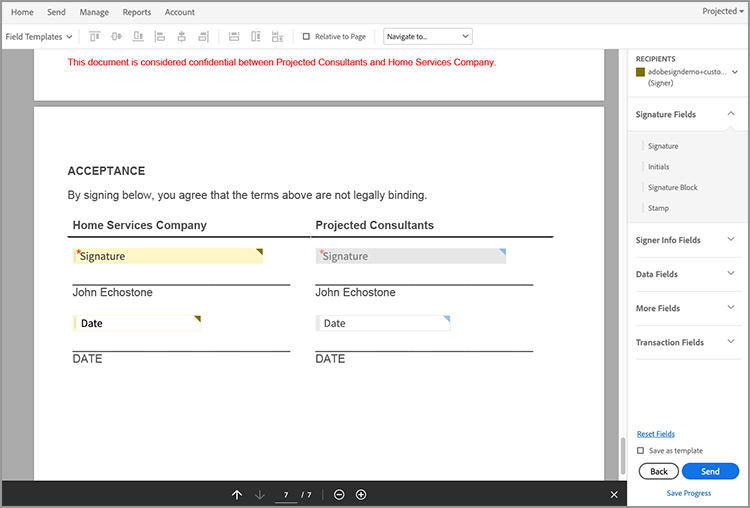
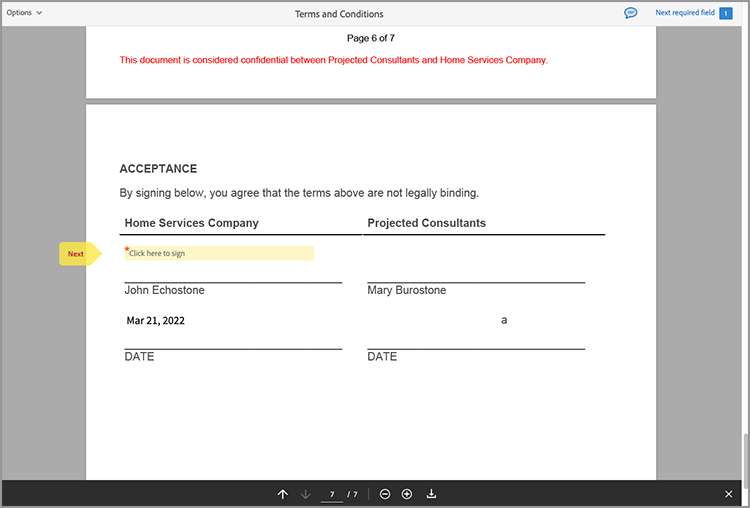

# 法的なワークフローの自動化


理想的なシナリオでは、契約書は修正なしで受諾されます。 しかし、多くの場合、契約書をカスタマイズし、法的な見直しを行う必要があります。 法務レビューは、多大なコストを生み出し、契約条件を提供するプロセスを遅らせます。 承認済みの言語に基づいて変更される定義済みのテンプレートを使用することで、法務チームは契約書の条件をより安全に管理できます。

このチュートリアルでは、州によって異なる法的契約を使用します。 これらのバリエーションに対処するために、特定の条件が満たされた場合にのみ含まれる、条件付きセクションを持つ契約書テンプレートが作成されます。 生成された文書は、Word文書でもPDF文書でもかまいません。 また、Adobe PDF Services APIまたはAcrobat Signを使用して文書をセキュリティ保護する方法についても学習します。

## 資格情報の取得

まず、無料のAdobe PDFサービスの資格情報を登録します。

1. 移動 [こちら](https://documentcloud.adobe.com/dc-integration-creation-app-cdn/main.html) をクリックして資格情報を登録します。
1. Adobe IDを使用してログインします。
1. 資格情報名を設定します。

   

1. サンプルコードをダウンロードする言語を選択します（例：Node.js）。
1. チェックして同意 **[!UICONTROL デベロッパー条件]**.
1. 選択 **[!UICONTROL 資格情報の作成]**.
サンプルファイル、pdfservices-api-credentials.json、認証用のprivate.keyを含むZIPファイルがコンピューターにダウンロードされます。

   

1. 選択 **[!UICONTROL Microsoft Wordアドインを入手]** または [AppSource](https://appsource.microsoft.com/en-cy/product/office/WA200002654) をインストールします。

   >[!NOTE]
   >
   >Wordアドインをインストールするには、Microsoft 365内でアドインをインストールする権限が必要です。 権限がない場合は、Microsoft 365管理者に連絡してください。

## データ

このシナリオでは、文書の生成に役立つ情報を渡し、特定のセクションを含めるかどうかを通知します。

```
{
    "customer": {
        "name": "Home Services Company",
        "street": "123 Any Street",
        "city": "Anywhere",
        "state": "CA",
        "zip": "12345",
        "country":"USA",
        "signer": {
            "email": "johnnyechostone@gmail.com",
            "firstName": "John",
            "lastName": "Echostone"
        }
    },
    "company": {
        "name": "Projected Consultants",
        "signer": {
            "email": "maryburostone@gmail.com",
            "firstName": "Mary",
            "lastName": "Burostone"
        }
    },
    "conditions": {
        "includeGeneralTerms": true,
        "includeConsumerDiscloure": true
    }
}
```

データには、お客様の名前、署名しているユーザー、現在の状態などに関する情報が含まれています。 さらに、契約書を生成する企業に関する情報を提供するセクションと、契約書の特定のセクションを含めるために使用する条件フラグがあります。

## 文書に基本的なタグを追加する

このシナリオでは、ダウンロード可能な利用条件の文書を使用します [こちら](https://github.com/benvanderberg/adobe-document-generation-samples/blob/main/Agreement/exercise/TermsAndConditions_Sample.docx?raw=true).


1. を開きます *TermsAndConditions.docx* Microsoft Wordのサンプル文書。
1. もし [文書の生成](https://appsource.microsoft.com/en-cy/product/office/WA200002654) プラグインがインストールされました、次を選択してください **[!UICONTROL 文書の生成]** をクリックします。 リボンに「ドキュメントの生成」が表示されない場合は、次の手順を実行します。
1. 選択 **[!UICONTROL 開始する]**.
1. 上記で記述したJSONサンプルデータを「 JSONデータ」フィールドにコピーします。

   

次に移動： *文書生成タガー* パネルを開いてドキュメントにタグを配置します。

## 会社名を挿入

1. 置き換えるテキストを選択します。 このシナリオでは、文書の最初のセクションのCOMPANYを置き換えます。
1. イン *文書生成タガー*&#x200B;で、「name」を検索します。
1. 「会社」で、 *名前*.

   

1. 選択 **[!UICONTROL テキストを挿入]**.

これにより、というタグが配置されます。 `{{company.name}}` タグはJSON内のそのパスの下にあるため。

```
{
    "company": {
        "name": "Projected Consultants",
        ...
    }
    ...
}
```

次に、CUSTOMERのテキストの最初のセクションでこの手順を繰り返します。 リピート **手順1 ～ 4**、お客様の下のCUSTOMERを「name」に置き換えます。 出力は次のようになります `{{customer.name}}`テキストが顧客オブジェクトの下から来ていることを示しています。

Adobeまた、Document Generation APIを使用すると、ヘッダーとフッター内、および署名のタイトルを追加する必要がある場所の最後にタグを追加できます。

で、このプロセスを再度繰り返します **手順1 ～ 4** フッターにCOMPANYとCUSTOMERというテキストが表示されます。


最後に、 **手順1 ～ 4を繰り返します** 署名ページの「お客様」セクションの「名」と「姓」を `{{customer.signer.firstName}}` および `{{customer.signer.lastName}}` それぞれ。 タグが長く、次の行に折り返される場合でも、心配する必要はありません。文書が生成されるとタグが置き換えられるためです。

ドキュメントおよびフッターの先頭は次のようになります。

* 開始セクション：


* フッター:


* 署名ページ:


タグが文書に配置されたので、生成された契約書をプレビューする準備が整いました。

## 生成された文書をプレビューする

Microsoft Word内で直接、サンプルJSONデータに基づいて生成された文書をプレビューできます。

1. イン *文書生成タガー*、選択 **[!UICONTROL 文書を生成]**.
1. 初めてログインするときには、Adobe IDを使用してログインするように求められる場合があります。 選択 **[!UICONTROL ログイン]** プロンプトに入力し、資格情報を使用してログインします。

   

1. 選択 **[!UICONTROL 文書を表示]**.

   

1. ブラウザーウィンドウが開き、ドキュメントの結果をプレビューできます。

   

## 各ステートにコンディショナル条件を追加

この次のセクションでは、特定の入力データ基準に基づいて、特定のセクションのみを含めるように設定します。 サンプルドキュメントでは、セクション4と5は特定の状態にのみ関連しています。 このシナリオでは、お客様がその州に居住している場合、州固有の条件のみを含める必要があります。 また、Microsoft Wordの番号付けでは、セクションが削除されている場合はそのセクションを含めないでください。 Document Generation APIの条件付きコンテンツ機能を使用して、これをタグ付けします。


1. 文書内の「カリフォルニア州への情報開示」セクションおよびすべての小段落を選択します。

   

1. イン *[!UICONTROL 文書生成タガー]*、選択 **[!UICONTROL 詳細]**.
1. 展開 **[!UICONTROL 条件付きコンテンツ]**.
1. イン *[!UICONTROL レコードの選択]* フィールド、検索、選択 **[!UICONTROL customer.state]**.
1. イン *[!UICONTROL 演算子の選択]* フィールド、選択 **=**.
1. イン *[!UICONTROL 値]* フィールド、タイプ *カルシウム*.
1. 選択 **[!UICONTROL コンディションを挿入]**.

これで、セクションはconditional-sectionタグと呼ばれるいくつかのタグで囲まれました。 タグを追加する際、コンディショナルセクションタグが番号付きの行として追加されている場合があります。 これを削除するには、タグの前にバックスペースを作成します。そうしないと、文書の生成時にタグが存在しなかったかのようにアイテムに番号が付けられます。 条件を満たすセクションは、 `` タグで作成されます。


**手順1 ～ 7を繰り返します** のために *ワシントン情報開示* セクション、置き換える *カルシウム* ～に価値を置く *ワシントン* お客様の州がワシントンの場合にのみ、このセクションが表示されることを示します。


## 条件付きセクションでのテスト

コンディショナルセクションを配置したら、次を選択して文書をプレビューできます。 **文書を生成**.

文書を生成する際、含まれるセクションはデータ基準を満たすセクションのみであることに注意してください。 次の例では、州がCAに等しいので、Californiaセクションのみが含まれています。


もう一つ注目すべき変化は、後続のセクションの番号が付いていることです。サービスとソフトウェアの使用は、5の番号を持っています。 つまり、Washingtonセクションを省略すると、番号が継続されます。


お客様がカリフォルニア州ではなくワシントン州にいるときに、テンプレートが正しく動作するかどうかをテストするには、テンプレートのサンプルデータを変更します。

1. イン *文書生成タガー*、選択 **[!UICONTROL 入力データの編集]**.

   

1. 選択 **[!UICONTROL 編集]**.

1. JSONデータで、 *カルシウム* から *ワシントン*.

   

1. 選択 **[!UICONTROL タグの生成]**.
1. 選択 **[!UICONTROL 文書を生成]** をクリックして、文書を再生成します。

文書には「ワシントン州」セクションのみが含まれていることに注意してください。


## コンディショナル文を追加する

条件節と同様に、特定の条件が満たされた場合に含まれる特定の文を持つことができます。 この例では、カリフォルニア州とワシントン州で返品ポリシーが異なります。

1. セクション3.1では、最初の文「ワシントン州で購入する場合、全額払い戻しのために、元のトランザクションから30日以内にMAILで返送する必要があります」を選択します。
1. イン *[!UICONTROL 文書生成タガー]*、選択 **[!UICONTROL 詳細]**.
1. 展開 **[!UICONTROL 条件付きコンテンツ]**.
1. 未満 *[!UICONTROL コンテンツタイプ]*、選択 **[!UICONTROL フレーズ]**.
1. イン *[!UICONTROL レコードの選択]* フィールド、検索、選択 **[!UICONTROL customer.state]**.
1. イン *[!UICONTROL 演算子の選択]* フィールド、選択 **=**.
1. イン *[!UICONTROL 値]* フィールド、タイプ *カルシウム*.
1. 選択 **[!UICONTROL コンディションを挿入]**.

タグの名前は同じですが、フレーズとセクションの主な違いは、フレーズには新しい行が含まれていないセクションがあることです。 condition-sectionタグと – end-sectionタグは、同じ段落に含める必要があります。


## Acrobat Signのタグを追加する

Acrobat Signを使用すると、署名用に契約書を送信したり、他のユーザーが簡単に表示して署名できるようにwebエクスペリエンスに埋め込んだりできます。 Microsoft WordのAdobe Document Generation Taggerを使用すると、Acrobat Signで送信する前の文書に簡単に事前にタグを付けることができるため、署名は常に正しい場所に配置されます。 このシナリオでは、文書に署名して日付を入力する場所を必要とする署名者が2人います。

1. お客様が署名する必要がある場所に移動します。
1. 署名を追加する位置にカーソルを置きます。

   

1. イン *[!UICONTROL 文書生成タガー]*、選択 **[!UICONTROL Adobe Sign]**.
1. イン *[!UICONTROL 受信者数を指定]* フィールドに受信者の数を設定します（この例では2を使用）。
1. イン *[!UICONTROL 受信者]* フィールド、選択 **[!UICONTROL 署名者 – 1]**.
1. イン *[!UICONTROL フィールド]* 文字を選択 **[!UICONTROL 署名]**.
1. 選択 **[!UICONTROL Adobe Signテキストタグを挿入]**.

   

>[!NOTE]
>
>もし **Adobe Signテキストタグを挿入** ボタンが表示されない場合は、下にスクロールしてください。

これにより、最初の署名者が署名する必要がある署名フィールドが配置されます。


次に、署名時に自動入力する署名者用のデータフィールドを配置します。

1. 日付を配置する場所にカーソルを移動します。

   

1. フィールドタイプを「日付」に設定します。
1. 選択 **[!UICONTROL Adobe Signテキストタグを挿入]**.

配置される日付タグはかなり長くなっています。 `{{Date 3_es_:signer1:date:format(mm/dd/yyyy):font(size=Auto)}}`. Acrobat Signテキストタグは、Document Generationタグとは異なる同じ行に配置する必要があります。 この `:format()` および `font()` パラメーターはオプションなので、このシナリオでは、タグを短くすることができます `{{Date 3_es_:signer1:date}}`.

上記の手順を繰り返します *会社の署名* セクションに追加します。 この場合は、「受信者」フィールドを **署名者 – 2**&#x200B;を選択しない場合、すべての署名フィールドは同じ担当者に割り当てられます。

## 契約書を生成

これで文書にタグが付き、作業を開始できます。 次の節では、Node.js用のDocument Generation APIサンプルを使用してドキュメントを生成する方法について説明します。 これらのサンプルはどの言語でも使用できます。

資格情報の登録時にダウンロードしたpdfservices-node-sdk-samples-masterファイルを開きます。 これらのファイルには、pdfservices-api-credentials.jsonおよびprivate.keyファイルが含まれます。

1. 開く **[!UICONTROL ターミナル]** 次を使用して依存関係をインストールするには `npm install`.
1. サンプルをコピー *data.json* の中に *resources* フォルダー。
1. 作成したWordテンプレートを *resources* フォルダー。
1. サンプルフォルダーのルートディレクトリに、 *generate-salesOrder.js*.

   ```
   const PDFServicesSdk = require('@adobe/pdfservices-node-sdk').
   const fs = require('fs');
   const path = require('path');
   
   var dataFileName = path.join('resources', '<INSERT JSON FILE');
   var outputFileName = path.join('output', 'salesOrder_'+Date.now()+".pdf");
   var inputFileName = path.join('resources', '<INSERT DOCX>');
   
   //Loads credentials from the file that you created.
   const credentials =  PDFServicesSdk.Credentials
      .serviceAccountCredentialsBuilder()
      .fromFile("pdfservices-api-credentials.json")
      .build();
   
   // Setup input data for the document merge process
   const jsonString = fs.readFileSync(dataFileName),
   jsonDataForMerge = JSON.parse(jsonString);
   
   // Create an ExecutionContext using credentials
   const executionContext = PDFServicesSdk.ExecutionContext.create(credentials);
   
   // Create a new DocumentMerge options instance
   const documentMerge = PDFServicesSdk.DocumentMerge,
   documentMergeOptions = documentMerge.options,
   options = new documentMergeOptions.DocumentMergeOptions(jsonDataForMerge, documentMergeOptions.OutputFormat.PDF);
   
   // Create a new operation instance using the options instance
   const documentMergeOperation = documentMerge.Operation.createNew(options)
   
   // Set operation input document template from a source file.
   const input = PDFServicesSdk.FileRef.createFromLocalFile(inputFileName);
   documentMergeOperation.setInput(input);
   
   // Execute the operation and Save the result to the specified location.
   documentMergeOperation.execute(executionContext)
   .then(result => result.saveAsFile(outputFileName))
   .catch(err => {
      if(err instanceof PDFServicesSdk.Error.ServiceApiError
         || err instanceof PDFServicesSdk.Error.ServiceUsageError) {
         console.log('Exception encountered while executing operation', err);
      } else {
         console.log('Exception encountered while executing operation', err);
      }
   });
   ```

1. 置換 `<JSON FILE>` /resources内のJSONファイルの名前を使用します。
1. 置換 `<INSERT DOCX>` にDOCXファイルの名前を付けます。
1. 実行するには、次を使用します **[!UICONTROL ターミナル]** ノードを実行するには `generate-salesOrder.js`.

出力ファイルは/outputフォルダーにあり、文書が正しく生成されます。

書式を変更するには、下の行を変更します。 DOCX形式は、この文書をWordでの編集や契約のレビューのために送信する場合に役立ちます。

PDF:

```
options = new documentMergeOptions.DocumentMergeOptions(jsonDataForMerge,
documentMergeOptions.OutputFormat.PDF);
```

Word:

```
options = new documentMergeOptions.DocumentMergeOptions(jsonDataForMerge, documentMergeOptions.OutputFormat.DOCX);
```

出力ファイル名を、PDFの場合は.pdfに、DOCXの場合は.docxに、それぞれ変更する必要があります。

```
var outputFileName = path.join('output', 'salesOrder_'+Date.now()+".docx");
```

## 契約書を署名用に送信

[Adobe Acrobat Sign](https://www.adobe.com/jp/sign.html) 1人または複数の受信者に契約書を送信して、文書の表示や署名を依頼できます。 REST APIを使用すると、署名用に文書を送信する使いやすいユーザーエクスペリエンスによって、Word、PDF、HTMLなどの形式を選択して署名用に文書を送信できます。

次の例では、REST APIドキュメントページを使用して、以前に生成されたドキュメントを取得し、署名用に送信する方法について説明します。 まず、Acrobat Sign webインターフェイスを使用する方法と、REST APIを使用する方法を説明します。

## Acrobat Signアカウントを取得

Acrobat Signアカウントをお持ちでない場合は、デベロッパーアカウントに新規登録して、ドキュメントを確認してください [こちら](https://developer.adobe.com/adobesign-api/)、を選択します **開発者アカウントの新規登録**. フォームに入力し、確認電子メールを受け取るように求められます。 その後、Webサイトに移動し、パスワードとアカウントを設定して、Acrobat Signにログインします。

## Webインターフェイスからの契約書の送信

1. 選択 **[!UICONTROL 送信]** をクリックします。

   

1. イン *受信者* フィールドに2つの電子メールアドレスを指定します。 Acrobat Signアカウントに関連付けられていない電子メールアドレスを使用することをお勧めします。

   

1. 設定 **[!UICONTROL 契約書名]** および **[!UICONTROL メッセージ]**.
1. 選択 **[!UICONTROL ファイルを追加]** 生成されたファイルをコンピューターからアップロードします。
1. 「**[!UICONTROL 署名フィールドをプレビューおよび追加]**」を選択します。
1. 「**[!UICONTROL 次へ]**」を選択します。
1. 署名ページにスクロールすると、タグに基づいて配置された署名フィールドが表示されます。

   

1. 「**[!UICONTROL 送信]**」を選択します。
1. 電子メールに、表示して署名するためのリンクを含むメッセージが表示されます。

   

1. 選択 **[!UICONTROL 確認して署名]**.
1. 選択 **[!UICONTROL 続行]** 利用条件に同意します。
1. 選択 **[!UICONTROL 開始]** 署名が必要な場所にジャンプします。

   

1. 選択 **[!UICONTROL ここをクリックして署名]**.

   

1. 署名を入力します。

   

1. 選択 **[!UICONTROL 適用]**.
1. 選択 **[!UICONTROL クリックして署名]**.

次の署名者に電子メールが送信されます。 手順9～16を繰り返して、2人目の署名者について表示し、署名を行います。

契約書が完了すると、契約書の署名済みコピーが各関係者に電子メールで送信されます。 Acrobat Signまた、署名済みの契約書は、 **管理** ページです。


次に、REST APIドキュメントで同じシナリオを実行する方法について説明します。

## 資格情報の取得

1. 移動先 [Acrobat Sign RESTドキュメント](https://secure.na1.adobesign.com/public/docs/restapi/v6).
1. 展開 *transientDocuments* および [POST/transientDocuments](https://benprojecteddemo.na1.adobesign.com/public/docs/restapi/v6#!/transientDocuments/createTransientDocument).
1. 選択 **[!UICONTROL OAUTHアクセストークン]**.

   

1. OAUTH権限を確認します *agreement_write*, *agreement_sign*, *widget_write*、および *library_write*.
1. 選択 **[!UICONTROL 承認]**.
1. ポップアップが表示され、Acrobat Signアカウントでログインするように求められます。 「ユーザー」に管理者のユーザー名とパスワードを入力します。
1. RESTドキュメントへのアクセスを許可するように求められます。 選択 **[!UICONTROL アクセスを許可]**.

次に、ベアラートークンが **Authorization** フィールドに入力します。

Acrobat Signの認証トークンの作成方法については、以下の手順に従ってください [こちら](https://opensource.adobe.com/acrobat-sign/developer_guide/helloworld.html).

## 一時的なドキュメントのアップロード

認証トークンは前の手順で追加したため、API呼び出しを行うには文書をアップロードする必要があります。

1. イン *ファイル* フィールドに、前の手順で生成されたPDF文書をアップロードします。

   

1. 選択 **[!UICONTROL ぜひお試しください。]**.
1. イン **[!UICONTROL 応答本文]**、コピー *transientDocumentId* 値を返します。

この *transientDocumentId* を使用して、Acrobat Signに一時的に保存されている文書を参照し、以降のAPI呼び出しで参照できるようにします。

## 署名用に送信

文書がアップロードされたら、署名用に契約書を送信する必要があります。

1. 「契約書」セクションと「POST契約書」セクションを展開します。
1. を *AgreementInfo* フィールドに次のJSONを入力します。

   ```
   {
   "fileInfos": [
      {
         "transientDocumentId": "3AAABLblqZhAJeoswpyslef8_toTGT1WgBLk3TlhfJXy_uSLlKyre2hjF0-J1meBDn0PlShk0uQy6JghlqEoqXNnskq7YawteF6QWtHefP9wN2CW_Xbt0O9kq1tkpznG0a5-mEm4bYAV1FGOnD1mt_ooYdzKxm7KzTB11DLX2-81Zbe2Z1suy7oXiWNR3VSb-zMfIb5D4oIxF8BiNfN0q08RwT108FcB1bx4lekkATGld3nRbf8ApVPhB72VNrAIF0F1rAFBWTtfgvBKZaxrYSyZq73R_neMdvZEtxWTk5fii_bLVe7VdNZMcO55sofH61eQC_QIIsoYswZP4rw6dsTa68ZRgKUNs"
      }
   ],
   "name": "Terms and Conditions",
   "participantSetsInfo": [
      {
         "memberInfos": [
         {
            "email": "adobesigndemo+customer@outlook.com"
         }
         ],
         "order": 1,
         "role": "SIGNER"
      },
      {
         "memberInfos": [
            {
               "email": "adobesigndemo+company@outlook.com"
            }
         ],
         "order": 1,
         "role": "SIGNER"
         }
   ],
   "signatureType": "ESIGN",
   "state": "IN_PROCESS"
   }
   ```

1. 選択 **[!UICONTROL ぜひお試しください。]**.

**POST契約書API** 契約書のIDを返します。 JSONモデルスキーマのテンプレートを取得するには、 **最小モデルスキーマ**. パラメーターの完全なリストは、 **完全なモデルスキーマ** セクションに追加します。

## 契約書のステータスを確認

契約書IDを取得すると、契約書のステータスを送信できます。

1. 展開 **[!UICONTROL GET /agreements/{agreementId}]**.
1. 追加のOAUTHスコープが必要な場合は、 **[!UICONTROL OAUTHアクセストークン]** また
1. 前のAPI呼び出し応答のagreementIdを「 agreementId 」フィールドにコピーします。
1. 選択 **[!UICONTROL ぜひお試しください。]**.

これで、その契約書に関する情報が表示されました。

```
{
    "id": "CBJCHBCAABAAc6LyP4SVuKXP_pNstzIzyripanRdz4IB",
    "name": "Terms and Conditions",
    "groupId": "CBJCHBCAABAAoyMb1yIgczAGhBuJeHf99mglPtM7ElEu",
    "type": "AGREEMENT",
    "participantSetsInfo": [
      {
        "id": "CBJCHBCAABAAzZE-IcHHkt05-AVbxas4Jz7DUl3oEBO6",
        "memberInfos": [
          {
            "email": "adobesigndemo+customer@outlook.com",
            "id": "CBJCHBCAABAAyWgMMReqbxUFM7ctI5xz16c2kOmEy-IQ",
            "securityOption": {
              "authenticationMethod": "NONE"
            }
          }
        ],
        "role": "SIGNER",
        "order": 1
      },
      {
        "id": "CBJCHBCAABAAaRHz3gY2W0w5n_6pj1GMMuZAfhBihc1j",
        "memberInfos": [
          {
            "email": "adobesigndemo+company@outlook.com",
            "id": "CBJCHBCAABAAOZQwjPwJXFiX8YDKPYtzMpftsmxYrIo9",
            "securityOption": {
              "authenticationMethod": "NONE"
            }
          }
        ],
        "role": "SIGNER",
        "order": 1
      }
    ],
    "senderEmail": "adobesigndemo+new@outlook.com",
    "createdDate": "2022-03-22T02:59:36Z",
    "lastEventDate": "2022-03-22T02:59:41Z",
    "signatureType": "ESIGN",
    "locale": "en_US",
    "status": "OUT_FOR_SIGNATURE",
    "documentVisibilityEnabled": true,
    "hasFormFieldData": false,
    "hasSignerIdentityReport": false,
    "documentRetentionApplied": false
  }
```

アップデートの変更時に通知を受け取る、より効率的な方法は、Webhooksを使用することです。この方法については、こちらを参照してください。 [こちら](https://opensource.adobe.com/acrobat-sign/developer_guide/webhookapis.html。

## 署名済み文書を保存

文書に署名したら、 GET /agreements/combinedDocumentファイルを使用して取得できます。

1. 展開 **[!UICONTROL GET /agreements/{agreementId}/combinedDocument]**.
1. 設定 **[!UICONTROL agreementId]** を *agreementId* 以前のAPI呼び出しから提供されています。
1. 選択 **[!UICONTROL ぜひお試しください。]**.

監査レポートまたはサポート文書を添付するための追加パラメーターは、 attachSupportingDocumentsパラメーターおよびattachAuditReportパラメーターを使用して設定できます。

を **応答本文**&#x200B;を選択します。ダウンロードしたファイルはコンピューターにダウンロードされ、任意の場所に保存されます。

## 詳細オプション

文書を生成して署名用に送信するだけでなく、追加のアクションを使用できます。

例えば、文書に署名がない場合、Adobe PDF Services APIを使用すると、契約書が生成された後に、次のような様々な方法で文書を変換できます。

* パスワードで文書を保護
* 画像が大きい場合はPDFを圧縮
* 利用可能なその他のアクションについて詳しくは、Adobe PDF Services APIのサンプルファイルの/srcフォルダー内のスクリプトを参照してください。 使用できる様々なアクションのドキュメントを確認して、詳細を確認することもできます。

さらに、Acrobat Signには次のような機能が追加されています。

* アプリケーションへの署名エクスペリエンスの埋め込み
* 署名者のID確認方法を追加
* 電子メール通知設定の構成
* 契約書の一部として個別のドキュメントをダウンロードする

## さらなる学習

さらに学習したいですか？ その他の使用方法を確認する [!DNL Adobe Acrobat Services]:

* 詳細情報： [文書](https://developer.adobe.com/document-services/docs/overview/)
* Adobe Experience Leagueのその他のチュートリアルを見る
* PDFの使用方法を確認するには、 /srcフォルダーにあるサンプルスクリプトを使用します
* フォロー [Adobe技術ブログ](https://medium.com/adobetech/tagged/adobe-document-cloud) 最新のヒントとコツ
* 購入する [ペーパークリップ（月間ライブストリーム）](https://www.youtube.com/playlist?list=PLcVEYUqU7VRe4sT-Bf8flvRz1XXUyGmtF) を使用したオートメーションについて学習するには [!DNL Adobe Acrobat Services].
