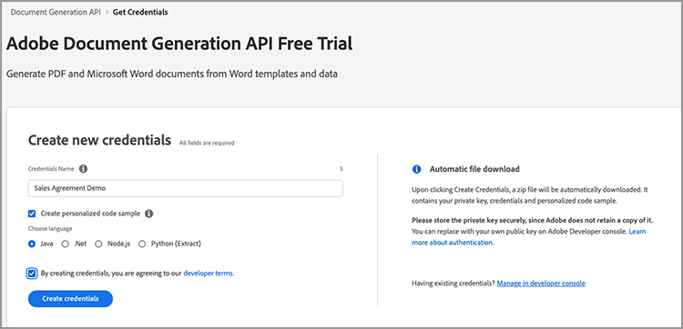
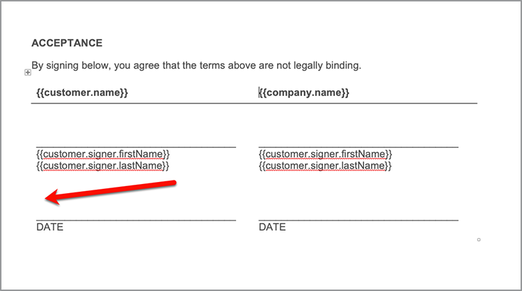

# 法務ワークフローの自動化


理想的なシナリオでは、契約条件は変更されずに承諾されます。 ただし、多くの場合、契約書にはカスタマイズが必要であり、その後、法的確認が必要になります。 法務レビューでは、大きなコストがかかり、契約書の提出手続きが遅くなります。 承認済みの言語に基づいて変更される定義済みのテンプレートを使用することで、法務チームが契約書を管理し、より安全に実行できるようになります。

このチュートリアルでは、州ごとに異なる法的契約を使用します。 これらの変化に対処するために、条件付きセクションを持つ契約テンプレートが作成されます。条件付きセクションは、特定の条件が満たされたときにのみ含まれます。 生成される文書は、Word 文書またはPDF文書です。 Adobe PDF Services API またはAcrobat Signを使用してドキュメントを保護する方法についても説明します。

## 資格情報の取得

無料のAdobe PDF Services 資格情報に登録します。

1. 移動 [ここ](https://documentcloud.adobe.com/dc-integration-creation-app-cdn/main.html) 」をクリックして資格情報を登録します。
1. Adobe IDを使用してログインします。
1. 資格情報の名前を設定します。

   

1. サンプルコードをダウンロードする言語（Node.js など）を選択します。
1. 確認して同意する **[!UICONTROL デベロッパー向け条件]**&#x200B;を選択します。
1. 選択 **[!UICONTROL 資格情報の作成]**を選択します。
認証用のサンプルファイル、pdfservices-api-credentials.json および private.key を含む ZIP ファイルがコンピューターにダウンロードされます。

   

1. 選択 **[!UICONTROL Microsoft Word アドインを入手]** または [AppSource](https://appsource.microsoft.com/en-cy/product/office/WA200002654) を選択します。

   >[!NOTE]
   >
   >Word アドインをインストールするには、Microsoft 365 内でアドインをインストールする権限が必要です。 権限がない場合は、Microsoft 365 管理者にお問い合わせください。

## データ

このシナリオでは、ドキュメントの生成に役立つ情報が渡され、特定のセクションを含めるかどうかが通知されます。

```
{
    "customer": {
        "name": "Home Services Company",
        "street": "123 Any Street",
        "city": "Anywhere",
        "state": "CA",
        "zip": "12345",
        "country":"USA",
        "signer": {
            "email": "johnnyechostone@gmail.com",
            "firstName": "John",
            "lastName": "Echostone"
        }
    },
    "company": {
        "name": "Projected Consultants",
        "signer": {
            "email": "maryburostone@gmail.com",
            "firstName": "Mary",
            "lastName": "Burostone"
        }
    },
    "conditions": {
        "includeGeneralTerms": true,
        "includeConsumerDiscloure": true
    }
}
```

データには、お客様に関する情報、お客様の名前、署名しているユーザー、お客様の状態などが含まれます。 また、契約書の特定のセクションを含めるために使用される契約書および条件フラグを生成する会社に関する情報のセクションもあります。

## ドキュメントへの基本タグの追加

このシナリオでは、ダウンロード可能な契約条件ドキュメントを使用します [ここ](https://github.com/benvanderberg/adobe-document-generation-samples/blob/main/Agreement/exercise/TermsAndConditions_Sample.docx?raw=true)を選択します。


1. パネルの「 *TermsAndConditions.docx* Microsoft Word のサンプル文書。
1. DITA マップの [文書生成](https://appsource.microsoft.com/en-cy/product/office/WA200002654) プラグインがインストールされている場合は、 **[!UICONTROL 文書生成]** 」をクリックします。 リボンに「ドキュメントの生成」が表示されない場合は、次の手順に従ってください。
1. 選択 **[!UICONTROL はじめに]**&#x200B;を選択します。
1. 上記の JSON サンプルデータを JSON データフィールドにコピーします。

   

次の場所にある *文書生成タグ* パネルが表示されます。

## 会社名の挿入

1. 置換するテキストを選択します。 このシナリオでは、ドキュメントの最初のセクションで COMPANY を置き換えます。
1. 入力 *文書生成タグ*&#x200B;で、「name」を検索します。
1. 会社の下で、 *name*&#x200B;を選択します。

   

1. 選択 **[!UICONTROL テキストを挿入]**&#x200B;を選択します。

これにより、 `{{company.name}}` タグは JSON のそのパスの下にあるからです。

```
{
    "company": {
        "name": "Projected Consultants",
        ...
    }
    ...
}
```

次に、「CUSTOMER」の最初のセクションでこの手順を繰り返します。 繰り返し **手順 1～4** customer の下の&quot;name&quot;に置き換えます。 出力は `{{customer.name}}`を表示し、テキストが顧客オブジェクトの下から入力されていることを示します。

Adobe文書生成 API を使用すると、ヘッダーとフッター内にタグを含めることも、署名のタイトルを最後に配置することもできます。

このプロセスを **手順 1～4** を入力します。


最後に、 **手順 1 ～ 4 を繰り返します。** 署名ページの「Customer」セクションにある「FIRST NAME」と「LAST NAME」を `{{customer.signer.firstName}}` および `{{customer.signer.lastName}}` それぞれ タグが長く、次の行に折り返しても問題ありません。文書が生成されると、タグは置換されます。

ドキュメントの先頭とフッターは次のようになります。

* 開始セクション：


* フッター:


* 署名ページ：


タグが文書に配置されたので、生成された契約書をプレビューする準備が整いました。

## 生成されたドキュメントのプレビュー

Microsoft Word 内で直接、サンプルの JSON データに基づいて生成された文書をプレビューできます。

1. 入力 *文書生成タグ*&#x200B;で、 **[!UICONTROL ドキュメントの生成]**&#x200B;を選択します。
1. 初めてAdobe IDでログインするように求められる場合があります。 選択 **[!UICONTROL サインイン]** 」をクリックし、資格情報を使用してログインするように求めるプロンプトに従います。

   

1. 選択 **[!UICONTROL ドキュメントを表示]**&#x200B;を選択します。

   

1. ブラウザーウィンドウが開き、文書の結果をプレビューできます。

   

## 各状態に条件条件を追加

次のセクションでは、特定の入力データ基準に基づいて、特定のセクションのみを含めるように設定します。 サンプルドキュメントでは、セクション 4 と 5 は特定の状態にのみ関連しています。 このシナリオでは、お客様がその州にお住まいの場合は、州固有の用語のみを含める必要があります。 また、Microsoft Word が削除されている場合は、そのセクションも自動番号に含めないでください。 Document Generation API の条件付きコンテンツ機能を使用してこのタグを付けます。


1. 文書で、「California Disclosure」セクションとすべての小段落の箇条書きを選択します。

   

1. 入力 *[!UICONTROL 文書生成タグ]*&#x200B;で、 **[!UICONTROL 詳細]**&#x200B;を選択します。
1. 展開 **[!UICONTROL 条件付きコンテンツ]**&#x200B;を選択します。
1. 入力 *[!UICONTROL レコードの選択]* 」フィールドに入力し、検索して「 **[!UICONTROL customer.state]**&#x200B;を選択します。
1. 入力 *[!UICONTROL 演算子の選択]* 」フィールドで、「 **=**&#x200B;を選択します。
1. 入力 *[!UICONTROL 値]* フィールド、タイプ *CA*&#x200B;を選択します。
1. 選択 **[!UICONTROL 条件の挿入]**&#x200B;を選択します。

セクションは、conditional-section タグと呼ばれるタグで囲まれます。 タグを追加したときに、番号付き行として conditional-section タグが追加されている場合があります。 タグの前にバックスペースを付けることで削除できます。そうしないと、ドキュメントの生成時にタグが存在しなかったかのようにアイテムに番号が付けられます。 条件付きのセクションは `` タグを使用します。


**手順 1 ～ 7 を繰り返します** 」を *ワシントン・ディスクロージャー* セクション、置換 *CA* 価値がある *WA* お客様の都道府県がワシントンの場合にのみセクションが表示されることを示します。


## 条件付きセクションを使用したテスト

条件セクションが配置されたら、 **ドキュメントの生成**&#x200B;を選択します。

ドキュメントを生成すると、含まれるセクションはデータ基準を満たすセクションのみであることに注意してください。 次の例では、state が CA に等しかったため、California セクションのみが含まれています。


もうひとつの重要な変更点は、後続の「サービスおよびソフトウェアの使用」セクションの番号が 5 であることです。 つまり、「ワシントン」セクションが省略されている場合も、自動番号は継続されます。


お客様がカリフォルニア州ではなくワシントン州にいる場合にテンプレートが正しく動作するかどうかをテストするには、テンプレートのサンプルデータを変更します。

1. 入力 *文書生成タグ*&#x200B;で、 **[!UICONTROL 入力データの編集]**&#x200B;を選択します。

   

1. 選択 **[!UICONTROL 編集]**&#x200B;を選択します。

1. JSON データで、 *CA* を *WA*&#x200B;を選択します。

   

1. 選択 **[!UICONTROL タグを生成]**&#x200B;を選択します。
1. 選択 **[!UICONTROL ドキュメントの生成]** を選択して、ドキュメントを再生成します。

この文書には、ワシントン州のセクションのみが含まれています。


## 条件文の追加

条件セクションと同様に、特定の条件が満たされたときに特定の文を含めることもできます。 この例では、カリフォルニア州とワシントン州では返品ポリシーが異なります。

1. セクション 3.1 では、「ワシントン州で購入する場合は、元の取引から 30 日以内に全額返金のために郵便で返送する必要があります」という最初の文を選択します。
1. 入力 *[!UICONTROL 文書生成タグ]*&#x200B;で、 **[!UICONTROL 詳細]**&#x200B;を選択します。
1. 展開 **[!UICONTROL 条件付きコンテンツ]**&#x200B;を選択します。
1. Under *[!UICONTROL コンテンツタイプ]*&#x200B;で、 **[!UICONTROL フレーズ]**&#x200B;を選択します。
1. 入力 *[!UICONTROL レコードの選択]* 」フィールドに入力し、検索して「 **[!UICONTROL customer.state]**&#x200B;を選択します。
1. 入力 *[!UICONTROL 演算子の選択]* 」フィールドで、「 **=**&#x200B;を選択します。
1. 入力 *[!UICONTROL 値]* フィールド、タイプ *CA*&#x200B;を選択します。
1. 選択 **[!UICONTROL 条件の挿入]**&#x200B;を選択します。

タグの名前は同じですが、フレーズとセクションの主な違いは、フレーズに新しい行を含まないセクションがあることです。 condition-section タグと —end-section タグは、同じ段落内に配置する必要があります。


## Acrobat Signへのタグの追加

Acrobat Signでは、署名用に契約書を送信したり、誰かが簡単に表示および署名できるように web エクスペリエンスに埋め込んだりすることができます。 MicrosoftのAdobe文書生成タグ Word では、文書にAcrobat Signで送信する前に簡単にタグを事前に設定できるため、署名は常に適切な場所に配置されます。 このシナリオでは、2 人の署名者が署名の場所と文書の日付を指定する必要があります。

1. お客様が署名する必要がある場所に移動します。
1. 署名を挿入する場所にカーソルを置きます。

   

1. 入力 *[!UICONTROL 文書生成タグ]*&#x200B;で、 **[!UICONTROL Adobe Sign]**&#x200B;を選択します。
1. 入力 *[!UICONTROL 受信者の数の指定]* 」フィールドで、受信者の数を設定します（この例では 2 を使用します）。
1. 入力 *[!UICONTROL 受信者]* 」フィールドで、「 **[!UICONTROL Signer-1]**&#x200B;を選択します。
1. 入力 *[!UICONTROL フィールド]* 」タイプで、「 **[!UICONTROL 署名]**&#x200B;を選択します。
1. 選択 **[!UICONTROL 挿入/Adobe Sign/テキストタグ]**&#x200B;を選択します。

   

>[!NOTE]
>
>DITA マップの **挿入/Adobe Sign/テキストタグ** 」ボタンが表示されない場合は、下にスクロールします。

これにより、最初の署名者が署名する必要がある署名フィールドが配置されます。


次に、署名時に自動入力する署名者用のデータフィールドを配置します。

1. 日付を配置する場所にカーソルを移動します。

   

1. フィールドタイプを「日付」に設定します。
1. 選択 **[!UICONTROL 挿入/Adobe Sign/テキストタグ]**&#x200B;を選択します。

配置される日付タグは長すぎます。 `{{Date 3_es_:signer1:date:format(mm/dd/yyyy):font(size=Auto)}}`を選択します。 Acrobat Signテキストタグは、ドキュメント生成タグとは異なり、同じ行に配置する必要があります。 この `:format()` および `font()` パラメーターはオプションなので、このシナリオではタグを `{{Date 3_es_:signer1:date}}`を選択します。

上記の手順を繰り返します。 *会社の署名* セクション この場合、「受信者」フィールドを **署名者 2**&#x200B;を選択しないと、すべての署名フィールドが同じユーザーに割り当てられます。

## 契約書の生成

これで文書にタグが付き、作業を開始する準備が整いました。 この次のセクションでは、Node.js のドキュメント生成 API サンプルを使用してドキュメントを生成する方法について説明します。 これらのサンプルは、どの言語でも使用できます。

資格情報の登録時にダウンロードした pdfservices-node-sdk-samples-master ファイルを開きます。 これらのファイルには、pdfservices-api-credentials.json および private.key ファイルが含まれます。

1. ファイルを **[!UICONTROL ターミナル]** を使用して依存関係をインストールするには `npm install`を選択します。
1. サンプルのコピー *data.json* を *resources* フォルダーを開きます。
1. 作成した Word テンプレートを *resources* フォルダーを開きます。
1. samples フォルダーのルートディレクトリに *generate-salesOrder.js*&#x200B;を選択します。

   ```
   const PDFServicesSdk = require('@adobe/pdfservices-node-sdk').
   const fs = require('fs');
   const path = require('path');
   
   var dataFileName = path.join('resources', '<INSERT JSON FILE');
   var outputFileName = path.join('output', 'salesOrder_'+Date.now()+".pdf");
   var inputFileName = path.join('resources', '<INSERT DOCX>');
   
   //Loads credentials from the file that you created.
   const credentials =  PDFServicesSdk.Credentials
      .serviceAccountCredentialsBuilder()
      .fromFile("pdfservices-api-credentials.json")
      .build();
   
   // Setup input data for the document merge process
   const jsonString = fs.readFileSync(dataFileName),
   jsonDataForMerge = JSON.parse(jsonString);
   
   // Create an ExecutionContext using credentials
   const executionContext = PDFServicesSdk.ExecutionContext.create(credentials);
   
   // Create a new DocumentMerge options instance
   const documentMerge = PDFServicesSdk.DocumentMerge,
   documentMergeOptions = documentMerge.options,
   options = new documentMergeOptions.DocumentMergeOptions(jsonDataForMerge, documentMergeOptions.OutputFormat.PDF);
   
   // Create a new operation instance using the options instance
   const documentMergeOperation = documentMerge.Operation.createNew(options)
   
   // Set operation input document template from a source file.
   const input = PDFServicesSdk.FileRef.createFromLocalFile(inputFileName);
   documentMergeOperation.setInput(input);
   
   // Execute the operation and Save the result to the specified location.
   documentMergeOperation.execute(executionContext)
   .then(result => result.saveAsFile(outputFileName))
   .catch(err => {
      if(err instanceof PDFServicesSdk.Error.ServiceApiError
         || err instanceof PDFServicesSdk.Error.ServiceUsageError) {
         console.log('Exception encountered while executing operation', err);
      } else {
         console.log('Exception encountered while executing operation', err);
      }
   });
   ```

1. 置換 `<JSON FILE>` の部分は、/resources にある JSON ファイルの名前を使用します。
1. 置換 `<INSERT DOCX>` に DOCX ファイルの名前を付けます。
1. 実行するには、 **[!UICONTROL ターミナル]** ノードを実行するには `generate-salesOrder.js`を選択します。

出力ファイルは/output フォルダーにあり、ドキュメントは正しく生成されます。

以下の行を変更して、形式を変更できます。 DOCX 形式は、この文書を Word で編集するために送信する場合や、契約のレビューのために送信する場合に便利です。

PDF:

```
options = new documentMergeOptions.DocumentMergeOptions(jsonDataForMerge,
documentMergeOptions.OutputFormat.PDF);
```

Word:

```
options = new documentMergeOptions.DocumentMergeOptions(jsonDataForMerge, documentMergeOptions.OutputFormat.DOCX);
```

また、出力ファイルの名前を、PDFまたは DOCX 出力形式の場合はそれぞれ.pdf または.docx に変更する必要があります。

```
var outputFileName = path.join('output', 'salesOrder_'+Date.now()+".docx");
```

## 署名用に契約書を送信

[Adobe Acrobat Sign](https://www.adobe.com/jp/sign.html) 文書を表示して署名してもらうために、1 人または複数の受信者に契約書を送信できます。 文書を署名用に送信するための使いやすいユーザーエクスペリエンスに加えて、REST API を利用して、Word、PDF、HTML、その他の形式を取り込んで署名用に送信できます。

以下の例では、REST API ドキュメントページを使用して、以前に生成されたドキュメントを取得し、署名用に送信する方法を説明します。 まず、Acrobat Sign Web インターフェイスを使用してこれを実行する方法を学習し、次に REST API を使用して実行する方法を学習します。

## Acrobat Signアカウントの取得

Acrobat Signアカウントをお持ちでない場合は、開発者アカウントにサインアップし、ドキュメントを確認してください [ここ](https://developer.adobe.com/adobesign-api/)を選択し、 **デベロッパーアカウントの新規登録**&#x200B;を選択します。 フォームに入力して確認用電子メールを受信するように求められます。 その後、パスワードとアカウントを設定する Web サイトに誘導され、そこでAcrobat Signにログインできます。

## Web インターフェイスからの契約書の送信

1. 選択 **[!UICONTROL 送信]** を選択します。

   

1. 入力 *受信者* 」フィールドで、2 つの電子メールアドレスを指定します。 Acrobat Signアカウントに関連付けられていない電子メールアドレスを使用することをお勧めします。

   

1. 設定 **[!UICONTROL 契約書名]** および **[!UICONTROL メッセージ]**&#x200B;を選択します。
1. 選択 **[!UICONTROL ファイルを追加]** を選択し、生成されたファイルをコンピューターからアップロードします。
1. 「**[!UICONTROL 署名フィールドをプレビューおよび追加]**」を選択します。
1. 「**[!UICONTROL 次へ]**」を選択します。
1. 署名ページまで下にスクロールすると、配置された署名フィールドがタグに基づいて表示されます。

   

1. 「**[!UICONTROL 送信]**」を選択します。
1. 電子メールに、表示して署名するためのリンクが記載されたメッセージが表示されます。

   

1. 選択 **[!UICONTROL レビューして署名]**&#x200B;を選択します。
1. 選択 **[!UICONTROL 続行]** 利用条件に同意します。
1. 選択 **[!UICONTROL 開始]** 署名が必要な場所に移動します。

   

1. 選択 **[!UICONTROL ここをクリックして署名]**&#x200B;を選択します。

   

1. 署名を入力します。

   

1. 選択 **[!UICONTROL 適用]**&#x200B;を選択します。
1. 選択 **[!UICONTROL クリックして署名]**&#x200B;を選択します。

次の署名者に電子メールが送信されます。 手順 9 ～ 16 を繰り返して、2 人目の署名者の表示と署名をおこないます。

契約書が完成すると、契約書の署名済みのコピーが各当事者に電子メールで送信されます。 また、署名済み契約書は、Acrobat Sign Web インターフェイスから **管理** ページを開きます。


次に、REST API ドキュメントで同じシナリオを実行する方法について説明します。

## 資格情報の取得

1. 次の場所に移動 [Acrobat Sign REST ドキュメント](https://secure.na1.adobesign.com/public/docs/restapi/v6)を選択します。
1. 展開 *transientDocuments* および [POST/transientDocuments](https://benprojecteddemo.na1.adobesign.com/public/docs/restapi/v6#!/transientDocuments/createTransientDocument)を選択します。
1. 選択 **[!UICONTROL OAUTH アクセストークン]**&#x200B;を選択します。

   

1. 次の OAUTH 権限を確認します。 *agreement_write*, *agreement_sign*, *widget_write*&#x200B;および *library_write*&#x200B;を選択します。
1. 選択 **[!UICONTROL 承認]**&#x200B;を選択します。
1. ポップアップが表示され、Acrobat Signアカウントでログインするように求められます。 ログインユーザー管理者のユーザー名とパスワード。
1. REST ドキュメントへのアクセスを許可するように求められます。 選択 **[!UICONTROL アクセスを許可]**&#x200B;を選択します。

次に、ベアラートークンが **Authorization** 」フィールドに入力します。

Acrobat Signの認証トークンを作成する方法について詳しくは、以下の手順を参照してください [ここ](https://opensource.adobe.com/acrobat-sign/developer_guide/helloworld.html)を選択します。

## 一時的なドキュメントのアップロード

認証トークンは前の手順で追加されているため、API を呼び出すにはドキュメントをアップロードする必要があります。

1. 入力 *ファイル* 」フィールドで、前の手順で生成したPDFドキュメントをアップロードします。

   

1. 選択 **[!UICONTROL 試してみる]**&#x200B;を選択します。
1. 入力 **[!UICONTROL 応答本文]**&#x200B;で、 *transientDocumentId* 値。

この *transientDocumentId* は、後続の API 呼び出しで参照できるように、Acrobat Signに一時的に保存されているドキュメントを参照するために使用されます。

## 署名用に送信

文書がアップロードされたら、契約書を署名用に送信する必要があります。

1. 契約書セクションとPOST契約書セクションを展開します。
1. 」を *AgreementInfo* 」フィールドに次の JSON を入力します。

   ```
   {
   "fileInfos": [
      {
         "transientDocumentId": "3AAABLblqZhAJeoswpyslef8_toTGT1WgBLk3TlhfJXy_uSLlKyre2hjF0-J1meBDn0PlShk0uQy6JghlqEoqXNnskq7YawteF6QWtHefP9wN2CW_Xbt0O9kq1tkpznG0a5-mEm4bYAV1FGOnD1mt_ooYdzKxm7KzTB11DLX2-81Zbe2Z1suy7oXiWNR3VSb-zMfIb5D4oIxF8BiNfN0q08RwT108FcB1bx4lekkATGld3nRbf8ApVPhB72VNrAIF0F1rAFBWTtfgvBKZaxrYSyZq73R_neMdvZEtxWTk5fii_bLVe7VdNZMcO55sofH61eQC_QIIsoYswZP4rw6dsTa68ZRgKUNs"
      }
   ],
   "name": "Terms and Conditions",
   "participantSetsInfo": [
      {
         "memberInfos": [
         {
            "email": "adobesigndemo+customer@outlook.com"
         }
         ],
         "order": 1,
         "role": "SIGNER"
      },
      {
         "memberInfos": [
            {
               "email": "adobesigndemo+company@outlook.com"
            }
         ],
         "order": 1,
         "role": "SIGNER"
         }
   ],
   "signatureType": "ESIGN",
   "state": "IN_PROCESS"
   }
   ```

1. 選択 **[!UICONTROL 試してみる]**&#x200B;を選択します。

**POST契約 API** 契約書の ID を返します。 JSON モデルスキーマのテンプレートを取得するには、「 **最小モデルスキーマ**&#x200B;を選択します。 パラメーターの完全なリストは、 **完全モデルスキーマ** セクション

## 契約書のステータスの確認

契約書 ID を取得したら、契約書ステータスを送信できます。

1. 展開 **[!UICONTROL GET/agreements/{agreementId}]**&#x200B;を選択します。
1. 追加の OAUTH スコープが必要な場合は、 **[!UICONTROL OAUTH アクセストークン]** 再び。
1. 前の API 呼び出し応答の agreementId を agreementId フィールドにコピーします。
1. 選択 **[!UICONTROL 試してみる]**&#x200B;を選択します。

これで、その契約書に関する情報が表示されます。

```
{
    "id": "CBJCHBCAABAAc6LyP4SVuKXP_pNstzIzyripanRdz4IB",
    "name": "Terms and Conditions",
    "groupId": "CBJCHBCAABAAoyMb1yIgczAGhBuJeHf99mglPtM7ElEu",
    "type": "AGREEMENT",
    "participantSetsInfo": [
      {
        "id": "CBJCHBCAABAAzZE-IcHHkt05-AVbxas4Jz7DUl3oEBO6",
        "memberInfos": [
          {
            "email": "adobesigndemo+customer@outlook.com",
            "id": "CBJCHBCAABAAyWgMMReqbxUFM7ctI5xz16c2kOmEy-IQ",
            "securityOption": {
              "authenticationMethod": "NONE"
            }
          }
        ],
        "role": "SIGNER",
        "order": 1
      },
      {
        "id": "CBJCHBCAABAAaRHz3gY2W0w5n_6pj1GMMuZAfhBihc1j",
        "memberInfos": [
          {
            "email": "adobesigndemo+company@outlook.com",
            "id": "CBJCHBCAABAAOZQwjPwJXFiX8YDKPYtzMpftsmxYrIo9",
            "securityOption": {
              "authenticationMethod": "NONE"
            }
          }
        ],
        "role": "SIGNER",
        "order": 1
      }
    ],
    "senderEmail": "adobesigndemo+new@outlook.com",
    "createdDate": "2022-03-22T02:59:36Z",
    "lastEventDate": "2022-03-22T02:59:41Z",
    "signatureType": "ESIGN",
    "locale": "en_US",
    "status": "OUT_FOR_SIGNATURE",
    "documentVisibilityEnabled": true,
    "hasFormFieldData": false,
    "hasSignerIdentityReport": false,
    "documentRetentionApplied": false
  }
```

更新が変更されたときに通知を受け取るより効率的な方法は、詳細を確認できる Webhooks を使用することです [ここ](https://opensource.adobe.com/acrobat-sign/developer_guide/webhookapis.html) また、使用可能な webhook イベントの完全なリストが用意されています [ここ](https://opensource.adobe.com/acrobat-sign/developer_guide/webhookevents.html)を選択します。

## 署名済み文書を保存する

文書に署名したら、/agreements/combinedDocumentGETファイルを使用して取得できます。

1. 展開 **[!UICONTROL GET/agreements/{agreementId}/combinedDocument]**&#x200B;を選択します。
1. 設定 **[!UICONTROL agreementId]** を *agreementId* 以前の API 呼び出しから提供されたものです。
1. 選択 **[!UICONTROL 試してみる]**&#x200B;を選択します。

監査レポートまたは補足文書を添付するための追加パラメーターは、attachSupportingDocuments および attachAuditReport パラメーターを使用して設定できます。

」を **応答本文**&#x200B;保存したファイルは、コンピューターにダウンロードして、任意の場所に保存できます。

## 詳細オプション

文書を生成して署名用に送信するだけでなく、追加のアクションを使用することもできます。

例えば、文書に署名がない場合、Adobe PDF Services API は、契約書の生成後に文書を変換する次のような多くの方法を提供します。

* 文書をパスワードで保護
* 大きな画像がある場合はPDFを圧縮
* 使用可能なその他のアクションについて詳しくは、Adobe PDF Services API のサンプルファイルにある/src フォルダー内のスクリプトを参照してください。 使用できる様々なアクションのドキュメントを確認して、詳細を確認することもできます。

さらに、Acrobat Signには、次のような追加機能があります。

* アプリケーションへの署名機能の埋め込み
* 署名者の ID 確認方法の追加
* 電子メール通知の設定
* 契約書の一部として個別の文書をダウンロード

## 詳細

詳しくは、 その他の活用方法を見る [!DNL Adobe Acrobat Services]:

* さらに詳しく [文書](https://developer.adobe.com/document-services/docs/overview/)
* その他のAdobe Experience Leagueチュートリアル
* /src フォルダーにあるサンプルスクリプトを使用して、PDF
* フォロー [Adobe技術ブログ](https://medium.com/adobetech/tagged/adobe-document-cloud) 最新のヒントとテクニック
* サブスクリプション [Paper Clips（毎月のライブストリーム）](https://www.youtube.com/playlist?list=PLcVEYUqU7VRe4sT-Bf8flvRz1XXUyGmtF) を使用した自動化について学習するには [!DNL Adobe Acrobat Services]を選択します。
