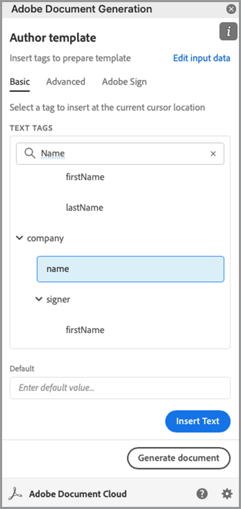

# 法的なワークフローの自動化


理想的なシナリオでは、契約書は修正なしで受諾されます。 しかし、多くの場合、契約書をカスタマイズし、法的な見直しを行う必要があります。 法務レビューは、多大なコストを生み出し、契約条件を提供するプロセスを遅らせます。 承認済みの言語に基づいて変更される定義済みのテンプレートを使用することで、法務チームは契約書の条件をより安全に管理できます。

このチュートリアルでは、州によって異なる法的契約を使用します。 これらのバリエーションに対処するために、特定の条件が満たされた場合にのみ含まれる、条件付きセクションを持つ契約書テンプレートが作成されます。 生成された文書は、Word文書でもPDF文書でもかまいません。 また、Adobe PDF Services APIまたはAcrobat Signを使用して文書をセキュリティ保護する方法についても学習します。

## 資格情報の取得

まず、無料のAdobe PDFサービスの資格情報を登録します。

1. [ここ](https://documentcloud.adobe.com/dc-integration-creation-app-cdn/main.html)に移動して、資格情報を登録します。
1. Adobe IDを使用してログインします。
1. 資格情報名を設定します。

   

1. サンプルコードをダウンロードする言語を選択します（例：Node.js）。
1. **[!UICONTROL デベロッパー利用条件]**&#x200B;に同意する場合にオンにします。
1. **[!UICONTROL 資格情報の作成]**を選択します。
サンプルファイル、pdfservices-api-credentials.json、認証用のprivate.keyを含むZIPファイルがコンピューターにダウンロードされます。

   

1. 「**[!UICONTROL Microsoft Wordアドインを入手]**」を選択するか、[AppSource](https://appsource.microsoft.com/en-cy/product/office/WA200002654)に移動してインストールします。

   >[!NOTE]
   >
   >Wordアドインをインストールするには、Microsoft 365内でアドインをインストールする権限が必要です。 権限がない場合は、Microsoft 365管理者に連絡してください。

## データ

このシナリオでは、文書の生成に役立つ情報を渡し、特定のセクションを含めるかどうかを通知します。

```
{
    "customer": {
        "name": "Home Services Company",
        "street": "123 Any Street",
        "city": "Anywhere",
        "state": "CA",
        "zip": "12345",
        "country":"USA",
        "signer": {
            "email": "johnnyechostone@gmail.com",
            "firstName": "John",
            "lastName": "Echostone"
        }
    },
    "company": {
        "name": "Projected Consultants",
        "signer": {
            "email": "maryburostone@gmail.com",
            "firstName": "Mary",
            "lastName": "Burostone"
        }
    },
    "conditions": {
        "includeGeneralTerms": true,
        "includeConsumerDiscloure": true
    }
}
```

データには、お客様の名前、署名しているユーザー、現在の状態などに関する情報が含まれています。 さらに、契約書を生成する企業に関する情報を提供するセクションと、契約書の特定のセクションを含めるために使用する条件フラグがあります。

## 文書に基本的なタグを追加する

このシナリオでは、利用条件のドキュメントを使用しています。このドキュメントは[こちら](https://github.com/benvanderberg/adobe-document-generation-samples/blob/main/Agreement/exercise/TermsAndConditions_Sample.docx?raw=true)からダウンロードできます。


1. Microsoft Wordで&#x200B;*TermsAndConditions.docx*&#x200B;サンプル文書を開きます。
1. [Document Generation](https://appsource.microsoft.com/en-cy/product/office/WA200002654)プラグインがインストールされている場合は、リボンの&#x200B;**[!UICONTROL Document Generation]**&#x200B;を選択します。 リボンに「ドキュメントの生成」が表示されない場合は、次の手順を実行します。
1. 「**[!UICONTROL 使用を開始]**」を選択します。
1. 上記で記述したJSONサンプルデータを「 JSONデータ」フィールドにコピーします。

   

*Document Generation Tagger*&#x200B;パネルに移動して、ドキュメントにタグを配置します。

## 会社名を挿入

1. 置き換えるテキストを選択します。 このシナリオでは、文書の最初のセクションのCOMPANYを置き換えます。
1. *Document Generation Tagger*&#x200B;で、「name」を検索します。
1. [会社]で、*名前*&#x200B;を選択します。

   

1. **[!UICONTROL [テキストの挿入]]**&#x200B;を選択します。

これにより、`{{company.name}}`と呼ばれるタグがJSON内のそのパスの下にあるため、このタグが配置されます。

```
{
    "company": {
        "name": "Projected Consultants",
        ...
    }
    ...
}
```

次に、CUSTOMERのテキストの最初のセクションでこの手順を繰り返します。 **手順1 ～ 4**&#x200B;を繰り返し、お客様の下のCUSTOMERを「name」に置き換えます。 出力は`{{customer.name}}`である必要があります。これは、テキストが顧客オブジェクトの下から取得されていることを反映しています。

Adobeまた、Document Generation APIを使用すると、ヘッダーとフッター内、および署名のタイトルを追加する必要がある場所の最後にタグを追加できます。

フッターにCOMPANYとCUSTOMERのテキストを入力し、**手順1 ～ 4**&#x200B;を使用してこのプロセスをもう一度繰り返します。


最後に、**手順1 ～ 4**&#x200B;を繰り返して、署名ページの「お客様」セクションの「名」と「姓」をそれぞれ`{{customer.signer.firstName}}`と`{{customer.signer.lastName}}`のタグに置き換えます。 タグが長く、次の行に折り返される場合でも、心配する必要はありません。文書が生成されるとタグが置き換えられるためです。

ドキュメントおよびフッターの先頭は次のようになります。

* 開始セクション：


* フッター：


* 署名ページ:


タグが文書に配置されたので、生成された契約書をプレビューする準備が整いました。

## 生成された文書をプレビューする

Microsoft Word内で直接、サンプルJSONデータに基づいて生成された文書をプレビューできます。

1. *Document Generation Tagger*&#x200B;で、**[!UICONTROL Generate document]**&#x200B;を選択します。
1. 初めてログインするときには、Adobe IDを使用してログインするように求められる場合があります。 「**[!UICONTROL ログイン]**」を選択し、画面の指示に従って資格情報でログインします。

   ![[ドキュメントの生成]ボタンを選択したスクリーンショット](assets/automatelegal_10.png)

1. **[!UICONTROL ドキュメントの表示]**&#x200B;を選択します。

   ![[ドキュメントの表示]ボタンのスクリーンショット](assets/automatelegal_11.png)

1. ブラウザーウィンドウが開き、ドキュメントの結果をプレビューできます。

   

## 各ステートにコンディショナル条件を追加

この次のセクションでは、特定の入力データ基準に基づいて、特定のセクションのみを含めるように設定します。 サンプルドキュメントでは、セクション4と5は特定の状態にのみ関連しています。 このシナリオでは、お客様がその州に居住している場合、州固有の条件のみを含める必要があります。 また、Microsoft Wordの番号付けでは、セクションが削除されている場合はそのセクションを含めないでください。 Document Generation APIの条件付きコンテンツ機能を使用して、これをタグ付けします。


1. 文書内の「カリフォルニア州への情報開示」セクションおよびすべての小段落を選択します。

   

1. *[!UICONTROL Document Generation Tagger]*&#x200B;で、**[!UICONTROL Advanced]**&#x200B;を選択します。
1. **[!UICONTROL 条件付きコンテンツ]**&#x200B;を展開します。
1. *[!UICONTROL [レコードの選択]]*&#x200B;フィールドで、**[!UICONTROL customer.state]**&#x200B;を検索して選択します。
1. *[!UICONTROL 演算子の選択]*&#x200B;フィールドで、**=**&#x200B;を選択します。
1. [*[!UICONTROL 値]*]フィールドに「*CA*」と入力します。
1. **[!UICONTROL [条件の挿入]]**&#x200B;を選択します。

これで、セクションはconditional-sectionタグと呼ばれるいくつかのタグで囲まれました。 タグを追加する際、コンディショナルセクションタグが番号付きの行として追加されている場合があります。 これを削除するには、タグの前にバックスペースを作成します。そうしないと、文書の生成時にタグが存在しなかったかのようにアイテムに番号が付けられます。 条件付きのセクションは、``タグで終わります。


***Washington Disclosure*セクションに対して手順1 ～ 7**&#x200B;を繰り返し、*CA*&#x200B;の値を&#x200B;*WA*&#x200B;に置き換えて、お客様の状態がワシントンである場合にのみセクションが表示されることを示します。


## 条件付きセクションでのテスト

条件付きセクションを設定したら、[**文書の生成**]を選択して文書をプレビューできます。

文書を生成する際、含まれるセクションはデータ基準を満たすセクションのみであることに注意してください。 次の例では、州がCAに等しいので、Californiaセクションのみが含まれています。


もう一つ注目すべき変化は、後続のセクションの番号が付いていることです。サービスとソフトウェアの使用は、5の番号を持っています。 つまり、Washingtonセクションを省略すると、番号が継続されます。


お客様がカリフォルニア州ではなくワシントン州にいるときに、テンプレートが正しく動作するかどうかをテストするには、テンプレートのサンプルデータを変更します。

1. *Document Generation Tagger*&#x200B;で、**[!UICONTROL 入力データの編集]**&#x200B;を選択します。

   

1. 「**[!UICONTROL 編集]**」を選択します。

1. JSONデータで、*CA*&#x200B;を&#x200B;*WA*&#x200B;に変更します。

   

1. 「**[!UICONTROL タグを生成]**」を選択します。
1. **[!UICONTROL 文書の生成]**&#x200B;を選択して、文書を再生成します。

文書には「ワシントン州」セクションのみが含まれていることに注意してください。


## コンディショナル文を追加する

条件節と同様に、特定の条件が満たされた場合に含まれる特定の文を持つことができます。 この例では、カリフォルニア州とワシントン州で返品ポリシーが異なります。

1. セクション3.1では、最初の文「ワシントン州で購入する場合、全額払い戻しのために、元のトランザクションから30日以内にMAILで返送する必要があります」を選択します。
1. *[!UICONTROL Document Generation Tagger]*&#x200B;で、**[!UICONTROL Advanced]**&#x200B;を選択します。
1. **[!UICONTROL 条件付きコンテンツ]**&#x200B;を展開します。
1. *[!UICONTROL コンテンツの種類]*&#x200B;で、**[!UICONTROL 語句]**&#x200B;を選択します。
1. *[!UICONTROL [レコードの選択]]*&#x200B;フィールドで、**[!UICONTROL customer.state]**&#x200B;を検索して選択します。
1. *[!UICONTROL 演算子の選択]*&#x200B;フィールドで、**=**&#x200B;を選択します。
1. [*[!UICONTROL 値]*]フィールドに「*CA*」と入力します。
1. **[!UICONTROL [条件の挿入]]**&#x200B;を選択します。

タグの名前は同じですが、フレーズとセクションの主な違いは、フレーズには新しい行が含まれていないセクションがあることです。 condition-sectionタグと – end-sectionタグは、同じ段落に含める必要があります。


## Acrobat Signのタグを追加する

Acrobat Signを使用すると、署名用に契約書を送信したり、他のユーザーが簡単に表示して署名できるようにwebエクスペリエンスに埋め込んだりできます。 Microsoft WordのAdobe Document Generation Taggerを使用すると、Acrobat Signで送信する前の文書に簡単に事前にタグを付けることができるため、署名は常に正しい場所に配置されます。 このシナリオでは、文書に署名して日付を入力する場所を必要とする署名者が2人います。

1. お客様が署名する必要がある場所に移動します。
1. 署名を追加する位置にカーソルを置きます。

   

1. *[!UICONTROL Document Generation Tagger]*&#x200B;で、**[!UICONTROL Adobe Sign]**&#x200B;を選択します。
1. *[!UICONTROL 受信者の数を指定]*&#x200B;フィールドに、受信者の数を設定します（この例では2を使用しています）。
1. 「*[!UICONTROL 受信者]*」フィールドで、「**[!UICONTROL 署名者–1]**」を選択します。
1. 「*[!UICONTROL フィールド]*」タイプで、「**[!UICONTROL 署名]**」を選択します。
1. **[!UICONTROL 「Adobe Signのテキストタグを挿入」]**&#x200B;を選択します。

   

>[!NOTE]
>
>「**Adobe Signテキストタグを挿入**」ボタンが表示されない場合は、下にスクロールしてください。

これにより、最初の署名者が署名する必要がある署名フィールドが配置されます。


次に、署名時に自動入力する署名者用のデータフィールドを配置します。

1. 日付を配置する場所にカーソルを移動します。

   

1. フィールドタイプを「日付」に設定します。
1. **[!UICONTROL 「Adobe Signのテキストタグを挿入」]**&#x200B;を選択します。

配置される日付タグが長すぎます： `{{Date 3_es_:signer1:date:format(mm/dd/yyyy):font(size=Auto)}}`。 Acrobat Signテキストタグは、Document Generationタグとは異なる同じ行に配置する必要があります。 `:format()`および`font()`パラメーターはオプションであるため、このシナリオではタグを`{{Date 3_es_:signer1:date}}`に短縮できます。

*会社の署名*&#x200B;セクションの上の手順を繰り返します。 この場合、「受信者」フィールドを&#x200B;**Signer-2**&#x200B;に変更する必要があります。変更しない場合、すべての署名フィールドが同じユーザーに割り当てられます。

## 契約書を生成

これで文書にタグが付き、作業を開始できます。 次の節では、Node.js用のDocument Generation APIサンプルを使用してドキュメントを生成する方法について説明します。 これらのサンプルはどの言語でも使用できます。

資格情報の登録時にダウンロードしたpdfservices-node-sdk-samples-masterファイルを開きます。 これらのファイルには、pdfservices-api-credentials.jsonおよびprivate.keyファイルが含まれます。

1. `npm install`を使用して&#x200B;**[!UICONTROL ターミナル]**&#x200B;を開き、依存関係をインストールしてください。
1. サンプル&#x200B;*data.json*&#x200B;を&#x200B;*resources*&#x200B;フォルダーにコピーします。
1. 作成したWordテンプレートを&#x200B;*resources*&#x200B;フォルダーにコピーします。
1. サンプルフォルダーのルートディレクトリに、*generate-salesOrder.js*&#x200B;という名前の新しいファイルを作成します。

   ```
   const PDFServicesSdk = require('@adobe/pdfservices-node-sdk').
   const fs = require('fs');
   const path = require('path');
   
   var dataFileName = path.join('resources', '<INSERT JSON FILE');
   var outputFileName = path.join('output', 'salesOrder_'+Date.now()+".pdf");
   var inputFileName = path.join('resources', '<INSERT DOCX>');
   
   //Loads credentials from the file that you created.
   const credentials =  PDFServicesSdk.Credentials
      .serviceAccountCredentialsBuilder()
      .fromFile("pdfservices-api-credentials.json")
      .build();
   
   // Setup input data for the document merge process
   const jsonString = fs.readFileSync(dataFileName),
   jsonDataForMerge = JSON.parse(jsonString);
   
   // Create an ExecutionContext using credentials
   const executionContext = PDFServicesSdk.ExecutionContext.create(credentials);
   
   // Create a new DocumentMerge options instance
   const documentMerge = PDFServicesSdk.DocumentMerge,
   documentMergeOptions = documentMerge.options,
   options = new documentMergeOptions.DocumentMergeOptions(jsonDataForMerge, documentMergeOptions.OutputFormat.PDF);
   
   // Create a new operation instance using the options instance
   const documentMergeOperation = documentMerge.Operation.createNew(options)
   
   // Set operation input document template from a source file.
   const input = PDFServicesSdk.FileRef.createFromLocalFile(inputFileName);
   documentMergeOperation.setInput(input);
   
   // Execute the operation and Save the result to the specified location.
   documentMergeOperation.execute(executionContext)
   .then(result => result.saveAsFile(outputFileName))
   .catch(err => {
      if(err instanceof PDFServicesSdk.Error.ServiceApiError
         || err instanceof PDFServicesSdk.Error.ServiceUsageError) {
         console.log('Exception encountered while executing operation', err);
      } else {
         console.log('Exception encountered while executing operation', err);
      }
   });
   ```

1. `<JSON FILE>`を/resources内のJSONファイルの名前に置き換えます。
1. `<INSERT DOCX>`をDOCXファイルの名前に置き換えます。
1. 実行するには、**[!UICONTROL ターミナル]**&#x200B;を使用してノード`generate-salesOrder.js`を実行します。

出力ファイルは/outputフォルダーにあり、文書が正しく生成されます。

書式を変更するには、下の行を変更します。 DOCX形式は、この文書をWordでの編集や契約のレビューのために送信する場合に役立ちます。

PDF:

```
options = new documentMergeOptions.DocumentMergeOptions(jsonDataForMerge,
documentMergeOptions.OutputFormat.PDF);
```

単語：

```
options = new documentMergeOptions.DocumentMergeOptions(jsonDataForMerge, documentMergeOptions.OutputFormat.DOCX);
```

出力ファイル名を、PDFの場合は.pdfに、DOCXの場合は.docxに、それぞれ変更する必要があります。

```
var outputFileName = path.join('output', 'salesOrder_'+Date.now()+".docx");
```

## 契約書を署名用に送信

[Adobe Acrobat Sign](https://www.adobe.com/jp/sign.html)を使用すると、1人または複数の受信者に契約書を送信して、文書の閲覧や署名を依頼できます。 REST APIを使用すると、署名用に文書を送信する使いやすいユーザーエクスペリエンスによって、Word、PDF、HTMLなどの形式を選択して署名用に文書を送信できます。

次の例では、REST APIドキュメントページを使用して、以前に生成されたドキュメントを取得し、署名用に送信する方法について説明します。 まず、Acrobat Sign webインターフェイスを使用する方法と、REST APIを使用する方法を説明します。

## Acrobat Signアカウントを取得

Acrobat Signアカウントをお持ちでない場合は、デベロッパーアカウントに新規登録してドキュメント「[こちら](https://developer.adobe.com/adobesign-api/)」を確認し、「**デベロッパーアカウントに新規登録**」を選択します。 フォームに入力し、確認電子メールを受け取るように求められます。 その後、Webサイトに移動し、パスワードとアカウントを設定して、Acrobat Signにログインします。

## Webインターフェイスからの契約書の送信

1. ナビゲーションバーから「**[!UICONTROL 送信]**」を選択します。

   

1. 「*受信者*」フィールドで、2つの電子メールアドレスを指定します。 Acrobat Signアカウントに関連付けられていない電子メールアドレスを使用することをお勧めします。

   

1. **[!UICONTROL 契約書名]**&#x200B;と&#x200B;**[!UICONTROL メッセージ]**&#x200B;を設定します。
1. 「**[!UICONTROL ファイルを追加]**」を選択し、生成されたファイルをコンピューターからアップロードします。
1. 「**[!UICONTROL 署名フィールドをプレビューおよび追加]**」を選択します。
1. 「**[!UICONTROL 次へ]**」を選択します。
1. 署名ページにスクロールすると、タグに基づいて配置された署名フィールドが表示されます。

   

1. 「**[!UICONTROL 送信]**」を選択します。
1. 電子メールに、表示して署名するためのリンクを含むメッセージが表示されます。

   

1. 「**[!UICONTROL 確認して署名]**」を選択します。
1. **[!UICONTROL 続行]**&#x200B;を選択して、利用条件に同意します。
1. 「**[!UICONTROL 開始]**」を選択して、署名が必要な場所にジャンプします。

   

1. **[!UICONTROL ここをクリックして署名]**&#x200B;を選択します。

   のスクリーンショット

1. 署名を入力します。

   

1. 「**[!UICONTROL 適用]**」を選択します。
1. 「**[!UICONTROL クリックして署名]**」を選択します。

次の署名者に電子メールが送信されます。 手順9～16を繰り返して、2人目の署名者について表示し、署名を行います。

契約書が完了すると、契約書の署名済みコピーが各関係者に電子メールで送信されます。 さらに、**管理**&#x200B;ページで、Acrobat Sign webインターフェイスから署名済みの契約書を取得できます。


次に、REST APIドキュメントで同じシナリオを実行する方法について説明します。

## 資格情報の取得

1. [Acrobat Sign RESTドキュメント](https://secure.na1.adobesign.com/public/docs/restapi/v6)に移動します。
1. *transientDocuments*&#x200B;と[POST/transientDocuments](https://benprojecteddemo.na1.adobesign.com/public/docs/restapi/v6#!/transientDocuments/createTransientDocument)を展開します。
1. **[!UICONTROL OAUTHアクセストークン]**&#x200B;を選択します。

   

1. *agreement_write*、*agreement_sign*、*widget_write*&#x200B;および&#x200B;*library_write*&#x200B;のOAUTH権限を確認します。
1. 「**[!UICONTROL 許可]**」を選択します。
1. ポップアップが表示され、Acrobat Signアカウントでログインするように求められます。 「ユーザー」に管理者のユーザー名とパスワードを入力します。
1. RESTドキュメントへのアクセスを許可するように求められます。 「**[!UICONTROL アクセスを許可]**」を選択します。

その後、ベアラートークンが&#x200B;**Authorization**&#x200B;フィールドに追加されます。

Acrobat Signの認証トークンの作成方法の詳細については、[こちら](https://opensource.adobe.com/acrobat-sign/developer_guide/helloworld.html)で説明している手順に従ってください。

## 一時的なドキュメントのアップロード

認証トークンは前の手順で追加したため、API呼び出しを行うには文書をアップロードする必要があります。

1. *ファイル*&#x200B;フィールドで、前の手順で生成されたPDF文書をアップロードします。

   

1. 「**[!UICONTROL Try it Out!]**」を選択します。
1. **[!UICONTROL 応答本文]**&#x200B;で、*transientDocumentId*&#x200B;の値をコピーします。

*transientDocumentId*&#x200B;は、Acrobat Signに一時的に保存されているドキュメントを参照するために使用され、その後のAPI呼び出しで参照できるようになります。

## 署名用に送信

文書がアップロードされたら、署名用に契約書を送信する必要があります。

1. 「契約書」セクションと「POST契約書」セクションを展開します。
1. *AgreementInfo*&#x200B;フィールドに、次のJSONを入力します。

   ```
   {
   "fileInfos": [
      {
         "transientDocumentId": "3AAABLblqZhAJeoswpyslef8_toTGT1WgBLk3TlhfJXy_uSLlKyre2hjF0-J1meBDn0PlShk0uQy6JghlqEoqXNnskq7YawteF6QWtHefP9wN2CW_Xbt0O9kq1tkpznG0a5-mEm4bYAV1FGOnD1mt_ooYdzKxm7KzTB11DLX2-81Zbe2Z1suy7oXiWNR3VSb-zMfIb5D4oIxF8BiNfN0q08RwT108FcB1bx4lekkATGld3nRbf8ApVPhB72VNrAIF0F1rAFBWTtfgvBKZaxrYSyZq73R_neMdvZEtxWTk5fii_bLVe7VdNZMcO55sofH61eQC_QIIsoYswZP4rw6dsTa68ZRgKUNs"
      }
   ],
   "name": "Terms and Conditions",
   "participantSetsInfo": [
      {
         "memberInfos": [
         {
            "email": "adobesigndemo+customer@outlook.com"
         }
         ],
         "order": 1,
         "role": "SIGNER"
      },
      {
         "memberInfos": [
            {
               "email": "adobesigndemo+company@outlook.com"
            }
         ],
         "order": 1,
         "role": "SIGNER"
         }
   ],
   "signatureType": "ESIGN",
   "state": "IN_PROCESS"
   }
   ```

1. 「**[!UICONTROL Try it Out!]**」を選択します。

**POST契約書API**&#x200B;は契約書のIDを返します。 JSONモデルスキーマのテンプレートを取得するには、**最小モデルスキーマ**&#x200B;を選択します。 パラメーターの完全な一覧は、**完全なモデルスキーマ**&#x200B;セクションで利用できます。

## 契約書のステータスを確認

契約書IDを取得すると、契約書のステータスを送信できます。

1. **[!UICONTROL GET /agreements/{agreementId}]**&#x200B;を展開します。
1. 追加のOAUTHスコープが必要な場合があるため、**[!UICONTROL OAUTH-ACCESS-TOKEN]**&#x200B;をもう一度選択してください。
1. 前のAPI呼び出し応答のagreementIdを「 agreementId 」フィールドにコピーします。
1. 「**[!UICONTROL Try it Out!]**」を選択します。

これで、その契約書に関する情報が表示されました。

```
{
    "id": "CBJCHBCAABAAc6LyP4SVuKXP_pNstzIzyripanRdz4IB",
    "name": "Terms and Conditions",
    "groupId": "CBJCHBCAABAAoyMb1yIgczAGhBuJeHf99mglPtM7ElEu",
    "type": "AGREEMENT",
    "participantSetsInfo": [
      {
        "id": "CBJCHBCAABAAzZE-IcHHkt05-AVbxas4Jz7DUl3oEBO6",
        "memberInfos": [
          {
            "email": "adobesigndemo+customer@outlook.com",
            "id": "CBJCHBCAABAAyWgMMReqbxUFM7ctI5xz16c2kOmEy-IQ",
            "securityOption": {
              "authenticationMethod": "NONE"
            }
          }
        ],
        "role": "SIGNER",
        "order": 1
      },
      {
        "id": "CBJCHBCAABAAaRHz3gY2W0w5n_6pj1GMMuZAfhBihc1j",
        "memberInfos": [
          {
            "email": "adobesigndemo+company@outlook.com",
            "id": "CBJCHBCAABAAOZQwjPwJXFiX8YDKPYtzMpftsmxYrIo9",
            "securityOption": {
              "authenticationMethod": "NONE"
            }
          }
        ],
        "role": "SIGNER",
        "order": 1
      }
    ],
    "senderEmail": "adobesigndemo+new@outlook.com",
    "createdDate": "2022-03-22T02:59:36Z",
    "lastEventDate": "2022-03-22T02:59:41Z",
    "signatureType": "ESIGN",
    "locale": "en_US",
    "status": "OUT_FOR_SIGNATURE",
    "documentVisibilityEnabled": true,
    "hasFormFieldData": false,
    "hasSignerIdentityReport": false,
    "documentRetentionApplied": false
  }
```

更新が変更されたときに通知を受け取る、より効率的な方法は、Webhooksを使用することです。[こちら](https://opensource.adobe.com/acrobat-sign/developer_guide/webhookapis.htmlで詳細を確認できます。

## 署名済み文書を保存

文書に署名したら、 GET /agreements/combinedDocumentファイルを使用して取得できます。

1. **[!UICONTROL GET /agreements/{agreementId}/combinedDocument]**&#x200B;を展開します。
1. **[!UICONTROL agreementId]**&#x200B;を、以前のAPI呼び出しで指定された&#x200B;*agreementId*&#x200B;に設定します。
1. 「**[!UICONTROL Try it Out!]**」を選択します。

監査レポートまたはサポート文書を添付するための追加パラメーターは、 attachSupportingDocumentsパラメーターおよびattachAuditReportパラメーターを使用して設定できます。

**応答本文**&#x200B;で、コンピューターにダウンロードして任意の場所に保存できます。

## 詳細オプション

文書を生成して署名用に送信するだけでなく、追加のアクションを使用できます。

例えば、文書に署名がない場合、Adobe PDF Services APIを使用すると、契約書が生成された後に、次のような様々な方法で文書を変換できます。

* パスワードで文書を保護
* 画像が大きい場合はPDFを圧縮
* 利用可能なその他のアクションについて詳しくは、Adobe PDF Services APIのサンプルファイルの/srcフォルダー内のスクリプトを参照してください。 使用できる様々なアクションのドキュメントを確認して、詳細を確認することもできます。

さらに、Acrobat Signには次のような機能が追加されています。

* アプリケーションへの署名エクスペリエンスの埋め込み
* 署名者のID確認方法を追加
* 電子メール通知設定の構成
* 契約書の一部として個別のドキュメントをダウンロードする

## さらなる学習

さらに学習したいですか？ [!DNL Adobe Acrobat Services]を使用するその他の方法を確認してください：

* 詳細については、[ドキュメント](https://developer.adobe.com/document-services/docs/overview/)を参照してください
* Adobe Experience Leagueのその他のチュートリアルを見る
* PDFの使用方法を確認するには、 /srcフォルダーにあるサンプルスクリプトを使用します
* [Adobe技術ブログ](https://medium.com/adobetech/tagged/adobe-document-cloud)をフォローして、最新のヒントとコツを確認してください
* [ペーパークリップ（月間ライブストリーム）](https://www.youtube.com/playlist?list=PLcVEYUqU7VRe4sT-Bf8flvRz1XXUyGmtF)のサブスクリプションを購入すると、[!DNL Adobe Acrobat Services]を使用したオートメーションについて学習できます。
