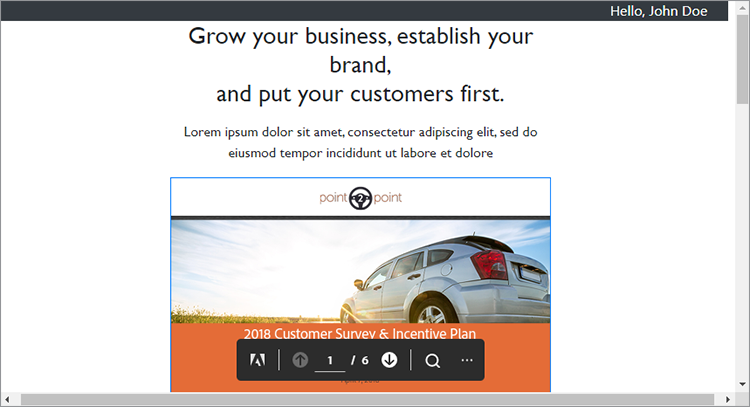

# デジタルドキュメントパブリッシング


電子文書はどこにでもあります。実際には存在する可能性があります。 [何兆というPDF](https://itextpdf.com/en/blog/technical-notes/do-you-know-how-many-pdf-documents-exist-world) 世界的にみると、その数は毎日増えているのです。 PDFビューアをwebページに埋め込むと、HTMLやCSSを再設計したり、webサイトへのアクセスを妨げたりすることなく、文書を表示できるようになります。

人気のあるシナリオを見てみましょう。 会社が勤める [Webサイトのホワイトペーパー](https://www.adobe.io/apis/documentcloud/dcsdk/digital-content-publishing.html)
アプリケーションやサービスのコンテキストを提供する。 このサイトのマーケターは、ユーザーがPDFベースのコンテンツをどのように操作し、webページやブランドと組み合わせるかを理解したいと考えています。 彼らはホワイトペーパーを～として公開することを決定しました [ゲーテッド量](https://whatis.techtarget.com/definition/gated-content-ungated-content#:~:text=Gated%20content%20is%20online%20materials,about%20their%20jobs%20and%20organizations.)、それらをダウンロードできるユーザーを制御します。

## 学習内容

この実践チュートリアルでは、以下を使用して、webページ内に埋め込まれたPDF文書を表示する方法について学習します。 [Adobe PDF Embed API](https://www.adobe.io/apis/documentcloud/dcsdk/pdf-embed.html)無料で簡単に使用できます。 これらの例では、JavaScript、Node.js、Express.js、HTML、CSSを使用しています。 完全なプロジェクトコードは、次の場所で表示できます [GitHub](https://www.google.com/url?q=https://github.com/marcelooliveira/EmbedPDF/tree/main/pdf-app&amp;sa=D&amp;source=editors&amp;ust=1617129543031000&amp;usg=AOvVaw2rzSwYuJ_JI7biVIgbNMw1).

## 関連APIとリソース

* [PDF埋め込みAPI](https://www.adobe.com/devnet-docs/dcsdk_io/viewSDK/index.html)

* [PDF Services API](https://opensource.adobe.com/pdftools-sdk-docs/release/latest/index.html)

* [プロジェクトコード](https://www.google.com/url?q=https://github.com/marcelooliveira/EmbedPDF/tree/main/pdf-app&amp;sa=D&amp;source=editors&amp;ust=1617129543031000&amp;usg=AOvVaw2rzSwYuJ_JI7biVIgbNMw1)

## ノードWebアプリケーションの作成

まず、Node.jsとExpressを使用して、見栄えの良いテンプレートを使用し、ダウンロード用にいくつかのPDFを提供するサイトを作成しましょう。

まず、 [node.jsのダウンロードとインストール](https://nodejs.org/en/download/).

最小限のWebアプリケーション構造でNode.jsプロジェクトを簡単に作成するには、アプリケーションジェネレータツールをインストールします `` `express-generator` ``.

```
npm install express-generator -g
```

次に、表示エンジンとして選択し、pdf-appという名前の新しいExpressアプリを作成します。

```
express pdf-app --view=ejs
```

\\pdf-appディレクトリに移動し、プロジェクトのすべての依存関係をインストールします。

```
cd pdf-app
npm install
```

次に、ローカルwebサーバーを起動し、アプリケーションを実行します。

```
npm start
```

最後に、次のサイトを開きます： <http://localhost:3000>.


これで、基本的なwebサイトが作成されました。

## ホワイトペーパーのデータをレンダリング中

Webサイトにホワイトペーパーを投稿するには、これらの文書を表示するためのホワイトペーパーのデータをWebサイト上で定義および準備します。 まず、プロジェクトのルートに新しい\\dataフォルダーを作成します。 利用できるホワイトペーパーの情報は、という名前の新しいファイルに含まれています [data.json](https://github.com/marcelooliveira/EmbedPDF/blob/main/pdf-app/data/data.json)を作成します。これはdataフォルダに格納されます。

Webアプリを洗練された素晴らしい外観にするには、 [Bootstrap](https://getbootstrap.com/) および [素晴らしいフォント](https://fontawesome.com/) フロントエンドライブラリ。

```
npm install bootstrap
npm install font-awesome
```

app.jsファイルを開き、これらのディレクトリを静的ファイルのソースとして含めて、既存のファイルの後に配置します `` `express.static` `` 行を追加します。

```
app.use(express.static(path.join(__dirname, '/node_modules/bootstrap/dist')));
app.use(express.static(path.join(__dirname, '/node_modules/font-awesome')));
```

PDF文書を含めるには、プロジェクトの\\publicフォルダーの下に\\pdfsという名前のフォルダーを作成します。 PDFとサムネールは自分で作成するのではなく、このファイルからコピーできます [GitHubリポジトリフォルダー](https://github.com/marcelooliveira/EmbedPDF/tree/main/pdf-app/public) を\\pdfフォルダーと\\imageフォルダーに移動します。

\\public\\pdfsフォルダーに、次のPDF文書が含まれるようになりました。


\\public\\imagesフォルダには、各PDF文書のサムネイルが含まれている必要があります。


次に、ホームページをルーティングするロジックが含まれている\\routes\\index.jsファイルを開きます。 data.jsonファイルからホワイトペーパーのデータを使用するには、ファイルシステムへのアクセスと対話を担当するNode.jsモジュールを読み込む必要があります。 次に、 `fs` \\routes\\index.jsファイルの最初の行で次のように定数を指定します。

```
const fs = require('fs');
```

次に、data.jsonファイルを読んで解析し、papers変数に保存します。

```
let rawdata = fs.readFileSync('data/data.json');
let papers = JSON.parse(rawdata);
```

ここで、インデックス・ビューのレンダリング・メソッドを呼び出すために行を変更し、インデックス・ビューのモデルとしてpapersコレクションを渡します。

```
res.render('index', { title: 'Embedding PDF', papers: papers });
```

ホームページにホワイトペーパーのコレクションを表示するには、\\views\\index.ejsファイルを開き、既存のコードをプロジェクトのコードに置き換えます。 [索引ファイル](https://github.com/marcelooliveira/EmbedPDF/blob/main/pdf-app/views/index.ejs).

npm startとopenを再実行します <http://localhost:3000> 利用可能なホワイトペーパーのコレクションを表示します。


次のセクションでは、webサイトの強化と使用について説明します [PDF埋め込みAPI](https://www.adobe.io/apis/documentcloud/dcsdk/pdf-embed.html) をクリックして、webページにPDF文書を表示します。 PDF埋め込みAPIは無料で使用できます。API資格情報を取得するだけで済みます。

## PDF埋め込みAPI資格情報の取得

無料のPDF埋め込みAPI資格情報を取得するには、 [開始する](https://www.adobe.io/apis/documentcloud/dcsdk/gettingstarted.html) 新しいアカウントにサインアップするか、既存のアカウントにログインした後のページです。

クリック **新しい資格情報の作成** その後 **使用開始：**


この時点で、無料アカウントをお持ちでない場合は、無料アカウントに登録するよう求められます。

選択 **PDF埋め込みAPI**、資格情報の名前とアプリケーションドメインを入力します。 次を使用します **localhost** webアプリをローカルでテストしているため、ドメインになっています。


「 **資格情報の作成** PDF資格情報にアクセスしてクライアントID（APIキー）を取得するためのボタン。


Node.jsプロジェクトで、アプリケーションのルートフォルダーに.ENVという名前のファイルを作成し、PDFのEmbed Client IDの環境変数を、前の手順で指定したAPI KEY資格情報の値で宣言します。

```
PDF_EMBED_CLIENT_ID=**********************************************
```

後でこのクライアントIDを使用して、PDF埋め込みAPIにアクセスします。 Node.jsコードを使用してこの環境変数にアクセスするには、dotenvパッケージをインストールしてください。

```
npm install dotenv
```

app.jsファイルを開き、ファイルの上部に次の行を追加して、Node.jsがdotenvモジュールを読み込めるようにします。

```
require('dotenv').config();
```

## WebアプリでのPDFの表示

PDF埋め込みAPIを使用して、サイトにPDFを表示できるようになりました。 ライブを開く [PDF埋め込みAPIデモ](https://documentcloud.adobe.com/view-sdk-demo/index.html#/view/FULL_WINDOW/Bodea%20Brochure.pdf).


左側のパネルで、webサイトのニーズに最適な埋め込みモードを選択できます。

* **フルウィンドウ**：このPDFはwebページのすべての領域をカバーします

* **サイズ変更コンテナ**:PDFはwebページ内に、サイズが制限されたdivで1ページずつ表示されます

* **インライン**:PDF全体がwebページ内のdivに表示されます

* **ライトボックス**:PDFは、webページの上にレイヤーとして表示されます

ホワイトペーパーにはインライン埋め込みモードを使用し、後でコードジェネレータを使用してアプリケーションにPDFを埋め込むことをお勧めします。

## インライン埋め込みモードページの作成

PDFビューアをwebページに埋め込み、すべてのページを同時に表示するには、インライン埋め込みモードを使用して新しいページを作成します。

EJSビューエンジンを使用して、\\views\\in-line.ejsファイルに新しいビューを作成します。

```
<! html DOCTYPE >
<html>
<head>
<title>
<%= title %>
</title>
<link rel='stylesheet' href='/stylesheets/style.css' />
<link rel='stylesheet' href='/css/bootstrap.min.css'/>
<link rel='stylesheet' href='/css/font-awesome.min.css' />
<style type="text/css">
p {
font-family: 'Gill Sans', 'Gill Sans MT', Calibri, 'Trebuchet MS', sans-serif
}
</style>
</head>
<body class="m-0">
<div>
<main>
<div class="row">
<div class="col-sm-3"></div>
<div class="col-sm-6">
<h3>
<p class="text-center">Grow your business, establish your brand,<br
/>
```

お客様を第一に考えます。

```
</p>
</h3>
<div>
<p class="text-center">Lorem ipsum dolor sit amet, consectetur adipiscing elit, sed do<br />
eiusmod tempor incididunt ut labore et dolore</p>
</div>
</div>
</main>
<footer>
<div class="row">
<div class="col-sm-3"></div>
<div class="col-sm-6">
<p class="text-center">Bodea Inc. Your trusted partner since 2008</p>
</div>
</div>
</footer>
</div>
</div>
</body>
</html>
```

次に、\\views\\index.ejsを変更して、インラインビューを開くためのボタンを作成します。

```
<div class="card-body">
<h5 class="card-title">
<span>
<%= paper.title %>
</span>
</h5>
<p>
<a class="btn btn-sm btn btn-danger" href="/in-line/<%=
paper.id %>">
<span type="button"></span>
<span class="fa fa-file-pdf-o"></span>&nbsp;View Document</button>
</a>
</p>
</div>
```

app.jsファイルを開き、indexRouter宣言の後に新しいルーターを宣言します。

```
var indexRouter = require('./routes/index');
var inLineRouter = require('./routes/in-line');
```

次に、このコードをapp.use(&#39;/&#39;, indexRouter)；の後に追加して、インライン埋め込みモードビューをルータに関連付けます。

```
app.use('/', indexRouter);
app.use('/in-line', inLineRouter);
```

次に、\\routesの下に新しいin-line.jsファイルを作成して、新しいルーターロジックを作成します。 Webアプリケーションバックエンドを有効にするノードモジュールであるExpressを含めます。

```
var express = require('express');
const fs = require('fs');
var router = express.Router();
```

次に、特定のホワイトペーパーIDのGETリクエストを処理し、in-line.ejsビューをレンダリングするエンドポイントを作成します。

```
router.all('/:id', function(req, res, next) {
let rawdata = fs.readFileSync('data/data.json');
let papers = JSON.parse(rawdata);
let paper = papers.filter(p => p.id == parseInt(req.params.id))[0];
res.render('in-line', { title: paper.title, paper: paper });
});
module.exports = router;
```

もう一度「 [ライブデモ](https://documentcloud.adobe.com/view-sdk-demo/index.html#/view/FULL_WINDOW/Bodea%20Brochure.pdf) PDF埋め込みAPIコードを自動的に生成します。 クリック **インライン** 左パネルから：


クリック **コードを生成** サイズコンテナPDFビューアの表示に必要なHTMLコードを確認するには、次の手順を実行します。


クリック **コードをコピー** コードをin-line.ejsファイルに貼り付けます。

```
<div>
<p class="text-center">Lorem ipsum dolor sit amet, consectetur adipiscing elit, sed do<br />
eiusmod tempor incididunt ut labore et dolore</p>
</div>
<div class="row align-items-center border border-primary">
<div id="adobe-dc-view" style="width: 800px;"></div>
<script src="https://documentcloud.adobe.com/view-sdk/main.js"></script>
<script type="text/javascript">
document.addEventListener("adobe_dc_view_sdk.ready", function(){
var adobeDCView = new AdobeDC.View({clientId: "<YOUR_CLIENT_ID>", divId: "adobe-dc-view"});
adobeDCView.previewFile({
content:{location: {url: "https://documentcloud.adobe.com/view-sdk-demo/PDFs/Bodea Brochure.pdf"}},
metaData:{fileName: "Bodea Brochure.pdf"}
}, {embedMode: "IN_LINE"});
});
</script>
</div>
```

ただし、ドキュメントパラメーターはハードコードされたままです。 EJSブラケット構文(\&lt;%= someValue %\>)で置き換えて、ホワイトペーパーのモデルデータに従ってページをレンダリングしてみましょう。

```
<div id="adobe-dc-view" style="width: 800px;"></div>
<script src="https://documentcloud.adobe.com/view-sdk/main.js"></script>
<script type="text/javascript">
document.addEventListener("adobe_dc_view_sdk.ready", function () {
var adobeDCView = new AdobeDC.View({ clientId: "<%=process.env.PDF_EMBED_CLIENT_ID %>", divId: "adobe-dc-view" });
adobeDCView.previewFile({
content: { location: { url: "<%= paper.pdf %>" } },
metaData: { fileName: "<%= paper.fileName %>" }
}, {
embedMode: "IN_LINE"
});
});
</script>
```

npm startコマンドを使用してアプリケーションを実行し、 <http://localhost:3000>.


最後に、1枚の白い紙を選択し、 **文書を表示** インライン埋め込みPDFで新しいページを開くには：


「PDFをダウンロード」と「PDFをプリント」のオプションが表示されるようになりました。


バックエンドでこれらのフラグを制御する場合。 その後、ユーザーIDに基づいて認証コントロールを実装し、ビジネス・ルールに従ってアクセスを制限できます。 この複雑さはここでは必要ないため、\\routes\\in-line.jsを変更して、認証済みのプロパティとアクセス許可のプロパティをモデルオブジェクトに含めましょう。

```
let authenticated = false;
res.render('in-line', {
title: paper.title,
paper: paper,
authenticated: authenticated,
permissions: {
showDownloadPDF: true,
showPrintPDF: true,
showFullScreen: true
}
});
```

次に、\\views\\in-line.ejsを変更して、webページがバックエンドから送信されるフラグ値をレンダリングできるようにします。

```
embedMode: "IN_LINE",
showDownloadPDF: <%= permissions.showDownloadPDF %>,
showPrintPDF: <%= permissions.showPrintPDF %>,
showFullScreen: <%= permissions.showFullScreen %>
Now, open the in-line.js route file and modify it to disallow the printing, downloading, and full-screen controls.
permissions: {
showDownloadPDF: false,
showPrintPDF: false,
showFullScreen: false
}
```

次に、アプリケーションを再実行して、この変更がPDFビューアにどのように反映されるかを確認します。


## ゲートされたコンテンツの作成

エンドユーザーのシナリオによると、同社のwebサイトのマーケターは、ユーザーがPDFベースのコンテンツをどのように操作し、コンテンツをWebページやブランドの残りの部分と組み込むかを理解したいと考えています。

ここでは、PDFの埋め込みに重点を置いているので、ユーザー認証機能は作成していません。 代わりに、ユーザー情報を受け入れ、フォームを送信するとPDF文書を表示するwebフォームを使用して、簡単な偽のペイウォールを実装するだけです。

ビューモデルにユーザー情報を提供するには、\\routes\\in-line.jsファイルを次の内容で置き換えます。

```
var express = require('express');
const fs = require('fs');
var router = express.Router();
router.all('/:id', function(req, res, next) {
let rawdata = fs.readFileSync('data/data.json');
let papers = JSON.parse(rawdata);
let paper = papers.filter(p => p.id == parseInt(req.params.id))[0];
let authenticated = false;
let user = {};
if (req.body.firstName) {
user = {
firstName: req.body.firstName,
lastName: req.body.lastName,
jobTitle: req.body.jobTitle,
email: req.body.email,
};
authenticated = true;
}
res.render('in-line', {
title: paper.title,
paper: paper,
user: user,
authenticated: authenticated,
permissions: {
showDownloadPDF: false,
showPrintPDF: false,
showFullScreen: false
}
});
});
module.exports = router;
```

その後、\\views\\in-line.ejsコンテンツを次のコードに置き換えます。 認証済ユーザーであるかどうかに応じて、ユーザー・データ・フォームまたはPDF・ビューアが表示されます。

```
<!DOCTYPE html>
<html>
<head>
<title>
<%= title %>
</title>
<link rel='stylesheet' href='/css/bootstrap.min.css'/>
<link rel='stylesheet' href='/css/font-awesome.min.css' />
<style type="text/css">
p {
font-family: 'Gill Sans', 'Gill Sans MT', Calibri, 'Trebuchet MS', sans-serif
}
</style>
</head>
<body class="m-0">
<% if (authenticated) { %>
<header class="bg-dark text-white">
<div class="text-right mr-4">Hello, <%= user.firstName %> <%= user.lastName%></div>
</header>
<% } %>
<div>
<main>
<div class="row">
<div class="col-sm-3"></div>
<div class="col-sm-6">
<h3>
<p class="text-center">Grow your business, establish your brand,<br
/>
```

お客様を第一に考えます。

```
</p>
</h3>
<div>
<p class="text-center">Lorem ipsum dolor sit amet, consectetur adipiscing elit, sed do<br />
eiusmod tempor incididunt ut labore et dolore</p>
</div>
<% if (!authenticated) { %>
<div class="row">
<form method="POST" class="center-panel text offset-md-3 col-md-6 border">
<fieldset class="offset-md-1">
<legend>Submit your info to<br/>access the whitepaper</legend>
<p><input name="firstName" placeholder="first name"/></p>
<p><input name="lastName" placeholder="last name"/></p>
<p><input name="jobTitle" placeholder="job title"/></p>
<p><input name="email" placeholder="email"/></p>
<p><button type="submit" class="btn btn-sm btn btn-primary">Submit</button></p>
</fieldset>
</form>
</div>
<% } %>
<% if (authenticated) { %>
<div class="row align-items-center border border-primary">
<div id="adobe-dc-view" style="width: 800px;"></div>
<script src="https://documentcloud.adobe.com/view-sdk/main.js"></script>
<script type="text/javascript">
document.addEventListener("adobe_dc_view_sdk.ready", function () {
var adobeDCView = new AdobeDC.View({ clientId: "<%=process.env.PDF_EMBED_CLIENT_ID %>", divId: "adobe-dc-view" });
adobeDCView.previewFile({
content: { location: { url: "<%= paper.pdf %>" } },
metaData: { fileName: "<%= paper.fileName %>" }
}, {
embedMode: "IN_LINE",
showDownloadPDF: <%= permissions.showDownloadPDF %>,
showPrintPDF: <%= permissions.showPrintPDF %>,
showFullScreen: <%= permissions.showFullScreen %>
});
});
</script>
<% } %>
</div>
</div>
</main>
<footer>
<div class="row">
<div class="col-sm-3"></div>
<div class="col-sm-6">
<p class="text-center">Bodea Inc. Your trusted partner since 2008</p>
</div>
</div>
</footer>
</div>
</div>
</body>
</html>
```


サイト訪問者は、情報を送信した後にのみPDFにアクセスできるようになりました。



## イベントの有効化

PDFビューアイベントをアプリケーションに簡単に組み込んで、マーケターの分析データを収集する方法を見てみましょう。 PDFのEmbedAPIを使用してビューアを拡張するには、adobeDCView変数を宣言した後、previewFileメソッドを呼び出す前に、次のコード行を追加します。

```
var adobeDCView = new AdobeDC.View({ clientId: "<%=process.env.PDF_EMBED_CLIENT_ID %>", divId: "adobe-dc-view" });
adobeDCView.registerCallback(
AdobeDC.View.Enum.CallbackType.EVENT_LISTENER,
function(event) {
console.log(event);
},
{ enablePDFAnalytics: true }
);
```

ここで、アプリケーションを再実行し、webブラウザーのデベロッパーツールを開いて、イベントデータを確認します。


このデータは次に送信できます： [Adobe Analytics](https://www.adobe.io/apis/documentcloud/dcsdk/docs.html?view=view) または他の分析ツール。

## 次の手順

[!DNL Acrobat Services] APIは、PDF中心のワークフローを使用して、デジタルパブリッシングの課題を開発者が簡単に解決するのに役立ちます。 ここまでで、ホワイトペーパーのコレクションを表示するサンプルのNode Webアプリを作成する方法を説明しました。 次に、 [無料のAPI資格情報](https://www.adobe.io/apis/documentcloud/dcsdk/gettingstarted.html) また、ホワイトペーパーへのアクセスを制限し、4つのうちいずれかに表示できるようにしました [埋め込みモード](https://documentcloud.adobe.com/view-sdk-demo/index.html#/view/FULL_WINDOW/Bodea%20Brochure.pdf).

このワークフローを組み合わせると、 [仮説的市場家](https://www.adobe.io/apis/documentcloud/dcsdk/digital-content-publishing.html) 見込み客の連絡先情報を収集し、ホワイトペーパーのダウンロードと、PDFの問い合わせ相手に関する統計情報を表示します。 これらの機能をwebサイトに組み込んで、ユーザーのエンゲージメントを促進および監視できます。

angularやReactの開発者の方は、ぜひ試してみてください [追加サンプル](https://github.com/adobe/pdf-embed-api-samples) PDF埋め込みAPIをReactやAngularのプロジェクトと連携させる方法を取り上げています。

Adobeは、革新的なソリューションでエンドツーエンドのカスタマーエクスペリエンスを構築することを可能にします。 チェックアウト [Adobe PDF Embed API](https://www.adobe.io/apis/documentcloud/viesdk) 無料。 その他に実行できる操作を確認するには、以下を使用してAdobe PDF Services APIを試してください [従量制の](https://www.adobe.io/apis/documentcloud/dcsdk/pdf-pricing.html)[着氷](https://www.adobe.io/apis/documentcloud/dcsdk/pdf-pricing.html).

[開始する](https://www.adobe.io/apis/documentcloud/dcsdk/gettingstarted.html) 使用する [!DNL Adobe Acrobat Services] 今日のAPI。
