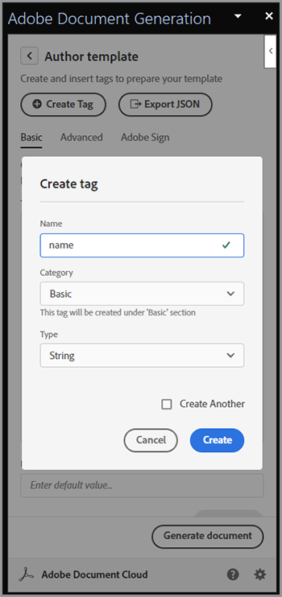
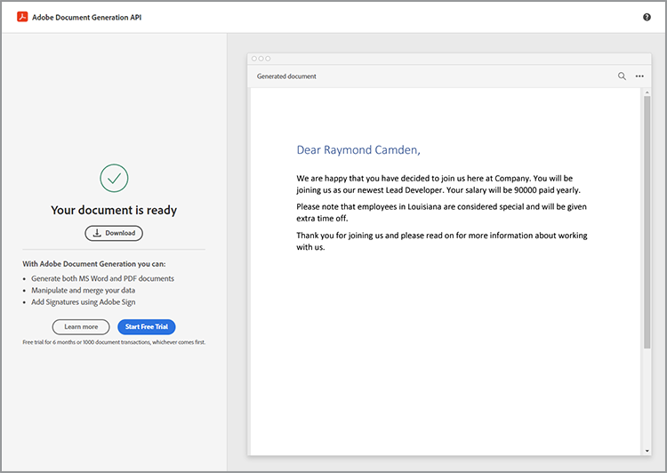

# 従業員オンボーディングの最新化


大規模な組織では、従業員のオンボーディングは、大規模で低速なプロセスとなる場合があります。 通常、カスタマイズされた文書と、新しい従業員が提示して署名する必要があるボイラープレート資料が混在しています。 このようにカスタマイズされたボイラープレート素材を組み合わせることで、複数の手順が必要となり、プロセスに関与するスタッフから貴重な時間を奪うことができます。 [!DNL Adobe Acrobat Services] また、Acrobat Signはこのアプローチを最新化して自動化し、人事担当者の個人的な仕事をより重要なタスクに振り向けることができます。 その方法を見てみましょう。

## 概要 [!DNL Adobe Acrobat Services]?

[[!DNL Adobe Acrobat Services]](https://developer.adobe.com/document-services/homepage) は、(PDFだけでなく)文書の操作に関連する一連のAPIです。 このサービススイートは、大まかに言うと、次の3つの主要なカテゴリに分類されます。

* 最初に、 [PDFサービス](https://developer.adobe.com/document-services/apis/pdf-services/) ツールのセット。 これらは、PDFやその他の文書を操作するための「ユーティリティ」方式です。 PDFとの間の変換、OCRや最適化の実行、PDFの結合や分割などのサービスが含まれます。 文書処理機能のツールボックスです。
* [PDFエクストラクトAPI](https://developer.adobe.com/document-services/apis/pdf-extract/) 強力なAI/MLテクニックを使用してPDFを分析し、コンテンツに関する驚くべき詳細を返します。 これには、テキスト、スタイル、および位置情報が含まれ、CSV/XLS形式で表形式のデータを返したり、画像を取得することもできます。
* 最後に [Document Generation API](https://developer.adobe.com/document-services/apis/doc-generation/) 開発者は、Microsoft Wordを「テンプレート」として使用し、（任意のソースからの）データと組み合わせて、動的にパーソナライズされた文書(PDFとWord)を生成できます。

デベロッパーは [新規登録](https://documentcloud.adobe.com/dc-integration-creation-app-cdn/main.html) 無料体験版でこれらのサービスをすべて試してください。 この [!DNL Acrobat Services] プラットフォームはRESTベースのAPIを使用しますが、Node、Java、.NET、およびPython用のSDKもサポートします（現時点ではExtractのみ）。

APIではありませんが、開発者はfree [PDF埋め込みAPI](https://developer.adobe.com/document-services/apis/pdf-embed/)を使用すると、Webページ上で文書を一貫した柔軟な方法で表示できます。

##  Acrobat Sign とは何ですか。

[Acrobat Sign](https://www.adobe.com/jp/sign.html) は、電子サインサービスの分野で世界をリードしています。 複数の署名を含む様々なワークフローを使用して、署名用に文書を送信できます。 Acrobat Signでは、署名や追加情報が必要なワークフローもサポートしています。 これらの機能はすべて、柔軟なオーサリングシステムを備えた強力なダッシュボードでサポートされています。

例えば、 [!DNL Acrobat Services]Acrobat Signには、 [無料体験版](https://www.adobe.com/sign.html#sign_free_trial) これにより、開発者は、ダッシュボードを介した署名プロセスと、使いやすいRESTベースのAPIを使用した署名プロセスの両方をテストできます。

## オンボーディングシナリオ

Adobeのサービスがどのように役立つかを示す、実際のシナリオを考えてみましょう。 新入社員が入社する際には、各自の役割に合わせてカスタマイズされた情報が必要です。 また、全社的な資料も必要です。 最後に、文書に署名して、企業ポリシーの受け入れを示す必要があります。 これを具体的な手順に分けてみましょう。

* まず、新入社員に名前で挨拶するカスタマイズされた表書きが必要です。 レターには、従業員の名前、役割、給与および事業所に関する情報を含める必要があります。
* カスタマイズされたレターは、基本的な全社的なPDF（様々な人事方針、福利厚生など）を含む情報と組み合わせる必要があります。
* 従業員の署名と日付を求める最終文書を含める必要があります。
* 上記のすべてを、署名用に従業員に送信される1つの文書として提示する必要があります。

この方法について詳しく説明します。

## 動的ドキュメントの生成

Adobe [文書の生成](https://developer.adobe.com/document-services/apis/doc-generation/) APIを使用すると、開発者はPDFやWord文書を作成するための基盤として、Microsoft Wordとシンプルなテンプレート言語を使用して動的な文書を作成できます。 この仕組みの例を次に示します。

値がハードコードされたWord文書から始めましょう。 文書は、グラフィックや表などを含め、好きなようにスタイルを設定できます。 これが最初の文書です。


文書生成は、データに置き換えられる「トークン」をWord文書に追加することによって機能します。 これらのトークンは手動で入力できますが、 [Microsoft Wordアドイン](https://developer.adobe.com/document-services/docs/overview/document-generation-api/wordaddin/) これにより、操作が容易になります。 これを開くと、作成者は文書で使用可能なタグやデータセットを定義できます。


ローカルファイルからJSON情報をアップロードするか、JSONテキストにコピーするか、初期データで続行するかを選択できます。 これにより、特定のニーズに基づいて一時的にタグを定義できます。 この例では、名前、役割、給与、および場所のタグのみが必要です。 これを行うには、 **タグを作成** ボタン：



最初のタグを定義した後、必要なだけ定義を続けることができます。


タグを定義した状態で、文書内のテキストを選択し、必要に応じてタグで置き換えます。 この例では、名前、役割、および給与にタグが追加されます。


ドキュメント生成では、単純なタグだけでなく、論理式もサポートされています。 文書の2番目の段落に、ルイジアナ州の人々のみに適用されるテキストが含まれています。 コンディショナル式を追加するには、文書タグの「詳細」タブでコンディションを定義します。 単純な等価条件を定義する方法は次のとおりです。ただし、数値比較やその他の比較タイプもサポートされていることに注意してください。


このテキストは、段落の周囲に挿入してラップできます。


この動作をテストするには、 **文書を生成**. 初めてログインする場合は、Adobe IDを使用する必要があります。 ログイン後、デフォルトのJSONが表示されます。このJSONは手動で編集できます。


PDFが生成され、表示またはダウンロードできるようになります。



Document Taggerでは、実稼働環境で作業が完了してすぐにデザインとテストを行うことができますが、いずれかのSDKを使用すると、このプロセスを自動化できます。 実際のコードは特定のニーズによって異なりますが、次にNode.jsでこのコードがどのように見えるかを示します。

```js
 const PDFServicesSdk = require('@adobe/pdfservices-node-sdk');

const credentials =  PDFServicesSdk.Credentials
    .serviceAccountCredentialsBuilder()
    .fromFile("pdfservices-api-credentials.json")
    .build();

// Data would be dynamic...
let data = {
    "name":"Raymond Camden",
    "role":"Lead Developer",
    "salary":9000,
    "location":"Louisiana"
}

// Create an ExecutionContext using credentials.
const executionContext = PDFServicesSdk.ExecutionContext.create(credentials);

// Create a new DocumentMerge options instance.
const documentMerge = PDFServicesSdk.DocumentMerge,
    documentMergeOptions = documentMerge.options,
    options = new documentMergeOptions.DocumentMergeOptions(jsonDataForMerge, documentMergeOptions.OutputFormat.PDF);

// Create a new operation instance using the options instance.
const documentMergeOperation = documentMerge.Operation.createNew(options);

// Set operation input document template from a source file.
const input = PDFServicesSdk.FileRef.createFromLocalFile('documentMergeTemplate.docx');
documentMergeOperation.setInput(input);

// Execute the operation and Save the result to the specified location.
documentMergeOperation.execute(executionContext)
    .then(result => result.saveAsFile('documentOutput.pdf'))
    .catch(err => {
        if(err instanceof PDFServicesSdk.Error.ServiceApiError
            || err instanceof PDFServicesSdk.Error.ServiceUsageError) {
            console.log('Exception encountered while executing operation', err);
        } else {
            console.log('Exception encountered while executing operation', err);
        }
    });
```

つまり、このコードは資格情報を設定し、操作オブジェクトを作成して、入力とオプションを設定してから、操作を呼び出します。 最後に、結果がPDFとして保存されます。 結果はWord形式でも出力できます。

ドキュメント生成は、完全に動的な表と画像を作成する機能を含め、より複雑なユースケースをサポートします。 参照： [文書](https://developer.adobe.com/document-services/docs/overview/document-generation-api/) 詳細はこちら。

## PDF処理の実行

この [PDFサービスAPI](https://developer.adobe.com/document-services/apis/pdf-services/) には、PDFを操作するための多数の「ユーティリティ」オペレーションが用意されています。 次の操作が含まれます。

* OfficeドキュメントからのPDFの作成
* PDFをOfficeドキュメントにエクスポートしています
* PDFの組み合わせと分割
* OCRのPDFへの適用
* PDFに対する保護の設定、削除および変更
* ページの削除、挿入、並べ替えおよび回転
* 圧縮またはリニア化によるPDFの最適化
* PDFプロパティの取得

この場合、Document Generation呼び出しの結果は、標準PDFと結合する必要があります。 この操作はSDKではかなり簡単です。 Node.jsの例を次に示します。

```js
const PDFServicesSdk = require('@adobe/pdfservices-node-sdk');
 
// Initial setup, create credentials instance.
const credentials = PDFServicesSdk.Credentials
    .serviceAccountCredentialsBuilder()
    .fromFile("pdfservices-api-credentials.json")
    .build();
 
// Create an ExecutionContext using credentials and create a new operation instance.
const executionContext = PDFServicesSdk.ExecutionContext.create(credentials),
    combineFilesOperation = PDFServicesSdk.CombineFiles.Operation.createNew();
 
// Set operation input from a source file.
const combineSource1 = PDFServicesSdk.FileRef.createFromLocalFile('documentOutput.pdf'),
      combineSource2 = PDFServicesSdk.FileRef.createFromLocalFile('standardCorporate.pdf');

combineFilesOperation.addInput(combineSource1);
combineFilesOperation.addInput(combineSource2);
 
// Execute the operation and Save the result to the specified location.
combineFilesOperation.execute(executionContext)
    .then(result => result.saveAsFile('combineFilesOutput.pdf'))
    .catch(err => {
        if (err instanceof PDFServicesSdk.Error.ServiceApiError
            || err instanceof PDFServicesSdk.Error.ServiceUsageError) {
            console.log('Exception encountered while executing operation', err);
        } else {
            console.log('Exception encountered while executing operation', err);
        }
    });
```

このコードは、2つのPDFを取り出してマージし、結果を新しいPDFに保存します。 シンプルで簡単！ 参照： [docs](https://developer.adobe.com/document-services/docs/overview/pdf-services-api/) 例えば、何ができるか。

## 署名プロセス

オンボーディングプロセスの最後の段階で、従業員は、内で定義されたすべてのポリシーを読み、同意したことを示す契約書に署名する必要があります。 [Acrobat Sign](https://www.adobe.com/jp/sign.html) は、 [API](https://opensource.adobe.com/acrobat-sign/developer_guide/index.html). 大雑把に言えば、最終段階は次の通り。

まず、署名が必要なフォームを含む文書をデザインします。 これには、 Adobe Signユーザーダッシュボードでデザインしたビジュアルを含め、複数の方法があります。 別のオプションとして、Document Generation Wordアドインを使用してタグを挿入することもできます。 次の使用例は、署名と日付を要求します。


この文書をPDFとして保存し、上記と同じ方法ですべての文書を結合することができます。 このプロセスでは、パーソナライズされた挨拶、標準的な企業の文書、署名に適した最終ページを含む、まとまりのあるパッケージが1つ作成されます。

テンプレートはAcrobat Signダッシュボードにアップロードして、新しい契約書に使用できます。 REST APIを使用すると、この文書を将来の従業員に送信して、署名を依頼できます。


## 実際に試す

この記事に記載されているすべての項目を今すぐテストできます。 この [!DNL Adobe Acrobat Services] API [無料体験版](https://documentcloud.adobe.com/dc-integration-creation-app-cdn/main.html) 現在、6か月間で1,000件の無料リクエストを提供しています。 Acrobat Sign [無料体験版](https://www.adobe.com/sign.html#sign_free_trial) テスト用に透かし入りの契約書を送信できます。

ご質問がある場合はこの [サポートフォーラム](https://community.adobe.com/t5/document-services-apis/ct-p/ct-Document-Cloud-SDK) Adobeの開発者やサポート担当者によって毎日監視されています。 さらにインスピレーションを得るには、次のヒントを必ず得てください [ペーパークリップ](https://www.youtube.com/playlist?list=PLcVEYUqU7VRe4sT-Bf8flvRz1XXUyGmtF) エピソード。 ニュースやデモ、お客様とのトークを定期的に行っています。
