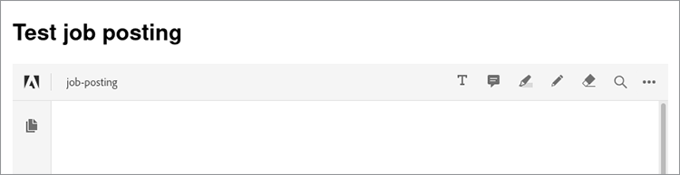

# 求人情報


複数のユーザーが含まれるwebサイトを操作する場合は、すべてのユーザーにスムーズなエクスペリエンスを提供するエクスペリエンスをデザインすることが重要です。

次のようなシナリオを考えてみましょう。雇用主が次のことを実行できるWebサイトがある場合 [求人投稿をアップロード](https://www.adobe.io/apis/documentcloud/dcsdk/job-posting.html). 求職者にとっては、投稿に関連するすべてのドキュメントを一貫した形式で簡単に表示できると便利です。 ただし、雇用主にとって、情報を添付するファイル形式は何でも構いません。 両方のユーザーの利便性を高めるために、アップロードしたすべての文書を自動的にPDFに変換し、投稿にインラインで埋め込むことができます。

## 学習内容

この実践チュートリアルでは、 [!DNL Adobe Acrobat Services] とその [Node.js SDK](https://www.npmjs.com/package/@adobe/documentservices-pdftools-node-sdk) 求人情報サイトにこれらの機能を追加します。 これにより、使いやすく、求職者と雇用主の両方にとって魅力的なwebサイトが作成されます。 これが、 [complete](https://github.com/contentlab-io/adobe_job_posting) [プロジェクトコード](https://github.com/contentlab-io/adobe_job_posting)を参照しながら作業を進める場合は、

開始するには、簡単なExpressベースのNode.js Webアプリケーションを設定します。 [Express](https://expressjs.com/) は、ルーティングやテンプレート作成などの機能を備えた、シンプルなwebアプリケーションフレームワークです。 アプリケーションのコードは、次の場所で入手できます： [GitHub](https://github.com/contentlab-io/adobe_job_posting). また、 [PostgreSQLデータベース](https://www.postgresql.org/) PDFを保存するために設定します。

## 関連 [!DNL Acrobat Services] API

* [PDF埋め込みAPI](https://www.adobe.com/devnet-docs/dcsdk_io/viewSDK/index.html)

* [PDF Services API](https://opensource.adobe.com/pdftools-sdk-docs/release/latest/index.html)

## AdobeAPI資格情報を作成しています

まず、次の操作を行います。 [資格情報の作成](https://www.adobe.com/go/dcsdks_credentials) Adobe PDF Embed API（無料）とAdobe PDF Services API（無料、6か月間） [従量課金制](https://www.adobe.io/apis/documentcloud/dcsdk/pdf-pricing.html) （文書トランザクションあたり\$0.05です）。 PDFサービスAPIの資格情報を作成する際に、[パーソナライズされたコードサンプルの作成]オプションをオンにします。 ZIPファイルを保存し、 pdftools-api-credentials.jsonとprivate.keyをNode.js Expressプロジェクトのルートディレクトリに抽出します。

また、自由に使用できる埋め込みAPIのAPIキーも必要です。 共有元 [プロジェクト](https://console.adobe.io/projects)作成したプロジェクトに移動します。 次に、 **プロジェクトに追加** を選択します **API**. 最後に、 **PDF埋め込みAPI**.

PDF埋め込みAPIのドメインを指定します。 APIキーは公開されている必要があります（ブラウザーで実行されるコードで検索してください）。 ドメインを指定すると、別のドメインのユーザーがAPIキーを使用できなくなります。

「localhost」をドメインとして使用することはできません。 「testing.local」などのドメインを指定し、コンピューター上のhostsファイルを編集して、ドメインをコンピューターの127.0.0.1にリダイレクトします。 次に、アプリケーションをlocalhost:3000でテストする代わりに、testing.local:3000でテストできます。 完了したら、プロジェクトページでPDF埋め込みAPIのAPIキーを探します。

## アップロードフォームとハンドラーの追加

ExpressアプリケーションとAPI資格情報が動作している場合は、ユーザーがドキュメントをwebサイトにアップロードできるようにするフォームも必要です。 この目的のために、 index.jadeテンプレートを編集します。

アップロードされた求人情報の名前、および詳細情報を含む文書の入力フィールドを作成します。

テンプレートのコンテンツブロック内に、次のフォームを追加します。

```
extends layout

block content
  h1= title

  form(action="/upload", enctype="multipart/form-data", method="POST")
    label Job posting name:&nbsp;
    input(type="text", name="name", required="required")
    br
    br
    label Describing document:&nbsp;
    input(type="file", name="attachment", required="required")
    br
    br
    input(type="submit", value="Submit job posting")
```

次に、POSTリクエストのハンドラーを/uploadアクションに追加します。 次に、 /uploadのルートをroutes/index.jsファイルに追加します。 このルート用に新しいファイルを作成できますが、新しいファイルを反映するようにapp.jsファイルを更新する必要があります。 このルートハンドラー内では、指定された名前とアップロードされたファイルにアクセスできます。

```
router.post('/upload', async function (req, res, next) {
    const name = req.body.name;
    const fileContents = req.files.attachment.data;

    // code to work with the uploaded document
  });
```

この関数は非同期なので、関数でawaitキーワードを使用できます。これは、API呼び出しを実行するメソッドを呼び出す際に便利です。


## PDFサービスAPIの使用

PDFサービスAPIを使用する前に、次のインポートをルートファイルの先頭に追加する必要があります。

```
const PDFToolsSdk = require('@adobe/documentservices-pdftools-node-sdk');
  const { Readable } = require('stream');
```

インポートのすぐ下で、API資格情報を読み込み、 [実行内容](https://www.javascripttutorial.net/javascript-execution-context/). 実行コンテキストは様々な操作で再利用できるため、再利用は1回だけにするほうが理にかなっています。

```
  const credentials = PDFToolsSdk.Credentials
  .serviceAccountCredentialsBuilder()
  .fromFile("pdftools-api-credentials.json")
  .build();

  const executionContext = PDFToolsSdk.ExecutionContext.create(credentials);
```

次に、 `router.post` ブロックします。 まず、文書をPDFに変換します。

```
  const createPdfOperation = PDFToolsSdk.CreatePDF.Operation.createNew();

  const input = PDFToolsSdk.FileRef.createFromStream(Readable.from(fileContents),
  req.files.attachment.mimetype);

  createPdfOperation.setInput(input);

  let result = await createPdfOperation.execute(executionContext);

  result.saveAsFile('output-pdf' + new Date().getTime() + '.pdf');
  return res.send('success!');
```

ほとんどの操作は同じ4つの手順を実行します。 まず、適切なクラスのcreateNewメソッドを使用して、操作のタイプを初期化します。 次に、操作の入力をFileRefとして作成します。 操作の結果もFileRefであるため、後続の操作はこの手順をスキップできます。 この最初の操作では、アップロードされたファイルのバイトからFileRefを作成します。 3番目に、オペレーションに入力を割り当てる必要があります。 最後に、実行コンテキストを実行メソッドのパラメータとして操作が実行されます。 このメソッドは、結果を待つことができるようにPromiseを返します。

このコードは、返されたPDFをファイルに保存し、単純な「success」レスポンスをブラウザに送ります。 ファイル名の「日付」部分は、一意のファイル名を保証します。 保存先ファイルが存在する場合、 saveAsFileはエラーを返します。

## 画像のテキストへの変換とPDFの圧縮

次に、光学式文字認識(OCR)を使用して画像をテキストに変換し、結果を圧縮します。 これは、CreatePDF操作と同様に、OCRおよびCompressPDF操作を使用して行います。 次の項目をroutesファイルに追加します。 `router.post`:

```
  const name = req.body.name;
  const fileContents = req.files.attachment.data;

  const createPdfOperation = PDFToolsSdk.CreatePDF.Operation.createNew();
  const input = PDFToolsSdk.FileRef.createFromStream(Readable.from(fileContents),
  req.files.attachment.mimetype);
  createPdfOperation.setInput(input);

  let result = await createPdfOperation.execute(executionContext);

  const ocrOperation = PDFToolsSdk.OCR.Operation.createNew();
  ocrOperation.setInput(result);
  result = await ocrOperation.execute(executionContext);

  const compressPdfOperation = PDFToolsSdk.CompressPDF.Operation.createNew();
  compressPdfOperation.setInput(result);
  result = await compressPdfOperation.execute(executionContext);

  result.saveAsFile('output-pdf' + new Date().getTime() + '.pdf');
  return res.send('success!');
```

結果がFileRefで、コードがsetInputに渡すことができるため、この操作は1回だけ行う必要があります。

ファイルをハードディスクに保存して、単純化されたHTTP応答を返すよりも良い方法があります。 代わりに、PDFをデータベースに保存し、Adobeの無償PDF埋め込みAPIを使用してPDFを埋め込んだwebページを表示します。 これにより、求職者が会社のロゴや他のデザイン要素を含む求人情報やパンフレットを見つけて閲覧できるように、雇用主の求人情報やパンフレットがWebサイトに表示されます。

## データベースへのPDFの格納

PDFをPostgreSQLデータベースに格納します。 Node.jsでPostgresに接続するためのnode-postgresパッケージを取得します。 ある時点でPDFの内容をバッファに格納する必要があり、FileRefが機能するのはストリームのみなので、stream-buffersパッケージをインストールします。 そのため、stream-buffersパッケージを使用して内容をバッファに書き込みます。

```
npm install pg stream-buffers
```

次に、ジョブ投稿用のデータベーステーブルを作成します。 一意のIDの列、名前の列、および関連付けられたPDFの列が必要です。 Postgresコマンドラインインターフェイス(CLI)からデータベース表を作成できます。

```
CREATE TABLE job_postings (id TEXT PRIMARY KEY, name TEXT NOT NULL, attachment
BYTEA NOT NULL);
```

Node.jsファイルに戻ります。 インポートをファイルの先頭に追加します。

```
  const { Client } = require('pg');
  const streamBuffers = require('stream-buffers');
```

データベース・テーブルにPDFを格納するには、アップロード機能を変更します。 最後の2行（saveAsFileおよびsend）を次のコードスニペットで置き換えます。

```
  const pgClient = new Client();
  pgClient.connect();

  const id = Math.random().toString(36).substr(2, 6); // not securely random at all,
  but serves the purpose for this demo

  const writableStream = new streamBuffers.WritableStreamBuffer();
  writableStream.on("finish", async () => {    
    await pgClient.query("INSERT INTO job_postings VALUES ($1, $2, $3)", [
      id,
      name,
      writableStream.getContents()
    ]);
    res.redirect(`/job/${id}`);
  })
  result.writeToStream(writableStream);
```

内容を書き込むには、WritableStreamBufferを作成します。 finishイベントを使用して、SQLクエリを実行します。 node-postgresパッケージは自動的にBufferパラメータをBYTEA形式に変換します。 クエリにより、ユーザーは/job/にリダイレクトされます。{id}後で作成されるエンドポイントです。

PDF埋め込みAPIの場合は、PDFの内容のみを返すエンドポイントも必要です。

```
  router.get('/pdf/:id', async function (req, res, next) {
    const id = req.params.id;
 
    const pgClient = new Client();
    pgClient.connect();

  const pgResult = await pgClient.query("SELECT attachment FROM job_postings WHERE id
  = $1", [id]);
  const buffer = pgResult.rows[0].attachment;
  res.type('pdf');
    return res.send(buffer);
  });
```

## PDFの埋め込み

次に、 /job/を作成します{id} endpoint：要求された求人情報の名前と埋め込みPDFを含むテンプレートをレンダリングします。

```
router.get('/job/:id', async function(req, res, next) {
    const id = req.params.id;

    const pgClient = new Client();
    pgClient.connect();

    const pgResult = await pgClient.query("SELECT name FROM job_postings WHERE id =
  $1", [id]);
    const name = pgResult.rows[0].name;

    res.render('job', { pdf_url: `/pdf/${id}`, name });
  });
```

views/ディレクトリで、次の内容のjob.jadeファイルを作成します。

```
  extends layout

  block content
    h1= name
    div(id='adobe-dc-view')
    script(src='https://documentcloud.adobe.com/view-sdk/main.js')
    script.
      window.embedUrl = "!{pdf_url}";
    script(src='/javascripts/embed-pdf.js')
```

最初のスクリプトはAdobeのView SDKで、これによりPDFを簡単に埋め込むことができます。 2番目のスクリプトは、window.embedUrlの値をExpressルートハンドラーによって提供されるPDFのURLに設定するインラインの1行です。 3つ目のスクリプトは、自分で次のように作成します。

```
  document.addEventListener("adobe_dc_view_sdk.ready", function () {
    var adobeDCView = new AdobeDC.View({ clientId: "YOUR API KEY HERE", divId:
   "adobe-dc-view" });
    adobeDCView.previewFile({
      content: { location: { url: '//' + window.location.host + window.embedUrl }
         },
      metaData: { fileName: "Job posting" }
    });
  });
```

これで、文書のアップロード、/job/idページへのリダイレクト、埋め込まれたPDFの表示のプロセス全体をテストできます。 ユーザーは同じ手順に従って、求人情報やその他のドキュメントをwebサイトに追加できます。



インライン埋め込みアクションを確認するには、以下を参照してください [ライブデモ](https://documentcloud.adobe.com/view-sdk-demo/index.html#/view/IN_LINE/Bodea%20Brochure.pdf).

## 次の手順

この実践チュートリアルでは、でNode.jsを使用する方法について説明しました。 [!DNL Acrobat Services] アップロードしたファイルを変換するには [求人情報](https://www.adobe.io/apis/documentcloud/dcsdk/job-posting.html) 様々な形式でPDFに変換できます。 作成されたPDFは、webページに埋め込まれました。 同じ機能をwebサイトに追加できるようになりました。これにより、求職者が見つけやすい求人情報やパンフレットなどを簡単にアップロードできます。 これらの機能は、誰もが夢の仕事を見つけるために必要な情報を得るのを助けます。

[!DNL Acrobat Services] 主要なドキュメント処理機能をwebサイトやアプリに追加するのに役立ちます。 これらのAPIの機能について詳しくは、次のquickstartドキュメントを参照してください。

* [PDF埋め込みAPI](https://www.adobe.com/devnet-docs/dcsdk_io/viewSDK/index.html)

* [PDF Services API](https://opensource.adobe.com/pdftools-sdk-docs/release/latest/index.html)

ユーザーフレンドリーなドキュメント処理機能をwebサイトに追加するには、 [無料体験版に新規登録](https://www.adobe.io/apis/documentcloud/dcsdk/gettingstarted.html). Adobe PDF Embed APIは常に無料で使用でき、Adobe PDF Services APIは6か月間無料です。この場合、文書トランザクション1つあたり\$0.05になるので、次のことができます [従量課金制](https://www.adobe.io/apis/documentcloud/dcsdk/pdf-pricing.html) 仕事の成長に応じて
