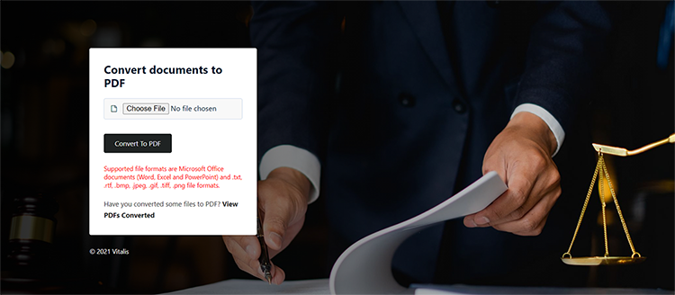

# 法的契約の管理


デジタル化には課題が伴います。 現在、ほとんどの組織には、作成、編集、承認、および別の関係者による署名が必要な[法的契約](https://www.adobe.io/apis/documentcloud/dcsdk/legal-contracts.html)の多くの種類があります。 これらの法的契約では、多くの場合、独自のカスタマイズとブランディングが必要になります。 組織は、安全を確保するために、署名後に保護された形式で保存する必要がある場合もあります。 これらすべてを実現するには、堅牢なドキュメント生成および管理ソリューションが必要です。

多くのソリューションには、文書生成の機能が備わっていますが、データ入力や条件ロジック（特定のシナリオにのみ適用する条項など）をカスタマイズすることはできません。 会社の法的テンプレートを手動で更新するのは困難で、これらの文書が広範に渡るにつれエラーが発生しやすくなります。 これらのプロセスを自動化する必要性は非常に大きい。

## 学習内容

この実践チュートリアルでは、ドキュメント内のカスタム入力フィールドの生成で[[!DNL Adobe Acrobat Services] API](https://www.adobe.io/apis/documentcloud/dcsdk/doc-generation.html)の機能を確認します。 また、生成された文書を保護されたポータブルドキュメントフォーマット(PDF)に簡単に変換して、データが操作されないようにする方法についても説明します。

このチュートリアルでは、契約書からPDFへのコンバージョンを学習する際のプログラミングを少々取り上げます。 [Microsoft Word](https://www.microsoft.com/en-us/download/office.aspx)と[Node.js](https://nodejs.org/)をPCにインストールすると、効率的に作業を進めることができます。 Node.jsおよび[ES6構文](https://www.w3schools.com/js/js_es6.asp)の基本的な理解も推奨されます。

## 関連APIとリソース

* [Adobe文書生成API](https://www.adobe.io/apis/documentcloud/dcsdk/doc-generation.html)

* [PDF埋め込みAPI](https://www.adobe.com/devnet-docs/dcsdk_io/viewSDK/index.html)

* [Adobe Sign API](https://www.adobe.io/apis/documentcloud/sign.html)

* [プロジェクトコード](https://github.com/agavitalis/adobe_legal_contracts.git)

## テンプレート文書の作成

Microsoft Wordアプリケーションを使用するか、Adobeの[サンプルWordテンプレート](https://www.adobe.io/apis/documentcloud/dcsdk/doc-generation.html#sample-blade)をダウンロードして、法的文書を作成できます。 Adobeそれでも、Microsoft Word用の[Adobe Document Generation Taggerアドイン](https://www.adobe.io/apis/documentcloud/dcsdk/docs.html?view=docgen-addin)などのヘルパーツールを使用せずに、入力をカスタマイズしてこれらの文書にデジタル署名を行うことは簡単ではありません。

Document Generation Taggerは、タグを使用した文書のシームレスなカスタマイズを可能にするMicrosoft Wordアドインです。 これにより、JSONデータを使用して動的に入力する文書テンプレートに動的フィールドを作成できます。


Document Generation Taggerの使用方法を説明するには、このアドインをインストールしてから、簡単な契約書ドキュメントのタグ付けに使用されるJSONデータモデルを作成します。

**[挿入]**&#x200B;タブをクリックしてWordにドキュメント生成タガーをインストールし、次に[アドイン]グループで[**個人用アドイン**]をクリックします。 [Officeアドイン]メニューで、[Adobeドキュメントの生成]を検索し、[**追加**]をクリックして手順に従います。 これらの手順は、上記の画面キャプチャで確認できます。

Document Generation Tagger for Wordアドインのインストール後、単純なJSONデータモデルを作成して、法的なドキュメントにタグを付けます。

続行するには、任意のエディターを開き、 Agreement.jsonという名前のファイルを作成して、作成したJSONファイルに以下のコードスニペットを貼り付けます。

```
{
"Agreement": {
"Date": "1/24/2021",
"Prime Contractor Name": "Ogbonna Vitalis Corp",
"Prime State": "Lagos",
"Address": "Maryland Ave, Lagos State, Ng",
"Sub Contractor Name": "Vivvaa Soln",
"Sub Contractor State": "California",
"Sub Contractor Address": "Molusi Avenue, Dallas Texas, CA",
"Agreement Date": "1/24/2021",
"Length": 5
}
}
```

このJSONドキュメントを保存したら、Document Generation Taggerアドインに読み込みます。 以下の画面キャプチャに示すように、Word画面の右上にあるAdobeグループで&#x200B;**Document Generation**&#x200B;をクリックして文書を読み込みます。


ガイドするビデオが表示されます。 確認するか、[**開始**]をクリックして、直接タグ付けフィールドに移動できます。 **[開始]**&#x200B;をクリックすると、アップロードフォームが表示されます。 **「JSONファイルをアップロード」**&#x200B;をクリックし、作成したJSONファイルを選択します。 読み込みが完了したら、[**タグの生成**]をクリックしてタグを生成します。

タグを取り込んで生成した後、これらのタグを文書に追加できます。 追加するには、タグを表示する正確な場所にカーソルを置きます。 次に、Document Generation APIからタグを選択し、[**テキストの挿入**]をクリックします。 この手順の概要を次の画面に示します。


読み込まれたJSONデータモデルを使用して作成された基本的なタグとは別に、高度な機能を使用して、画像、条件ロジック、計算、繰り返し要素、条件フレーズなどの詳細オプションを使用することもできます。 これらの機能にアクセスするには、ドキュメント生成タガーパネルで「**詳細**」をクリックします。 これは、以下の画面キャプチャで確認できます。


これらの高度な機能は、基本的なタグと同じです。 コンディショナルロジックを含めるには、文書の中から塗りつぶす部分を選択します。 その後、タグの挿入を決定するルールを設定します。

さらに詳しく説明すると、例えば契約書に、コンディショナルのみ含めるセクションがある場合などです。 [コンテンツタイプの選択]フィールドで、[**セクション]を選択します。** [レコードの選択]フィールドで、条件付きセクションを表示するかどうかを決定するオプションを選択します。 目的の条件演算子を選択し、「値」フィールドにテストする値を設定します。 次に、[**条件の挿入]をクリックします。**&#x200B;以下の画面キャプチャは、このプロセスを示しています。


計算の場合は、「算術」または「集計」を選択し、関連する最初のレコード、演算子、および使用可能なテンプレート・タグに基づいて使用する2番目のレコードを含めます。 次に、[**計算の挿入**]をクリックします。

また、法的契約には多くの場合、当事者の署名が必要です。 「数値計算」セクションのすぐ下にあるAdobe Signテキストタグを使用して、電子サインを挿入できます。 電子サインを含めるには、受信者の数を指定し、**署名者**&#x200B;を選択して、ドロップダウンリストからフィールドタイプを適宜選択する必要があります。 完了したら、**「Adobe Signテキストタグを挿入」**&#x200B;をクリックして、プロセスを完了します。

データの整合性を確保するには、法的文書を保護された形式で保存します。 [!DNL Acrobat Services] APIを使用すると、文書をPDF形式にすばやく変換できます。 Document Generation APIを組み込み、このシンプルなアプリケーションを使用して、タグ付き文書をWordからPDFフォーマットに変換します。

## プロジェクト設定

まず、Node.jsアプリケーションのフォルダ構造を設定します。 この例では、この単純なアプリケーションをAdobeLegalContractAPIと呼びます。 ソースコード[ここ](https://github.com/agavitalis/adobe_legal_contracts.git)を取得できます。

### ディレクトリ構造

AdobeLegalContractAPIという名前のフォルダーを作成し、任意のエディターで開きます。 次のフォルダー構造を使用して、```npm init```コマンドで基本のNode.jsアプリケーションを作成します。

```
###Directory Structure
AdobeLegalContractAPI
-----config
----------default.json
-----controllers
----------createPDFController.js
----------previewController.js
-----models
----------document.js
-----routes
----------web.js
-----services
-----------upload.js
-----uploads
-----views
-----index.js
```

上記は、アプリケーションの単純なNode.jsアプリケーション構造です。 次に、必要なnpmパッケージのインストールに進みます。

### パッケージのインストール

次のコードスニペットに示すように、npm installコマンドを使用して、必要なパッケージをインストールします。

```
npm install express body-parser morgan multer hbs path config mongoose
```

パッケージをインストールしたら、 package.jsonファイルの内容が次のコードスニペットと同様であることを確認します。

```
###package.json
{
"name": "adobelegalcontractapi",
"version": "1.0.0",
"description": "",
"main": "index.js",
"directories": {
"test": "test"
},
"dependencies": {
"body-parser": "^1.19.0",
"config": "^3.3.6",
"express": "^4.17.1",
"hbs": "^4.1.1",
"mongoose": "^5.12.1",
"morgan": "^1.10.0",
"multer": "^1.4.2",
"path": "^0.12.7"
},
"devDependencies": {},
"scripts": {
"start": "node index.js"
},
"repository": {
"type": "git",
"url": "https://github.com/agavitalis/adobe_legal_contracts.git"
},
"author": "Ogbonna Vitalis",
"license": "ISC",
"bugs": {
"url": "https://github.com/agavitalis/adobe_legal_contracts/issues"
},
"homepage": "https://github.com/agavitalis/adobe_legal_contracts#readme"
}
```

これらのコードスニペットでは、ビューのHandlebarsテンプレートエンジンなどのアプリケーション依存関係をインストールしました。

このチュートリアルでは、[[!DNL Acrobat Services] API](https://www.adobe.io/apis/documentcloud/dcsdk/)を使用して文書をPDFに変換することに重点を置いています。 したがって、このNode.jsアプリケーションの構築方法を順を追って説明する必要はありません。 ただし、[GitHub](https://github.com/agavitalis/adobe_legal_contracts.git)で動作している完全なNode.jsアプリケーションコードを取得することはできます。

## [!DNL Adobe Acrobat Services] APIをNode.jsアプリケーションに統合しています

[!DNL Adobe Acrobat Services] APIは、ドキュメントをシームレスに操作できるように設計されたクラウドベースの信頼性の高いサービスです。 次の3つのAPIが用意されています。

* Adobe PDF Services API

* Adobe PDF Embed API

* Adobe文書生成API

[!DNL Acrobat Services] APIを使用するには資格情報が必要です(PDFのEmbed API資格情報とは異なります)。 有効な資格情報がない場合は、以下の画面キャプチャに示すように、[登録](https://www.adobe.com/go/dcsdks_credentials?ref=getStartedWithServicesSDK)してワークフローを完了してください。 [6か月間の無料体験後は従量課金制](https://www.adobe.io/apis/documentcloud/dcsdk/pdf-pricing.html)で、ドキュメントのトランザクション1件につきわずか0.05ドルです。


サインアッププロセスが完了すると、コードサンプルが自動的にPCにダウンロードされ、開始に役立ちます。 このコード例を抽出して、それに従うことができます。 抽出したコードサンプルのpdftools-api-credentials.jsonファイルとprivate.keyファイルをNode.jsプロジェクトのルートディレクトリに必ずコピーしてください。 [!DNL Acrobat Services]個のAPIエンドポイントにアクセスするには、資格情報が必要です。 パーソナライズされた資格情報を使用してSDKサンプルをダウンロードすることもできるため、サンプルコードでキーを更新する必要はありません。

次に、アプリケーションのルートディレクトリにあるターミナルを使用して```npm install \--save @adobe/documentservices-pdftools-node-sdk```コマンドを実行し、Adobe PDF Services Node SDKをインストールします。 正常にインストールされると、[!DNL Acrobat Services]個のAPIを使用して、アプリケーション内のドキュメントを操作できます。

## PDF文書の作成

[!DNL Acrobat Services]のAPIは、Microsoft Office文書(Word、Excel、PowerPoint)や、.txt、.rtf、.bmp、.jpeg、.gif、.tiff、.pngなどの[サポートされているファイル形式](https://opensource.adobe.com/pdftools-sdk-docs/release/latest/howtos.html#create-a-pdf)からのPDFの作成をサポートしています。 AcrobatサービスAPIを使用して、法的契約を他のファイル形式からPDFに簡単に変換できます。

AdobeDocument Generation APIにより、WordファイルまたはPDFーへの変換が可能になります。 例えば、Wordテンプレートを使用して、編集したテキストをマークするための朱書きなどの契約書を生成できます。 次に、文書をPDFに変換し、PDFサービスAPIを使用して、文書をパスワードで保護したり、署名用に送信したりすることができます。

使用可能なサポートされているファイル形式からPDF文書を作成するには、[!DNL Acrobat Services]を使用して変換用の文書をアップロードするフォームがあります。

デザインされたアップロードフォームが下の画面キャプチャに表示され、[GitHub](https://github.com/agavitalis/adobe_legal_contracts.git)でHTMLとCSSファイルにアクセスできます。



次のコードスニペットをcontrollers /createPDFController.jsファイルに追加します。 このコードは、アップロードされた文書を取得し、PDFに変換します。 [!DNL Acrobat Services]は、元のアップロードファイルと変換されたファイルを別のフォルダーに保存します。

```
###controllers/createPDFController.js
const PDFToolsSdk = require('@adobe/documentservices-pdftools-node-sdk');
const Document = require('../models/document');
/*
* GET / route to show the createPDF form.
*/
function createPDF(req, res) {
//catch any response on the url
let response = req.query.response
res.render('index', { response })
}
/*
* POST /createPDF to create a new PDF File.
*/
function createPDFPost(req, res) {
let filePath = req.file.path;
let fileName = req.file.filename;
try {
// Initial setup, create credentials instance.
const credentials = PDFToolsSdk.Credentials
.serviceAccountCredentialsBuilder()
.fromFile("pdftools-api-credentials.json")
.build();
// Create an ExecutionContext using credentials and create a new operation instance.
const executionContext = PDFToolsSdk.ExecutionContext.create(credentials),
createPdfOperation = PDFToolsSdk.CreatePDF.Operation.createNew();
// Set operation input from a source file.
const input = PDFToolsSdk.FileRef.createFromLocalFile(filePath);
createPdfOperation.setInput(input);
// Execute the operation and Save the result to the specified location.
createPdfOperation.execute(executionContext)
.then(async(result) => {
let newFileName = `createPDFFromDOCX-${Math.random() * 171}.pdf`
let newFilePath = require('path').resolve('./') + `\\output\\${newFileName}`
await result.saveAsFile(`views/output/${newFileName}`)
//Creates a new document
let newDocument = new Document({
documentName: newFileName,
url: newFilePath
});
//Save it into the DB.
newDocument.save((err, docs) => {
if (err) {
res.send(err);
}
else {
res.redirect('/?response=PDF Successfully created')
}
});
})
.catch(err => {
if (err instanceof PDFToolsSdk.Error.ServiceApiError
|| err instanceof PDFToolsSdk.Error.ServiceUsageError) {
console.log('Exception encountered while executing operation', err);
} else {
console.log('Exception encountered while executing operation', err);
}
});
} catch (err) {
console.log('Exception encountered while executing operation', err);
}
}
//export all the functions
module.exports = { createPDF, createPDFPost };
```

上記のコードスニペットには、以前にインストールしたドキュメントモデルと[!DNL Acrobat Services]ノードSDKが必要でした。 次の2つの関数があります。

* createPDFに「文書をアップロード」フォームが表示されます。

* createPDFPostは、アップロードされた文書をPDFに変換します。

これらの関数は、変換されたPDF文書をviews/outputディレクトリに保存し、PCにダウンロードすることができます。

また、フリーPDF埋め込みAPIを使用して、変換されたPDFファイルをプレビューすることもできます。 PDF埋め込みAPIを使用して、[!DNL Acrobat Services]資格情報とは異なる[ここ](https://www.adobe.com/go/dcsdks_credentials)でAdobe資格情報を生成し、許可されたドメインを登録してAPIにアクセスできます。 手順に従って、アプリケーションのPDF埋め込みAPI資格情報を生成します。 デモの[こちら](https://documentcloud.adobe.com/view-sdk-demo/index.html#/view/FULL_WINDOW/Bodea%20Brochure.pdf)を確認することもできます。そこから簡単にコードを生成して、すばやく作業を開始できます。

アプリケーションに戻り、アプリケーションのviewフォルダーにlist.hbsファイルとpreview.hbsファイルを作成して、以下のコードスニペットをそれぞれlist.hbsファイルとpreview.hbsファイルに貼り付けます。

```
###views/list.hbs
<!DOCTYPE html>
<html lang="en">
<head>
<title>Adobe Legal Contract</title>
<!-- Meta tags -->
<meta charset="UTF-8">
<meta name="viewport" content="width=device-width,
initial-scale=1.0">
<meta http-equiv="X-UA-Compatible" content="ie=edge">
<!-- //Meta tags -->
<link
href=".min.css" rel="stylesheet" integrity="sha384-eOJMYsd53ii+scO/
bJGFsiCZc+5NDVN2yr8+0RDqr0Ql0h+rP48ckxlpbzKgwra6" crossorigin="anonymous">
<link rel="stylesheet" href="css/style.css" type="text/css"
media="all" /><!-- Style-CSS -->
<link href="css/font-awesome.css" rel="stylesheet" /><!--
font-awesome-icons -->
</head>
<body>
<section>
<div class="form-36-mian section-gap">
<div class="wrapper">
<div class="container">
<div class="row">
{{#each documents}}
<div class="col-md-4 mb-2">
<div class="card" style="width:
18rem;">

<div class="card-body">
<h5
class="card-title">{{documentName}}</h5>
<a
href="/downloadPDF/{{_id}}" class="btn btn-primary"><i class="fa
fa-download" aria-hidden="true"></i> Download</a>
<a
href="/previewPDF/{{_id}}" class="btn btn-info"><i class="fa fa-eye"
aria-hidden="true"></i> Preview</a>
</div>
</div>
</div>
{{/each}}
</div>
</div>
<!-- copyright -->
<div class="copy-right">
<p>(c) 2021 Vitalis</p>
</div>
<!-- //copyright -->
</div>
</div>
</section>
</body>
</html>
###views/preview.hbs
<!DOCTYPE html>
<html lang="en">
<head>
<title>[!DNL Adobe Acrobat Services] PDF Embed API</title>
<meta charset="utf-8" />
<meta http-equiv="X-UA-Compatible" content="IE=edge,chrome=1" />
<meta id="viewport" name="viewport" content="width=device-width,
initial-scale=1" />
</head>
<body style="margin: 0px">
<input type="hidden" id="pdfDocumentName"
value={{document.documentName}} />
<input type="hidden" id="pdfDocumentUrl" value={{document.url}} />
<div id="adobe-dc-view"></div>
<script
src="https://documentcloud.adobe.com/view-sdk/main.js"></script>
<script type="text/javascript">
let pdfDocumentName =
document.getElementById("pdfDocumentName").value;
let pdfDocumentUrl =
document.getElementById("pdfDocumentUrl").value;
document.addEventListener("adobe_dc_view_sdk.ready", function
() {
var adobeDCView = new AdobeDC.View({ clientId:
"XXXXXXXXXXXXXXXX", divId: "adobe-dc-view" });
adobeDCView.previewFile({
content: { location: { url:
`http://localhost:5000/output/${pdfDocumentName}` } },
metaData: { fileName: pdfDocumentName }
}, {});
});
</script>
</body>
</html>
```

また、 controller/previewController.jsファイルを作成し、その下のコードスニペットをファイルに貼り付けます。

```
const Document = require('../models/document');
/*
* GET /listFiles route to show PDF file lists.
*/
async function listFiles(req, res) {
let documents = await Document.find({});
res.render('lists', { documents })
}
/*
* GET /previewPDF route to show PDF file in AdobeEmbedAPI.
*/
async function previewPDF(req, res) {
//catch any response on the url
let documentId = req.params.documentId
let document = await Document.findOne({_id:documentId});
res.render('preview', { document })
}
/*
* GET /downloadPDF To Download PDF Documents.
*/
async function downloadPDF(req, res) {
let documentId = req.params.documentId
let document = await Document.findOne({_id:documentId});
res.download(document.url);
}
//export all the functions
module.exports = {listFiles, previewPDF, downloadPDF };
```

上記のコントローラファイルには、 listFiles 、 previewPDF 、 downloadPDFの3つの関数があります。 listFiles関数は、[!DNL Acrobat Services] APIを使用してこれまでに生成されたすべてのPDFファイルを一覧表示します。 previewPDF関数を使用すると、PDFファイルをPDF埋め込みAPIでプレビューできます。また、downloadPDF関数を使用すると、生成されたPDFファイルをPCにダウンロードできます。 以下の画面キャプチャは、PDF埋め込みAPIを使用したPDFプレビューのサンプルを示しています。


## 要約

この実践チュートリアルでは、Document Generation Tagger Microsoft Wordアドインを使用して文書にタグ付けしました。 次に、[!DNL Acrobat Services] APIをNode.jsアプリケーションに統合し、
タグ付き文書をダウンロード可能なPDF形式に変換しましたが、PDFに直接契約書を作成することもできます。 最後に、Adobe PDF Embed APIを使用して、生成されたPDFを検証および署名用にプレビューしました。

完成したアプリを使用すると、[法的な契約テンプレート](https://www.adobe.io/apis/documentcloud/dcsdk/legal-contracts.html)に動的フィールドをタグ付けしたり、PDFに変換したり、プレビューしたり、[!DNL Acrobat Services]のAPIを使用して署名したりすることが簡単になります。 一意の契約を作成するのに時間を費やす代わりに、チームは各クライアントに正しい契約を自動的に送信し、ビジネスの成長により多くの時間を費やすことができます。

組織は、[!DNL Adobe Acrobat Services]個のAPIを使用して、完全性と使いやすさを実現しています。 特に、[6か月間の無料体験後、従量課金制](https://www.adobe.io/apis/documentcloud/dcsdk/pdf-pricing.html)をお楽しみいただけます。 君は使った分だけお金を払う。 さらに、PDF埋め込みAPIは常に無料です。

文書のフローを改善して、生産性を向上させましょう。 [今すぐ](https://www.adobe.io/apis/documentcloud/dcsdk/gettingstarted.html)を開始してください。
