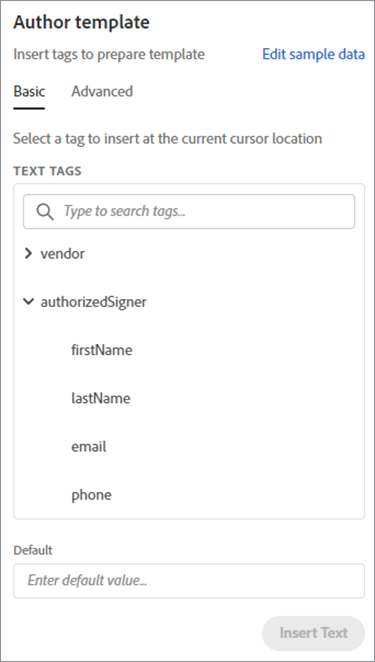

# NDA の作成


組織は、サービスや製品を構築するために、外部のコントリビューターと協力します。 秘密保持契約 (NDA) は、このような提携の中でも重要な要素です。 これにより、すべての当事者が、いずれかのエンティティに損害を与える可能性のある機密情報を公開することが禁じられます。

最も広く使用されている NDA 形式は、PDF文書です。 組織は NDA を作成し、すべての関係者に送信します。 その後、全員が署名すると、契約が開始されます。 高速チームでは、手作業でのPDF作成が遅くなります。

## 学習内容

この実践チュートリアルでは、自社に特化したMicrosoft Word NDA テンプレートの作成方法を説明します。 Microsoft Word 用Adobeの無料アドイン [Adobe文書生成タグ](https://opensource.adobe.com/pdftools-sdk-docs/docgen/latest/wordaddin.html#add-in-demo)で、動的な値を入力するために「タグ」を挿入します。 JSON データをテンプレートに渡して動的テンプレートを作成する方法についてPDFします。 作成されたPDFは、ビジネス要件や目標に応じて、電子メールで送信したり、ブラウザーで共同作業者に表示したりできます。 手順に沿って作業を進めるには、Node.js、JavaScript、Express.js、HTML、CSS の経験が必要です。

## 関連する API とリソース

を [!DNL Adobe Acrobat Services]を使用すると、動的データを使用してPDFドキュメントをその場で生成することができます。 [!DNL Acrobat Services] には、自動化のためのPDF文書生成 API を含む、Adobeツールのスイートが用意されています [NDA の作成](https://www.adobe.io/apis/documentcloud/dcsdk/nda-creation.html)を選択します。

* [Adobeドキュメント生成 API](https://www.adobe.io/apis/documentcloud/dcsdk/doc-generation.html)

* [Adobe Sign API](https://www.adobe.io/apis/documentcloud/sign.html)

* [Adobe文書生成タグ](https://opensource.adobe.com/pdftools-sdk-docs/docgen/latest/wordaddin.html#add-in-demo)

* [プロジェクトコード](https://github.com/afzaal-ahmad-zeeshan/adobe-docugen-sample)

* [[!DNL Acrobat Services] キー](https://opensource.adobe.com/pdftools-sdk-docs/release/latest/index.html#getcred)

## JSON モデルの作成

Microsoft Word テンプレートは JSON モデルに依存するため、最初にそれを作成します。 チュートリアルでは、連絡先情報などの会社の詳細を含む基本的な JSON 構造を使用します。

```
{
"vendor": {
"companyName": "GlobalCorp",
"street": "123 Any Street",
"street2": "",
"city":"Anywhere",
"state":"CA",
"primaryContact": {
"firstName":"John",
"lastName":"Doe",
"email":"john-doe@example.com",
"phone":"123-456-7890"
}
},
"authorizedSigner": {
"firstName": "Sarah",
"lastName": "Rose",
"email": "sarah@example.com",
"phone":"555-555-1234"
}
}
```

この構造は、Microsoft Word 内でテンプレートを生成するために使用します。 JSON 形式であれば、あらゆるデータソースからデータを取得できます。 わかりやすくするために、Node.js アプリケーション内に複数のファイルを作成しますが、使用例によっては、ベンダー情報を取得するためにデータベース接続が必要になる場合があります。

## Microsoft Word テンプレートの作成

Microsoft Word 文書で NDA テンプレートを作成します。 Adobe PDF Services API では、サービスが JSON ドキュメントから値を注入できるタグがMicrosoft Word ドキュメントに含まれている必要があります。 テンプレートはすべてのAdobeリクエストで同じですが、JSON の動的データが変更されます。 これらのタグは、この場合、すべてのベンダーのPDF文書を作成するのに役立ちます。Microsoft Word の 1 つのテンプレートを使用し、NDA 文書の生成を自動化することで、プロセスを高速化できます。

この [無料ドキュメント生成タグアドイン](https://opensource.adobe.com/pdftools-sdk-docs/docgen/latest/wordaddin.html#add-in-demo) をMicrosoft Word に変換します。 組織に所属しているユーザーは、すべてのユーザー向けの無償アドインをインストールするようにMicrosoft Office 管理者に依頼できます。

アドインをインストールすると、「ホーム」タブの「Adobe」カテゴリに表示されます。 タブを開くには、 **文書生成**:


タブ内で、サンプルの JSON ドキュメントをアップロードできます。 この文書は、Microsoft Word テンプレートの作成にのみ使用するので、サンプルとして使用できます。


選択 **タグを生成** 」をクリックして、テンプレート内で使用できるアイテムを表示します。 以下に、JSON 構造から抽出されたプロパティを示します。これらは、テンプレートですぐに使用できます。



これらは、 `authorizedSigner` 」フィールドに入力します。 その他のフィールドは折り返され、Microsoft Word でビューを拡張できます。 このアドインには、テーブル、リスト、計算値など、高度なデータオプションも用意されています。

## タグの作成

テンプレートを作成するか、 [既存のテンプレート](https://www.adobe.io/apis/documentcloud/dcsdk/doc-generation.html#sample-blade) をMicrosoft Word に変換します。 文書を設定したら、アドインの対応するトークンをクリックして、各フィールドにタグを追加します。

Microsoft Word ファイルの次のテンプレート：


このファイルにはいくつかのタグが含まれています。 プログラムを実行すると、これらのフィールドにベンダー情報が入力されます。

Document Generation Tagger はAdobe Sign API と統合します。 この統合により、Sign テキストタグを自動的に作成し、生成された文書を署名用にAdobe Signに送信できます。

## ベンダーの NDA の生成

サンプルアプリケーション内に、入力および出力用のフォルダーを用意します。 前述のように、JSON ファイルを使用すると、システムで利用可能なベンダーを表示するファイルが 2 つあります。 ファイルは、ブラウザーに印刷されるフォーム内に表示されます。

```
<h1><b>NDA</b>: Generate for vendor.</h1>
<hr />
<p>Following ({{files.length}}) vendors are ready, select to generate NDA and deliver for signature:</p>
<form method="POST">
<ul>
{{#each files }}
<li><input type="checkbox" name="vendor" value="{{this}}" id="file-{{@index}}" /> <label for="file-{{@index}}">{{this}}</label></li>
{{/each}}
</ul>
<input type="submit" value="Create NDA" />
</form>
```

このコードは、ブラウザーに次のユーザーインターフェイス (UI) を生成します。


管理者が人物を選択すると、アプリはAdobe PDF Services を使用して外出先で NDA を生成します。

```
async function compileDocFile(json, inputFile, outputPdf) {
try {
// configurations
const credentials = adobe.Credentials
.serviceAccountCredentialsBuilder()
.fromFile("./src/pdftools-api-credentials.json")
.build();
// Capture the credential from app and show create the context
const executionContext = adobe.ExecutionContext.create(credentials);
// create the operation
const documentMerge = adobe.DocumentMerge,
documentMergeOptions = documentMerge.options,
options = new documentMergeOptions.DocumentMergeOptions(json, documentMergeOptions.OutputFormat.PDF);
const operation = documentMerge.Operation.createNew(options);
// Pass the content as input (stream)
const input = adobe.FileRef.createFromLocalFile(inputFile);
operation.setInput(input);
// Async create the PDF
let result = await operation.execute(executionContext);
await result.saveAsFile(outputPdf);
} catch (err) {
console.log('Exception encountered while executing operation', err);
}
}
```

Express ルータ内で次のコードを使用します。

```
// Create one report and send it back
try {
console.log(`[INFO] generating the report...`);
const fileContent = fs.readFileSync(`./public/documents/raw/${vendor}`, 'utf-8');
const parsedObject = JSON.parse(fileContent);
await pdf.compileDocFile(parsedObject, `./public/documents/template/Adobe-NDA-Sample.docx`, `./public/documents/processed/output.pdf`);
console.log(`[INFO] sending the report...`);
res.status(200).render("preview", { page: 'nda', filename: 'output.pdf' });
} catch(error) {
console.log(`[ERROR] ${JSON.stringify(error)}`);
res.status(500).render("crash", { error: error });
}
```

以下を表示できます [完全なサンプルコード](https://github.com/afzaal-ahmad-zeeshan/adobe-docugen-sample) を参照してください。

このコードは、 [!DNL Adobe Acrobat Services] SDK 応答として、出力を受け取り、アプリケーションのファイルシステムに保存します。 生成されたドキュメントを電子メールでクライアントに転送したり、ブラウザー内で無料の [Adobe PDF Embed API](https://www.adobe.io/apis/documentcloud/dcsdk/pdf-embed.html)を選択します。

この呼び出しにより、次の NDA ドキュメントが作成されます。


[!DNL Adobe Acrobat Services] API はコンテンツを挿入してPDF文書を作成 これらのツールを使用しないと、Office ドキュメントを処理し、未処理のPDFファイル形式で作業するコードを作成する必要があります。 Adobe PDF Services を使用すると、1 つの API 呼び出しでこれらの手順をすべて実行できます。

次の用途 [Adobe Sign API](https://www.adobe.io/apis/documentcloud/sign.html) NDA に署名を依頼し、最終的な署名済み文書をすべての関係者に配信します。 Adobe Signから通知されます [webhook の使用](https://www.adobe.io/apis/documentcloud/sign/docs.html#!adobedocs/adobe-sign/master/webhooks.md)を選択します。 この Web フックを聞くと、NDA のステータスを取得できます。

Adobe Sign [ドキュメントを参照してください](https://www.adobe.io/apis/documentcloud/sign/docs.html) 詳しくは、こちらの詳細なブログ記事を参照してください。

## 次の手順

この実践チュートリアルでは、Adobeドキュメント生成タグを使用して、Microsoft Word テンプレートと JSON データファイルを使用してPDFドキュメントを動的に生成しました。 アドインが役に立ちました [nda の自動作成](https://www.adobe.io/apis/documentcloud/dcsdk/nda-creation.html) 各関係者に合わせてカスタマイズし、Sign API を使用して署名を収集します。

これらのテクニックを使用すると、独自の NDA やその他のドキュメントを動的に作成して、チームの時間を生産的な作業に集中させることができます。 概要 [[!DNL Adobe Acrobat Services]](https://www.adobe.io/apis/documentcloud/dcsdk/pdf-tools.html) PDF関数をアプリケーションに直接追加して迅速にPDF文書を作成できるように、選択した言語とランタイムに対応する API と SDK を見つけることができます。 [今すぐ始める](https://www.adobe.io/apis/documentcloud/dcsdk/gettingstarted.html) 6 ヶ月間の無料体験を利用できる
[従量制の](https://www.adobe.io/apis/documentcloud/dcsdk/pdf-pricing.html) 文書トランザクションあたり 0.05 USD のみ。
