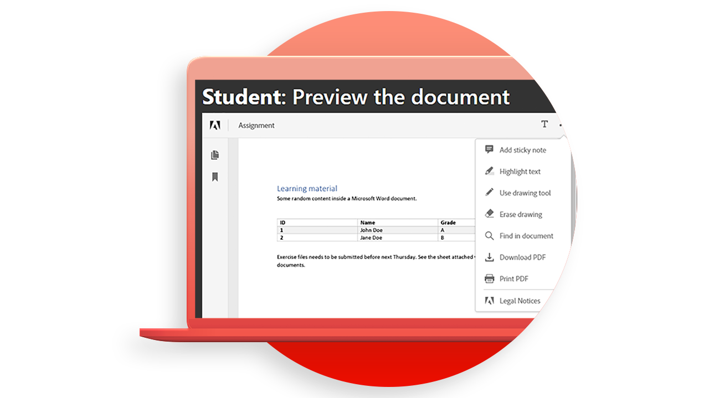

# [!DNL Adobe Acrobat Services] APIの使用例

## [!DNL Adobe Acrobat Services] APIを使用すると何ができますか？

[!DNL Adobe Acrobat Services] APIを使用して、これらの実践ユースケースでビジネスを変える方法について説明します。

### [!DNL Acrobat Services]個のAPI

<table style="table-layout:fixed">
<tr>
  <td>
    
    

    <a href="automatelegalworkflows.md"><strong>法的なワークフローの自動化</strong></a>
    

    <em>条件付きコンテンツを使用して法的に有効なワークフローを自動化する方法を説明します</em>
     
  </td>
  <td>
      
      

      <a href="employeeonboarding.md"><strong>従業員のオンボーディングの最新化</strong></a>
      

      <em>従業員のオンボーディングを最新化する方法を学ぶ</em>
       
  </td>
  <td>
      
      

      <a href="acceleratesales.md"><strong>セールス・プロセスの促進</strong></a>
      

      <em>ドキュメントのエクスペリエンスを統合して販売を加速する方法を学ぶ</em>
       
    </td>
    <td>
      
      

      <a href="sales.md"><strong>営業提案と契約の管理</strong></a>
      

      <em>効率的なワークフローを構築して販売提案を自動化および簡素化する方法を学ぶ</em>
       
    </td>
</tr>
<tr>
  <td>
    
    

    <a href="nda.md"><strong>NDAを作成しています</strong></a>
    

    <em>共同作業のための動的なNDA PDFを作成する方法を説明します</em>
     
  </td>
  <td>
    
    

    <a href="legal.md"><strong>法的契約の管理</strong></a>
    

    <em>カスタムデータ入力を使用して法律文書を自動的に生成および保護する方法を説明します</em>
     
  </td>
  <td>
    
    

    <a href="offer.md"><strong>従業員の内定通知の管理</strong></a>
    

    <em>新しい従業員に署名用に配信できる内定通知を作成する方法を説明します</em>
     
  </td>
  <td>
    
    

    <a href="searching.md"><strong>検索とインデックス作成</strong></a>
    

    <em>スキャンした文書から検索可能なPDFファイルを作成する方法を説明します</em>
     
  </td>
</tr>
<tr>
  <td>
    
    

    <a href="reviews.md"><strong>レビューと承認</strong></a>
    

    <em>チーム間の共同作業のためにドキュメントのレビューと承認のワークフローを構築する方法を説明します</em>
     
  </td>
  <td>
    
    

    <a href="reportcreation.md"><strong>レポートの作成と編集</strong></a>
    

    <em>顧客のWebサイトでPDFレポートを作成する方法を説明します</em>
     
  </td>
  <td>
    
    

    <a href="jobposting.md"><strong>求人情報</strong></a>
    

    <em>求職者および雇用者に対して円滑で一貫したWebエクスペリエンスを開発する方法を学ぶ</em>
     
  </td>
  <td>
    
    

    <a href="educationcollab.md"><strong>学生・教職員間の共同作業</strong></a>
    

    <em>教職員や生徒がPDFで簡単にリソースを共有できるオンライン学習プラットフォームを構築する方法を説明します</em>
     
  </td>
</tr>
<tr>
  <td>
    
    

    <a href="AgreementWorkflowsNodejs.md"><strong>Node.jsの契約ワークフロー</strong></a>
    

    <em>[!DNL Adobe Acrobat Services]個のAPIで、PDF機能をWebアプリケーションに簡単に組み込むことができます</em>
     
  </td>
  <td>
    
    

    <a href="HRAgreementWorkflowsJava.md"><strong>JavaのHR文書ワークフロー</strong></a>
    

    <em>[!DNL Adobe Acrobat Services]個のAPIで、PDF機能を人事Webアプリケーションに簡単に組み込むことができます</em>
     
  </td>
  <td>
    
    

    <a href="FinanceWorkflowsJava.md"><strong>Javaでの財務文書ワークフローの管理</strong></a>
    

    <em>[!DNL Adobe Acrobat Services]は、PDFの財務文書のデータを処理および抽出するために必要なすべてのツール、サービス、および機能を提供します</em>
     
  </td>
  <td>
    
    

     
  </td>
</tr>
</table>

### Document Generation API

<table style="table-layout:fixed">
<tr>
  <td>
    
    

    <a href="invoices.md"><strong>請求書の処理</strong></a>
    

    <em>顧客の請求書を自動的に生成し、パスワードで保護し、配信する方法を説明します</em>
     
  </td>
  <td>
    
    

     
  </td>
  <td>
    
    

     
  </td>
  <td>
    
    

     
  </td>
</tr>
</table>

### PDF埋め込みAPI

<table style="table-layout:fixed">
<tr>
   <td>
    
    

    <a href="ddppdfembedapi.md"><strong>デジタルドキュメントパブリッシング</strong></a>
    

    <em>Adobe PDF Embed APIを使用して、Webページ内に埋め込まれたPDF文書を表示する方法を学びます</em>
     
  </td>
  <td>
    
    

     
  </td>
  <td>
    
    

     
  </td>
  <td>
    
    

     
  </td>
</tr>
</table>