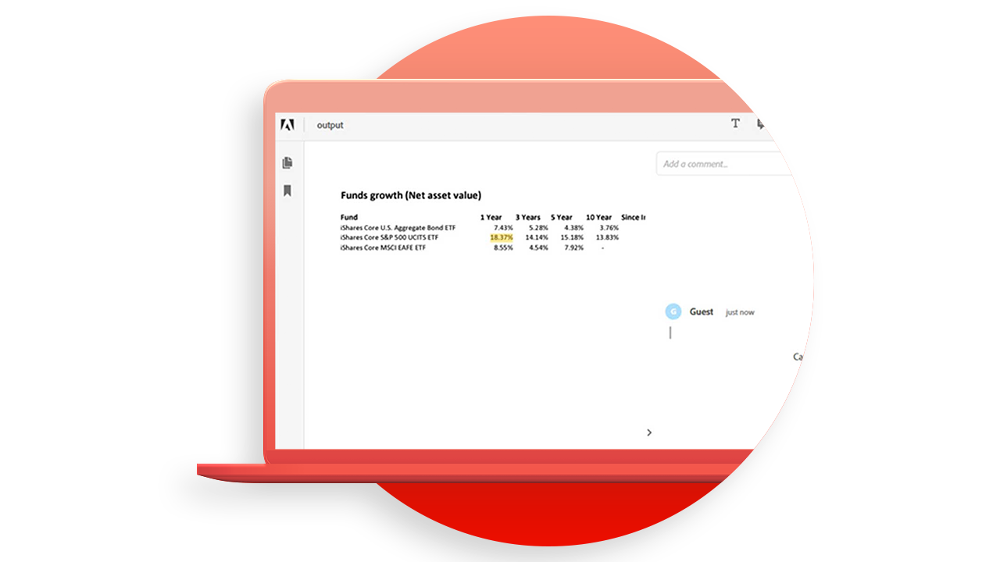

# [!DNL Adobe Acrobat Services] APIの使用例

![[!DNL Acrobat Services] APIユースケースのバナー](../assets/usecaseshero.jpg)

## 次の操作を実行できます [!DNL Adobe Acrobat Services] APIは役に立ちますか？

操作方法 [!DNL Adobe Acrobat Services] これらの実践ユースケースにより、APIはビジネスを変えることができます。

### [!DNL Acrobat Services] API

<table style="table-layout:fixed">
<tr>
  <td>
    
    

    <a href="automatelegalworkflows.md"><strong>法的なワークフローの自動化</strong></a>
    

    <em>条件付きコンテンツを使用して法的なワークフローを自動化する方法について説明します</em>
     
  </td>
  <td>
      
      

      <a href="employeeonboarding.md"><strong>従業員オンボーディングの最新化</strong></a>
      

      <em>従業員のオンボーディングを最新化する方法</em>
       
  </td>
  <td>
      
      

      <a href="acceleratesales.md"><strong>販売プロセスの迅速化</strong></a>
      

      <em>ドキュメントのエクスペリエンスを統合して販売を促進する方法を説明します</em>
       
    </td>
    <td>
      
      

      <a href="sales.md"><strong>販売提案と契約の管理</strong></a>
      

      <em>販売提案を自動化および簡素化するための効率的なワークフローを構築する方法を説明します</em>
       
    </td>
</tr>
<tr>
  <td>
    
    

    <a href="nda.md"><strong>NDAの作成</strong></a>
    

    <em>共同作業のために動的なNDA PDFを作成する方法について説明します</em>
     
  </td>
  <td>
    
    

    <a href="legal.md"><strong>法的契約の管理</strong></a>
    

    <em>カスタムデータ入力を使用して、法的ドキュメントを自動的に生成および保護する方法について説明します。</em>
     
  </td>
  <td>
    
    

    <a href="offer.md"><strong>従業員の内定通知の管理</strong></a>
    

    <em>新しい従業員に署名用に配信できる内定通知を生成する方法について説明します</em>
     
  </td>
  <td>
    
    

    <a href="searching.md"><strong>検索とインデックス作成</strong></a>
    

    <em>スキャンした文書から検索可能なPDFファイルを作成する方法について説明します</em>
     
  </td>
</tr>
<tr>
  <td>
    
    

    <a href="reviews.md"><strong>レビューと承認</strong></a>
    

    <em>クロスチーム共同作業のためのドキュメントのレビューと承認ワークフローを構築する方法について説明します</em>
     
  </td>
  <td>
    
    

    <a href="reportcreation.md"><strong>レポートの作成と編集</strong></a>
    

    <em>お客様向けのwebサイトでPDFレポートを生成する方法について説明します</em>
     
  </td>
  <td>
    
    

    <a href="jobposting.md"><strong>求人情報</strong></a>
    

    <em>求職者および雇用者のwebエクスペリエンスを円滑かつ一貫して開発する方法を説明します</em>
     
  </td>
  <td>
    
    

    <a href="educationcollab.md"><strong>学生・教職員間の連携</strong></a>
    

    <em>ここでは、教職員や生徒がPDFで簡単にリソースを共有できるオンライン学習プラットフォームを構築する方法を説明します</em>
     
  </td>
</tr>
<tr>
  <td>
    
    

    <a href="AgreementWorkflowsNodejs.md"><strong>Node.jsの契約書ワークフロー</strong></a>
    

    <em>[!DNL Adobe Acrobat Services] APIにより、PDF機能をwebアプリケーションに簡単に組み込むことができます</em>
     
  </td>
  <td>
    
    

    <a href="HRAgreementWorkflowsJava.md"><strong>Javaでの人事文書ワークフロー</strong></a>
    

    <em>[!DNL Adobe Acrobat Services] APIは、PDF機能をHR Webアプリケーションに簡単に組み込むことができます</em>
     
  </td>
  <td>
    
    

    <a href="FinanceWorkflowsJava.md"><strong>Javaでの財務文書ワークフローの管理</strong></a>
    

    <em>[!DNL Adobe Acrobat Services] PDFの財務文書のデータを処理および抽出するために必要なすべてのツール、サービス、機能を提供</em>
     
  </td>
  <td>
    
    

     
  </td>
</tr>
</table>

### Document Generation API

<table style="table-layout:fixed">
<tr>
  <td>
    
    

    <a href="invoices.md"><strong>請求書の処理</strong></a>
    

    <em>顧客請求書の自動生成、パスワード保護、配信を行う方法を説明します</em>
     
  </td>
  <td>
    
    

     
  </td>
  <td>
    
    

     
  </td>
  <td>
    
    

     
  </td>
</tr>
</table>

### PDF埋め込みAPI

<table style="table-layout:fixed">
<tr>
   <td>
    
    

    <a href="ddppdfembedapi.md"><strong>デジタルドキュメントパブリッシング</strong></a>
    

    <em>Adobe PDF Embed APIを使用して、webページ内に埋め込まれたPDF文書を表示する方法について説明します</em>
     
  </td>
  <td>
    
    

     
  </td>
  <td>
    
    

     
  </td>
  <td>
    
    

     
  </td>
</tr>
</table>