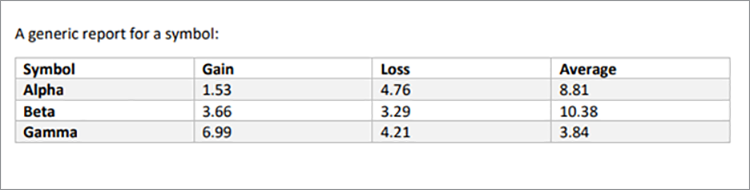

# レポートの作成と編集


財務、教育、マーケティングなどの業界では、PDFを使用して顧客や関係者とデータを共有しています。 PDFを使用すると、誰でも表示できる形式で、テーブル、グラフィック、インタラクティブコンテンツを含むリッチドキュメントを簡単に共有できます。 [!DNL Adobe Acrobat Services] APIを使用すると、これらの企業はMicrosoft Word、Microsoft Excel、グラフィック、およびその他の多様な文書フォーマットから共有可能なPDFレポートを作成できます。

言ってみろ [ソーシャルメディアトラッキング会社を経営する](https://www.adobe.io/apis/documentcloud/dcsdk/on-demand-report-creation.html). 顧客がサイトのパスワードで保護された部分にログインして、キャンペーン分析を表示します。 多くの場合、経営幹部、株主、寄付者、その他の利害関係者と統計を共有したいと考えています。 ダウンロード可能なPDF文書は、番号やグラフなどを顧客に伝える場合に便利です。

組み込むことによって [PDFサービスAPI](https://www.adobe.io/apis/documentcloud/dcsdk/pdf-tools.html) webサイトにログインすると、顧客ごとに外出先でPDFレポートを作成できます。 PDFを作成し、それらを1つの便利なレポートにまとめることができます。このレポートは、お客様がダウンロードし、関係者に渡すことができます。

## 学習内容

この実践チュートリアルでは、Node.jsとExpress.js環境で(一部のJavaScript、HTML、CSSを使用して)PDFサービスSDKを使用し、PDF指向の機能を既存のwebサイトにすばやく簡単に追加する方法について学習します。 このWebサイトには、管理者がレポートをアップロードするページがあります。管理者は、使用可能なレポートのリストやPDFに変換する文書を確認したり、システムで生成されたPDFをダウンロードするのに役立つエンドポイントを確認したりできます。

## 関連APIとリソース

* [PDF Services API](https://opensource.adobe.com/pdftools-sdk-docs/release/latest/index.html)

* [PDF埋め込みAPI](https://www.adobe.com/devnet-docs/dcsdk_io/viewSDK/index.html)

## お客様向けのキャンペーンレポートダッシュボード

>[!NOTE]
>
>このチュートリアルは、Node.jsのベスト・プラクティスやWebアプリケーションのセキュリティ保護方法については説明しません。 Webサイトの一部の領域は公開されており、ドキュメントの名前付けは実用に適さない場合があります。 このようなシステムを設計する最善の方法について話し合うには、建築家やエンジニアに相談してください。

ここでは、顧客レポートエリアと管理者セクションを持つ基本的なExpress.js webアプリケーションがあります。 このアプリケーションは、ソーシャルメディアキャンペーンのレポートを表示できます。 例えば、広告がクリックされた回数を示すことができます。


このプロジェクトは、からダウンロードできます。 [GitHubリポジトリー](https://github.com/afzaal-ahmad-zeeshan/express-adobe-pdf-tools).

次に、レポートを公開する方法について説明します。

## レポートのアップロード

シンプルにするために、ここではファイルシステムベースのアップロードと処理のみを使用してください。 Express.jsでは、 fsモジュールを使用して、ディレクトリ内の使用可能なファイルをすべて一覧表示できます。

同じページで、お客様が確認できるように管理者がレポートファイルをサーバーにアップロードできるようにします。 これらのファイルは、Microsoft Word、Microsoft Excel、HTML、 [他のデータ形式]https://opensource.adobe.com/pdftools-sdk-docs/release/latest/howtos.html#create-a-pdf)（グラフィックファイルを含む） 管理ページは次のようになります。


>[!NOTE]
>
>URLをパスワードで保護するか、npmのパスポートパッケージを使用して、認証および承認レイヤーの背後でアプリケーションを保護します。

管理者がファイルを選択してアップロードすると、他のユーザーがアクセスできるパブリックリポジトリに移動されます。 同じリポジトリを使用して管理者ページからドキュメントを公開し、顧客が利用できるマーケティングレポートを一覧表示します。 このコードは次のとおりです。

```
router.get('/', (req, res) => {
try {
let files = fs.readdirSync('./public/documents/raw') // read the files
res.status(200).render("reports", { page: 'reports', files: files });
} catch (error) {
res.status(500).render("crash", { error: error });
}
});
```

このコードはすべてのファイルをリストし、ファイルリストのビューをレンダリングします。

## レポートの選択

ユーザー側には、顧客がソーシャルメディアキャンペーンレポートに含める文書を選択するためのフォームがあります。 わかりやすくするために、サンプルページでは、ドキュメント名とチェックボックスのみを表示して、ドキュメントを選択します。 1つまたは複数のレポートを選択して、1つのPDF文書にまとめることができます。

より高度なユーザーインターフェイスの場合は、レポートのプレビューもここに表示できます。


## PDFレポートの生成

PDFサービスSDKを使用して、データ入力からPDFレポートを作成します。 上記のスクリーンショットに示されているように、データは、Microsoft Word、Microsoft Excel、HTML、グラフィックなど、様々なデータフォーマットから取得されます。 まず、PDFサービスSDK用のnpmパッケージをインストールします。

```
$ npm install --save @adobe/documentservices-pdftools-node-sdk
```

開始する前に、API資格情報、 [Adobeがない](https://opensource.adobe.com/pdftools-sdk-docs/release/latest/index.html#getcred). 次を使用： [!DNL Acrobat Services] 勘定 [6か月無料、その後従量課金制](https://www.adobe.io/apis/documentcloud/dcsdk/pdf-pricing.html) 文書トランザクションあたり\$0.05です。

アーカイブファイルをダウンロードし、JSONファイルを展開して、資格情報と秘密鍵を取得します。 サンプルプロジェクトで、 srcディレクトリにファイルを配置します。


これで資格情報の設定が完了したので、PDF変換タスクを記述できます。 このデモでは、アプリケーションで次の2つの操作を実行する必要があります。

* RAW文書をPDFファイルに変換

* 複数のPDFファイルを1つのレポートにまとめる

全体的な手順は、任意の操作を実行する場合と同様です。 唯一の違いは、使用するサービスです。 次のコードでは、RAW文書をPDFファイルに変換します。

```
async function createPdf(rawFile, outputPdf) {
try {
// configurations
const credentials = adobe.Credentials
.serviceAccountCredentialsBuilder()
.fromFile("./src/pdftools-api-credentials.json")
.build();
// Capture the credential from app and show create the context
const executionContext = adobe.ExecutionContext.create(credentials),
operation = adobe.CreatePDF.Operation.createNew();
// Pass the content as input (stream)
const input = adobe.FileRef.createFromLocalFile(rawFile);
operation.setInput(input);
// Async create the PDF
let result = await operation.execute(executionContext);
await result.saveAsFile(outputPdf);
} catch (err) {
console.log('Exception encountered while executing operation', err);
}
}
```

上記のコードでは、資格情報を読み取り、実行コンテキストを作成します。 PDFサービスSDKでは、リクエストを認証するために実行コンテキストが必要です。

次に、PDFを作成する操作を実行して、RAW文書をPDF形式に変換します。 最後に、 `outputPdf` PDFレポートをコピーするパラメーターです。 コード例では、このコードはsrc/helpers/pdf.jsファイルの下にあります。 このチュートリアルの後半で、PDFモジュールを読み込み、このメソッドを呼び出します。

前のセクションで示したように、お客様は次のページに移動して、PDFに変換するレポートを選択できます。


お客様がこれらのレポートを1つ以上選択すると、PDFファイルが作成されます。

まず、1つのPDFファイルの動作を確認します。 ユーザーが1つのレポートを選択した場合は、そのレポートをPDFに変換し、ダウンロードリンクを提供するだけです。

```
try {
console.log(`[INFO] generating the report...`);
await pdf.createPdf(`./public/documents/raw/${reports}`, `./public/documents/processed/output.pdf`);
console.log(`[INFO] sending the report...`);
res.status(200).render("download", { page: 'reports', filename: 'output.pdf' });
} catch(error) {
console.log(`[ERROR] ${JSON.stringify(error)}`);
res.status(500).render("crash", { error: error });
}
```

このコードはレポートを作成し、ダウンロードURLをお客様と共有します。 出力Webページは次のとおりです。


出力PDFは次のとおりです。



お客様は、複数のファイルを選択して結合レポートを生成できます。 お客様が複数の文書を選択した場合は、2つの処理を実行します。1つは、各文書の一部としてPDFを作成する処理、もう1つは、それらを1つのPDFレポートにまとめる処理です。

```
async function combinePdf(pdfs, outputPdf) {
try {
// configurations
const credentials = adobe.Credentials
.serviceAccountCredentialsBuilder()
.fromFile("./src/pdftools-api-credentials.json")
.build();
// Capture the credential from app and show create the context
const executionContext = adobe.ExecutionContext.create(credentials),
operation = adobe.CombineFiles.Operation.createNew();
// Pass the PDF content as input (stream)
for (let pdf of pdfs) {
const source = adobe.FileRef.createFromLocalFile(pdf);
operation.addInput(source);
}
// Async create the PDF
let result = await operation.execute(executionContext);
await result.saveAsFile(outputPdf);
} catch (err) {
console.log('Exception encountered while executing operation', err);
}
}
```

このメソッドはsrc/helpers/pdf.jsファイルで使用でき、モジュールの書き出しの一部として公開されます。

```
try {
console.log(`[INFO] creating a batch report...`);
// Create a batch report and send it back
let partials = [];
for (let index in reports) {
const name = `partial-${index}-${reports[index]}`;
await pdf.createPdf(`./public/documents/raw/${reports[index]}`, `./public/documents/processed/${name}`);
partials.push(`./public/documents/processed/${name.replace('docx', 'pdf').replace('xlsx', 'pdf')}`);
}
await pdf.combinePdf(partials, `./public/documents/processed/output.pdf`);
console.log(`[INFO] sending the combined report...`);
res.status(200).render("download", { page: 'reports', filename: 'output.pdf' });
} catch(error) {
console.log(`[ERROR] ${JSON.stringify(error)}`);
res.status(500).render("crash", { error: error });
}
```

このコードは、複数の入力ドキュメントのコンパイルされたレポートを生成します。 追加された関数は、 `combinePdf` PDFファイルのパス名のリストを取得し、1つの出力PDFを返すメソッド。

これで、ソーシャルメディアダッシュボードの顧客は、自分のアカウントから関連するレポートを選択し、1つの便利なPDFとしてダウンロードできるようになりました。 このダッシュボードを使用すると、管理者やその他の関係者、キャンペーンの成功をデータ、表、グラフで表示できます。この形式は例外なく開きやすい形式です。

## 次の手順

この実践チュートリアルでは、お客様が関連するレポートを簡単に共有できるPDFとしてダウンロードできるように、PDFサービスAPIの使用方法について説明しました。 Node.jsアプリケーションを作成して、PDFのレポート作成および読み取りサービス用のPDFサービスAPIの機能を紹介しました。 このアプリケーションでは、お客様が1つのレポート文書をダウンロードする方法や、複数の文書を組み合わせて1つのPDFレポートに結合する方法を示しました。

このAdobeを利用したアプリケーションは、次の用途に役立ちます [ソーシャルメディアダッシュボードのお客様](https://www.adobe.io/apis/documentcloud/dcsdk/on-demand-report-creation.html) 必要なレポートを取得して共有します。受信者全員が、自分のデバイスにMicrosoft Officeまたはその他のソフトウェアがインストールされているかどうかを心配する必要はありません。 独自のアプリケーションで同じ方法を使用して、ユーザーがドキュメントを表示、結合、ダウンロードできるようにすることができます。 または、Adobeのその他多くのAPIをチェックして、署名の追加や追跡などを行うことができます。

使用を開始するには、無料を申請してください [[!DNL Adobe Acrobat Services]](https://www.adobe.io/apis/documentcloud/dcsdk/gettingstarted.html) 次に、従業員と顧客の魅力的なレポートエクスペリエンスを作成します。 6か月間アカウントを無料でお楽しみください [従量課金制](https://www.adobe.io/apis/documentcloud/dcsdk/pdf-pricing.html) マーケティングの取り組みが拡大すると、文書トランザクションあたり\$0.05になります。
