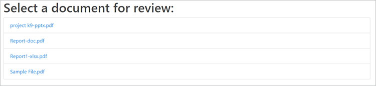

# レビューと承認


COVID-19 が急速に拡大する中、多くの企業ではチーム間のリモートコラボレーションが必要になりました。 [デジタルドキュメントの共有とレビュー](https://www.adobe.io/apis/documentcloud/dcsdk/review-and-approval.html) チームや部門間のリソースに一連の課題をもたらします。

これには、様々なファイル形式でドキュメントを共有すること、コンテンツを効果的にレビューしてコメントを追加すること、最新の編集内容と同期することが含まれます。 [!DNL Adobe Acrobat Services] API は、アプリケーション開発者がユーザーのこれらの課題を解決できるように設計されています。

## 学習内容

この実践チュートリアルでは、Node.js および Express Web アプリケーションでドキュメントのレビューと承認のワークフローを構築する方法を説明します。 このチュートリアルに沿って作業を進めるには、Node.js の経験が必要です。

アプリケーションには次の機能があります。

* 様々なファイル形式をPDF

* ファイルのアップロードの有効化

* ユーザーがコメントや注釈を追加できるようにする

* コメントとともにPDFを表示します。

* ユーザープロファイルでコメントの作成者を識別できるようにする

* ユーザーがダウンロードできる最終PDFにファイルを結合します。

## 関連する API とリソース

* [PDF Services API](https://opensource.adobe.com/pdftools-sdk-docs/release/latest/index.html)

* [PDF埋め込み API](https://www.adobe.com/devnet-docs/dcsdk_io/viewSDK/index.html)

* [プロジェクトコード](https://github.com/contentlab-io/adobe_reviews_and_approvals)

## AdobeAPI 資格情報の作成

コードを開始する前に、 [資格情報の作成](https://www.adobe.com/go/dcsdks_credentials) Adobe PDF Embed API とAdobe PDF Services API 用。 PDF埋め込み API は無料で使用できます。 PDFサービス API は 6 か月間無料で使用できます。その後、 [従量制プラン](https://www.adobe.io/apis/documentcloud/dcsdk/pdf-pricing.html) 1 ドキュメントトランザクションあたり\$0.05 です。

PDFサービス API の資格情報を作成する場合は、 **パーソナライズされたコードサンプルの作成** 」オプションを選択し、言語として Node.js を選択します。 ZIP ファイルを保存し、pdftools-api-credentials.json と private.key を Node.js Express プロジェクトのルートディレクトリに抽出します。

## プロジェクトと依存関係の設定

Node.js および Express プロジェクトを設定して、「public」という名前のフォルダーから静的ファイルを提供します。 環境設定に応じて、プロジェクトの方法を設定できます。 すぐに使い始めるには、 [Express アプリジェネレータ](https://expressjs.com/en/starter/generator.html)を選択します。 または、シンプルさを維持したい場合は、 [ゼロから始める](https://expressjs.com/en/starter/hello-world.html) コードを単一の JavaScript ファイルに保存できます。 上記にリンクしたサンプルプロジェクトでは、1 ファイルのアプローチを使用し、すべてのコードを index.js に保持しています。

コピー `pdftools-api-credentials.json` および `private.key` ファイルをカスタマイズして、プロジェクトのルートディレクトリにコピーします。 また、資格ファイルがある場合は、.gitignore ファイルに追加して、資格ファイルが誤ってリポジトリに送信されないようにします。

次に、 `npm install @adobe/documentservices-pdftools-node-sdk` インストール・サービス用の Node.js SDK をPDFします。 このモジュールをインポートし、次のように依存関係の残りの部分をインポートした後に、コード内（サンプルプロジェクトの index.js）に API 資格情報オブジェクトを作成します。

```
  const PDFToolsSdk = require( "@adobe/documentservices-pdftools-node-sdk" );

  // Create Credentials
  const credentials =  PDFToolsSdk.Credentials
      .serviceAccountCredentialsBuilder()
      .fromFile( "pdftools-api-credentials.json" )
      .build();
```

開始コードは次のようになります。

```
  
  const express = require( "express" );
  const PDFToolsSdk = require( "@adobe/documentservices-pdftools-node-sdk" );

  // Create Credentials
  const credentials =  PDFToolsSdk.Credentials
      .serviceAccountCredentialsBuilder()
      .fromFile( "pdftools-api-credentials.json" )
      .build();

  const app = express();

  app.use( express.static( "public" ) );

  app.listen( 8889, function() {
      console.log( "Server started on port", 8889 );
  } );
```

これで、 [!DNL Acrobat Services] API

## ファイルのPDF

ドキュメントワークフローの最初の部分では、エンドユーザーは共有するドキュメントをアップロードする必要があります。 この機能を有効にするには、アップロード機能を追加し、さまざまなドキュメントファイル形式をPDFに統合して、レビュープロセスに備えます。

最初に、 [PDFサービス API の例](https://www.adobe.io/apis/documentcloud/dcsdk/pdf-tools.html)を選択します。 この例では、OCR（光学式文字認識）、パスワード保護と削除、圧縮など、その他の重要な機能のスニペットも示しています。

```
function fileToPDF( filename, outputFilename, callback ) {
      // Create an ExecutionContext using credentials and create a new operation
  instance.
      const executionContext = PDFToolsSdk.ExecutionContext.create( credentials ),
          createPdfOperation = PDFToolsSdk.CreatePDF.Operation.createNew();

      // Set operation input from a source file.
      const input = PDFToolsSdk.FileRef.createFromLocalFile( filename );
      createPdfOperation.setInput( input );

      // Execute the operation and Save the result to the specified location.
      createPdfOperation.execute( executionContext )
          .then( result => {
              result.saveAsFile( outputFilename );
              callback( outputFilename );
          } );
  }
```

この関数を使用して、アップロードされたドキュメントからPDFを作成できるようになりました。

## ファイルのアップロード処理

次に、サーバーは、文書を受信して処理するために、Web サーバー上のファイルアップロードエンドポイントを必要とします。

まず、アップロードフォルダー内にフォルダーを作成し、「drafts」という名前を付けます。 アップロードしたファイルと変換したPDFファイルを保存します。 次に、 `npm install express-fileupload` express-FileUpload モジュールをインストールし、コードでミドルウェアを Express に追加するには：

```
const fileUpload = require( "express-fileupload" );
app.use( fileUpload() );
```

次に、 `/upload `」エンドポイントをクリックし、アップロードしたファイルを同じファイル名で下書きフォルダー内に保存します。 次に、前に記述した関数を呼び出して、同じドキュメントのPDFファイルを作成します ( まだPDF形式でない場合 )。 アップロードした元のドキュメントの名前に基づいて、新しいPDFファイルのファイル名を生成することができます。

```
// Create a PDF file from an uploaded file
app.post( "/upload", ( req, res ) => {
    if( !req.files || Object.keys( req.files ).length === 0 ) {
        return res.status( 400 ).send( "No files were uploaded." );
    }
    
    // Create PDF from the uploaded file
    let file = req.files.myFile;
    file.mv( __dirname + "/uploads/drafts/" + file.name, ( err ) => {
        if( err ) {
            return res.status( 500 ).send( err );
        }
        if( file.name.endsWith( ".pdf" ) ) {
            res.redirect( "/" );
        }
        else {
            // Convert to PDF
            fileToPDF( __dirname + "/uploads/drafts/" + file.name, __dirname + "/uploads/drafts/" + file.name.replace( /\./g, "-" ) + ".pdf", ( file ) => {
                res.redirect( "/" );
            } );
        }
    });
} );
```

## アップロードページの作成

Web アプリケーションからファイルをアップロードするには、 `index.html` アップロードフォルダー内の web ページ。 ページで、/upload エンドポイントにファイルを送信するファイルアップロードフォームを追加します。

```
<form ref="uploadForm" 
      action="/upload"
      method="post" 
      encType="multipart/form-data">
      <input type="file" name="myFile" accept=".doc,.docx,.ppt,.pptx,.xls,.xlsx,.txt,.rtf,.bmp,.jpg,.gif,.tiff,.png">
      <input type="submit" value="Upload File" />
  </form>
```


Node.js サーバーにドキュメントをアップロードできるようになりました。 サーバーはアップロード/下書きフォルダー内にファイルを保存し、それに加えてPDF形式のバージョンを作成します。

アップロードした文書を埋め込む準備ができました。PDF埋め込み API を使用して、ユーザーが文書に簡単にコメントや注釈を追加できるようにします。

## 列挙，PDFファイル

一般的なドキュメントワークフローでは複数のドキュメントが使用されるため、ドキュメントのリストを表示し、各ドキュメントをアプリケーションの新しいドキュメントレビューページにリンクする必要があります。

まず、Server Code 内に/files エンドポイントを追加します。このエンドポイントは、uploads/drafts フォルダーに格納されているすべてのPDFファイルのリストを取得して返します。

```
const fs = require( "fs" );

app.get( "/files", ( req, res ) =\> {

fs.readdir( \_\_dirname + "/uploads/drafts/", ( err, files ) =\> {

if( err ) {

return res.status( 500 ).send( err );using

}

return res.json( files.filter( f =\> f.endsWith( ".pdf" ) ) );

} );

} );
```

新しい `/download/:file` web ページに埋め込むために、アップロードされたPDFファイルへのアクセスを提供するルート。

>[!NOTE]
>
>運用アプリケーションでは、要求が有効なユーザーから送信されたものであり、ユーザーがドキュメントにアクセスできることを確認するために、認証と承認を追加する必要があります。

```
app.get( "/download/:file", function( req, res ){
    // Note: In production code, this should check authentication and user access permissions
    res.download( __dirname + "/uploads/drafts/" + req.params[ "file" ] );
});
```

読み込み時に入力されるファイルリストエレメントで index.html ページを更新します。 各アイテムは draft.html Web ページにリンクでき、クエリ文字列パラメーターを使用してファイル名をページに渡します。

>[!NOTE]
>
>jQuery を使用して各アイテムを追加するので、Web ページに jQuery ライブラリを読み込むか、別のメソッドを使用してエレメントを追加する必要があります。

```
  <ul id="filelist">
      <li>Loading documents...</li>
  </ul>

  ...

  <script>
      // Load current files
      fetch( "/files" )
      .then( r => r.json() )
      .then( files => {
          if( files && files.length > 0 ) {
              $( "#filelist" ).empty();
              files.forEach( file => {
                  $( "#filelist" ).append( `<li><a
  href="/draft.html?file=${file}">${file}</a></li>` );
              })
          } else {
                  $("#filelist").append("<div>No documents found.</div>");
                }
      });
  </script>
```



## PDF

これで、Web アプリケーション内にPDFファイルを埋め込んで表示できます。

「draft.html」という名前の Web ページを作成し、ページに埋め込みエレメントの divPDFを追加します。

```
  <div id="adobe-dc-view"></div>
```

含める [!DNL Acrobat Services] ライブラリ：

```
  <script src="https://documentcloud.adobe.com/view-sdk/main.js"></script>
```

カスタムスクリプトタグ内で、クエリ文字列パラメーターからファイル名を解析して、ページに埋め込むファイルを確認します。

```
  <script type="text/javascript">
          let params = new URLSearchParams( window.location.search );
          let filename = params.get( "file" );
  </script>
```

指定したPDFファイルを div エレメント内の埋め込みビューに読み込む、adobe_dc_view_sdk.ready イベントのドキュメントイベントリスナーを追加します。 クライアント ID は、埋め込み API 資格情報PDFから使用します。 コメントと注釈を有効にするには、FULL_WINDOW モードでビューを埋め込み、showAnnotationsTools オプションを true に設定します。

```
  document.addEventListener( "adobe_dc_view_sdk.ready", () => { 
      var adobeDCView = new AdobeDC.View( { 
          clientId: "YOUR CLIENT ID HERE",
          divId: "adobe-dc-view",
          locale: "en-US",
      } );
      adobeDCView.previewFile( {
          content: { location: { url: "download/" + filename } },
          metaData: { fileName: "Draft Version.pdf" }
      }, {
          embedMode: "FULL_WINDOW",
          showAnnotationTools: true,
          showPageControls: true
      } );
  });
```

## ユーザープロファイルの作成

このビューでは、コメントと注釈はデフォルトで「ゲスト」と表示されます。 現在のレビュー担当者のコメントと注釈の名前を設定するには、ページコード内のユーザープロファイルのコールバックをコールバックビューにPDFします。 プロファイルの例を次に示します。 ユーザー認証を含む本格的なアプリケーションでは、このように、ログインユーザーセッションのプロファイル情報を設定して、レビューワークフローで文書の各コメントを識別できます。

```
  adobeDCView.registerCallback(
      AdobeDC.View.Enum.CallbackType.GET_USER_PROFILE_API,
      () => {
          return new Promise( ( resolve, reject ) => {
              resolve({
                  code: AdobeDC.View.Enum.ApiResponseCode.SUCCESS,
                  data: {
                      userProfile: {
                          name: "YOUR NAME",
                          firstName: "FIRST",
                          lastName: "LAST",
                          email: "document.editor@adobe.com"
                      }
                  }
              });
          });
      }
  );
```

この Web ページを使用してアップロードされた文書を表示し、注釈を付けると、プロファイルによって特定のユーザーとして識別されます。

## 文書のフィードバックの保存

ユーザーが文書に注釈を追加した後、「 **保存します。** デフォルトでは、 **保存** 更新されたインストールファイルをPDFします。 このアクションを変更して、サーバー上の現在のPDFファイルを更新します。

新しい `/save` uploads/drafts フォルダー内のサーバーファイルを上書きするPDFコードへのエンドポイント：

```
  // Overwrite the PDF file with latest PDF changes and annotations
  app.post( "/save", ( req, res ) => {
      if( !req.files || Object.keys( req.files ).length === 0 ) {
          return res.status( 400 ).send( "No files were uploaded." );
      }

      let file = req.files.pdf;
      file.mv( __dirname + "/uploads/drafts/" + file.name, ( err ) => {
          if( err ) {
              return res.status( 500 ).send( err );
          }
          res.send( "File uploaded" );
      });
  } );
```

コンテンツを/savePDFにアップロードする SAVE_API のエンドポイント表示コールバックを登録します。 必要に応じて、autoSaveFrequency 値を変更して、タイマーの変更を自動的に保存し、完了時に現在埋め込まれているファイルにメタデータを追加することができます。

```
  adobeDCView.registerCallback(
      AdobeDC.View.Enum.CallbackType.SAVE_API,
      ( metaData, content, options ) => {
          return new Promise( ( resolve, reject ) => {
              let formData = new FormData();
              formData.append( "pdf", new Blob( [ content ] ), "drafts/" + filename
  );
              fetch( "/save", {
                  method: "POST",
                  body: formData
              }).then( resp => {
                  resolve({
                      code: AdobeDC.View.Enum.ApiResponseCode.SUCCESS,
                      data: {
                          /* Updated file metadata after successful save operation */
                          metaData: Object.assign( metaData, {} )
                      }
                  });
              });
          });
      },
      {
          autoSaveFrequency: 0,
          enableFocusPolling: false,
          showSaveButton: true
      }
  );
```

下書き文書のコメントと注釈がサーバーに保存されるようになりました。 また、 [コールバックの方法について詳しく見る](https://www.adobe.com/devnet-docs/dcsdk_io/viewSDK/howtos_ui.html#callbacks-workflows) ワークフローに合わせる 例えば、 [status コールバック](https://www.adobe.com/devnet-docs/dcsdk_io/viewSDK/howtos_ui.html#status-callback) 複数のユーザーが同じドキュメントを同時にレビューしてコメントする場合に、ファイルの競合を処理するのに役立ちます。

最後の手順では、編集サービス API を使用して、すべての編集済み文書を 1 つのPDFファイルにPDFします。

## 結合、PDFファイル

PDFの組み合わせコードは、PDFの作成コードに似ていますが、CombineFiles 操作を使用し、各ファイルを入力として追加します。

```
  function combineFilesToPDF( files, outputFilename, callback ) {
      // Create an ExecutionContext using credentials and create a new operation
  instance.
      const executionContext = PDFToolsSdk.ExecutionContext.create( credentials ),
          combineFilesOperation = PDFToolsSdk.CombineFiles.Operation.createNew();

      // Set operation inputs from source files.
      files.forEach( file => {
          const input = PDFToolsSdk.FileRef.createFromLocalFile( file );
          combineFilesOperation.addInput( input );
      } );

      // Execute the operation and Save the result to the specified location.
      combineFilesOperation.execute( executionContext )
          .then( result => {
              result.saveAsFile( outputFilename );
              callback( outputFilename );
          } );
 }
```

## 最終ダウンロードのPDF

/finalize というエンドポイントを追加して、この関数を呼び出し、 `uploads/drafts` フォルダーを `Final.pdf` ファイルをダウンロードします。

```
  app.get( "/finalize", ( req, res ) => {
      fs.readdir( __dirname + "/uploads/drafts/", ( err, files ) => {
          if( err ) {
              return res.status( 500 ).send( err );
          }
          combineFilesToPDF(
              files.filter( f => f.endsWith( ".pdf" ) ).map( f => __dirname + 
  "/uploads/drafts/" + f ),
              __dirname + "/uploads/Final.pdf", ( file ) => {
              res.download( file );
          } );
      } );
  } );
```

最後に、メインの index.html Web ページに、この/finalize エンドポイントへのリンクを追加します。 このリンクを使用すると、ドキュメントワークフローの結果をダウンロードできます。

```
<a href="/finalize">Download final PDF</a>
```


## 次の手順

この実践チュートリアルでは、 [!DNL Acrobat Services] API は [ドキュメント共有とレビューワークフロー](https://www.adobe.io/apis/documentcloud/dcsdk/review-and-approval.html) を Web アプリケーションに追加します。 このアプリケーションを使用すると、リモートワーカーはファイルを共有したり、チームメイトと共同作業したりできます。これは、在宅勤務の従業員や請負業者にとって特に役立ちます。

これらのテクニックを使用して、アプリまたは探索で共同作業を有効にすることができます [PDFサービスノード SDK サンプル](https://github.com/adobe/pdftools-node-sdk-samples) および [PDF埋め込み API サンプル](https://github.com/adobe/pdf-embed-api-samples) GitHub で、Adobeの API の使用方法に関するインスピレーションを得ることができます。

さっそく自分のアプリで文書の共有とレビューを有効にしましょう 新規登録 [[!DNL Adobe Acrobat Services]](https://www.adobe.io/apis/documentcloud/dcsdk/gettingstarted.html) 開発者アカウント Adobe PDF Embed に無料でアクセスし、他の API の 6 ヶ月間の無料体験版をお試しください。 体験版の終了後は、次の操作を実行できます [従量制の](https://www.adobe.io/apis/documentcloud/dcsdk/pdf-pricing.html) ビジネスの成長に合わせて、文書トランザクションあたり 0.05 USD で利用可能
